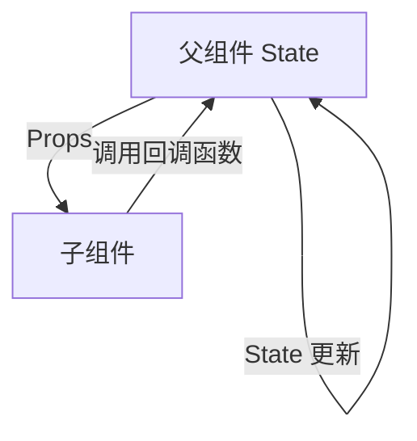

# React 核心哲学

## 1. 声明式 UI 与组件化

React 的核心哲学在于**声明式编程 (Declarative Programming)** 和**组件化驱动 (Component-Driven)**。

### 指令式 vs 声明式

- **指令式 (Imperative)**：告诉计算机*怎么做*（如直接操作 DOM API `document.createElement`）。
- **声明式 (Declarative)**：告诉计算机*想要什么*（如提供目标的 UI 状态，框架来负责怎么将其推送到 DOM）。

```tsx
// 指令式：手动操作 DOM
const button = document.createElement('button');
button.textContent = '点击我';
button.addEventListener('click', () => {
  alert('被点击了');
});
document.body.appendChild(button);

// 声明式：描述 UI 应该是什么样子
function Button() {
  return (
    <button onClick={() => alert('被点击了')}>
      点击我
    </button>
  );
}
```

### 组件化思维

将 UI 拆分为可复用的独立组件，每个组件只负责自己的渲染逻辑和状态管理。

```tsx
// 组件组合
function App() {
  return (
    <div>
      <Header />
      <MainContent />
      <Footer />
    </div>
  );
}
```

---

## 2. 单向数据流 (One-Way Data Flow)

在 React 中，数据永远只能由父组件流向子组件（通过 Props）。子组件绝不能直接修改父组件的 Props，而是通过父组件传递下来的 Callback 回调函数来触发状态改变。



### 数据流示例

```tsx
function Parent() {
  const [count, setCount] = useState(0);

  return (
    <div>
      <p>父组件计数: {count}</p>
      {/* 数据向下流动 */}
      <Child count={count} onIncrement={() => setCount(count + 1)} />
    </div>
  );
}

function Child({ count, onIncrement }: { count: number; onIncrement: () => void }) {
  return (
    <div>
      <p>子组件接收到的计数: {count}</p>
      {/* 通过回调函数向上通知 */}
      <button onClick={onIncrement}>增加</button>
    </div>
  );
}
```

### 单向数据流的优势

1. **可预测性**：数据流向明确，便于追踪状态变化
2. **可维护性**：避免了双向绑定带来的隐式依赖
3. **可调试性**：使用 React DevTools 可以清晰地看到数据流向

---

## 3. UI 状态机的映射公式

React 的底层思维可以用一个简单的数学公式来表示：

$$
UI = f(state)
$$

只要**状态 (state)** 确立，**视图 (UI)** 就是确定的。开发者不再需要手工管理冗杂复杂的 DOM 状态，只需要维护干净的 JSON 或对象状态即可。

### 纯函数组件

```tsx
// 给定相同的 props，总是渲染相同的 UI
function Greeting({ name }: { name: string }) {
  return <h1>你好，{name}</h1>;
}

// 多次调用产生相同结果
<Greeting name="张三" /> // 总是渲染 "你好，张三"
<Greeting name="张三" /> // 总是渲染 "你好，张三"
```

### 状态驱动视图

```tsx
function TodoList() {
  const [todos, setTodos] = useState([
    { id: 1, text: '学习 React', completed: false },
    { id: 2, text: '构建应用', completed: false }
  ]);

  // 状态改变 → UI 自动更新
  const toggleTodo = (id: number) => {
    setTodos(todos.map(todo =>
      todo.id === id ? { ...todo, completed: !todo.completed } : todo
    ));
  };

  return (
    <ul>
      {todos.map(todo => (
        <li
          key={todo.id}
          style={{ textDecoration: todo.completed ? 'line-through' : 'none' }}
          onClick={() => toggleTodo(todo.id)}
        >
          {todo.text}
        </li>
      ))}
    </ul>
  );
}
```

---

## 4. 不可变性 (Immutability)

React 依赖不可变性来高效地检测状态变化。直接修改状态对象不会触发重新渲染。

### 错误示范

```tsx
// ❌ 错误：直接修改状态
function Component() {
  const [user, setUser] = useState({ name: '张三', age: 25 });

  const updateAge = () => {
    user.age = 26; // 直接修改对象
    setUser(user); // React 无法检测到变化，不会重新渲染
  };

  return <button onClick={updateAge}>更新年龄</button>;
}
```

### 正确做法

```tsx
// ✅ 正确：创建新对象
function Component() {
  const [user, setUser] = useState({ name: '张三', age: 25 });

  const updateAge = () => {
    setUser({ ...user, age: 26 }); // 创建新对象
  };

  return <button onClick={updateAge}>更新年龄</button>;
}
```

### 不可变更新模式

```tsx
// 数组操作
const [items, setItems] = useState([1, 2, 3]);

// 添加元素
setItems([...items, 4]);

// 删除元素
setItems(items.filter(item => item !== 2));

// 更新元素
setItems(items.map(item => item === 2 ? 20 : item));

// 对象操作
const [user, setUser] = useState({ name: '张三', profile: { age: 25 } });

// 浅层更新
setUser({ ...user, name: '李四' });

// 深层更新
setUser({
  ...user,
  profile: {
    ...user.profile,
    age: 26
  }
});
```

---

## 5. 组合优于继承 (Composition over Inheritance)

React 推荐使用组合而非继承来实现代码复用。

### 包含关系 (Containment)

```tsx
// 通用容器组件
function Card({ title, children }: { title: string; children: ReactNode }) {
  return (
    <div className="card">
      <h2>{title}</h2>
      <div className="card-body">{children}</div>
    </div>
  );
}

// 使用组合
function UserProfile() {
  return (
    <Card title="用户资料">
      <p>姓名: 张三</p>
      <p>年龄: 25 岁</p>
    </Card>
  );
}
```

### 特殊化 (Specialization)

```tsx
// 通用对话框
function Dialog({ title, children }: { title: string; children: ReactNode }) {
  return (
    <div className="dialog">
      <h1>{title}</h1>
      <div>{children}</div>
    </div>
  );
}

// 特殊化：欢迎对话框
function WelcomeDialog() {
  return (
    <Dialog title="欢迎">
      <p>感谢访问我们的网站！</p>
    </Dialog>
  );
}
```

---

## 6. 关注点分离 (Separation of Concerns)

React 通过 Hooks 实现了真正的关注点分离，将逻辑与 UI 解耦。

### 自定义 Hook 封装逻辑

```tsx
// 封装数据获取逻辑
function useFetch<T>(url: string) {
  const [data, setData] = useState<T | null>(null);
  const [loading, setLoading] = useState(false);
  const [error, setError] = useState<Error | null>(null);

  useEffect(() => {
    setLoading(true);
    fetch(url)
      .then(r => r.json())
      .then(setData)
      .catch(setError)
      .finally(() => setLoading(false));
  }, [url]);

  return { data, loading, error };
}

// 组件专注于 UI 渲染
function UserList() {
  const { data: users, loading, error } = useFetch<User[]>('/api/users');

  if (loading) return <div>加载中...</div>;
  if (error) return <div>错误: {error.message}</div>;

  return (
    <ul>
      {users?.map(user => <li key={user.id}>{user.name}</li>)}
    </ul>
  );
}
```

---

## 7. 总结

React 的核心哲学可以归纳为以下几点：

| 原则 | 说明 |
| ------ | ------ |
| 声明式 UI | 描述 UI 应该是什么样子，而非如何操作 DOM |
| 单向数据流 | 数据由父到子流动，通过回调向上通知 |
| 状态驱动 | $UI = f(state)$，状态确定则 UI 确定 |
| 不可变性 | 通过创建新对象来更新状态，而非直接修改 |
| 组件组合 | 使用组合而非继承来实现代码复用 |
| 关注点分离 | 使用 Hooks 将逻辑与 UI 解耦 |

理解这些核心哲学是掌握 React 的基础，它们贯穿于整个 React 生态系统的设计之中。
