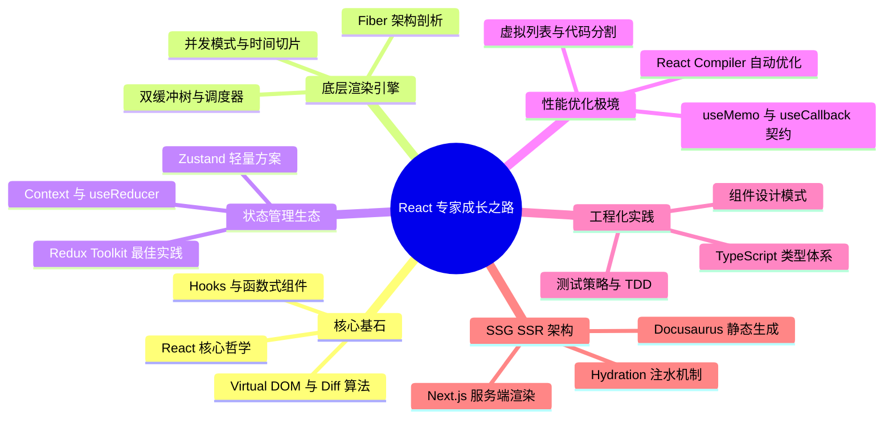

## React 19 现代化开发体系

欢迎来到 React 深度探索之旅。本体系旨在为追求极致性能、渴望洞察 Fiber 底层渲染机制的前端工程师提供一套**系统化、源码级**的知识图谱，涵盖从核心哲学到生产实践的完整路径。

---

## 🗺️ 前端工程师进阶路线图

---

## 第一阶段：核心基石与设计哲学 (Core Foundation)

深入理解 React 的设计思想与编程范式。

### 1.1 React 核心哲学

- [React 核心哲学](basic/philosophy.md)：声明式 UI、单向数据流与 $UI = f(state)$ 的数学映射模型。

### 1.2 Hooks 与函数式组件

- [Hooks 与函数式组件](basic/hooks.md)：深度剖析 `useState`、`useEffect`、`useMemo` 等核心 Hooks 的链表底层原理，理解为何 Hooks 严禁在条件语句中使用。探索 React 19 全新 API：`useActionState`、`useFormStatus`、`use` 关键字等并发模式下的异步状态管理革命。

### 1.3 组件设计模式

- [组件设计模式与最佳实践](basic/component-patterns.md)：复合组件模式、Render Props、高阶组件 (HOC)、受控与非受控组件、组件组合 vs 继承等企业级组件设计范式。

---

## 第二阶段：Fiber 架构与底层渲染引擎 (Advanced Rendering)

揭秘 React 16+ 引入的 Fiber 架构如何实现可中断渲染与并发模式。

### 2.1 Fiber 架构剖析

- [Fiber 架构剖析](advanced/fiber-architecture.md)：从传统 Stack Reconciler 的瓶颈到 Fiber 引擎的心跳机制，深入链表结构代替调用栈、双缓冲树 (Double Buffering) 与 `beginWork` / `completeWork` 的工作循环。

### 2.2 虚拟 DOM 与 Diff 算法

- [Virtual DOM 与 Diff 算法优化](advanced/virtual-dom-diff.md)：分析 React 的 $O(n)$ 复杂度 Diff 算法三大策略：树分层比较、组件类型判断、`key` 属性优化。探究 `key` 的正确使用与反模式案例。

### 2.3 并发模式与调度器

- [并发模式与时间切片调度](advanced/concurrent-mode.md)：Concurrent Mode 的优先级调度机制、`startTransition` 与 `useDeferredValue` 的应用场景、Scheduler 包的 Lane 模型与任务中断恢复策略。

---

## 第三阶段：状态管理生态与数据流 (State Management)

掌握从 Context 到第三方状态库的完整状态管理方案。

### 3.1 Context 与 useReducer

- [Context API 与 useReducer 模式](advanced/context-reducer.md)：深度剖析 Context 的订阅更新机制、性能陷阱与优化方案。使用 `useReducer` 构建可预测的复杂状态机。

### 3.2 第三方状态管理库

- [状态管理库选型与实践](advanced/state-management.md)：对比 Redux Toolkit、Zustand、Jotai、Recoil 等主流方案的设计理念、性能表现与适用场景。探索 React 19 时代的状态管理新范式。

---

## 第四阶段：性能优化极境 (Performance Optimization)

将 React 应用性能推向极致的工程化手段。

### 4.1 React Compiler 与自动优化

- [性能优化与 React Compiler](advanced/performance-optimization.md)：React 19 引入的自动 Memoization 编译器、`useMemo` 与 `useCallback` 的正确使用时机、React DevTools Profiler 性能分析、虚拟列表 (react-window) 与代码分割 (React.lazy) 等优化技术。

### 4.2 渲染优化与批量更新

- [批量更新与渲染优化策略](advanced/render-optimization.md)：自动批处理 (Automatic Batching)、`flushSync` 强制同步渲染、避免不必要的重渲染、组件拆分与状态提升策略。

---

## 第五阶段：TypeScript 类型体系与工程化 (TypeScript & Engineering)

构建类型安全的企业级 React 应用。

### 5.1 TypeScript 与 React 类型系统

- [TypeScript 类型体系与泛型约束](advanced/typescript-react.md)：`React.FC` vs 普通函数组件、泛型组件设计、`PropsWithChildren`、Refs 类型标注、事件处理类型、自定义 Hooks 类型推导等高级类型技巧。

### 5.2 测试策略与 TDD

- [测试驱动开发与测试策略](advanced/testing-strategy.md)：React Testing Library 最佳实践、组件单元测试、集成测试、E2E 测试 (Playwright)、Mock 策略与测试覆盖率管理。

---

## 第六阶段：SSG/SSR 架构与 Hydration (Server-Side Rendering)

掌握服务端渲染与静态生成的完整技术栈。

### 6.1 SSR 与 SSG 原理

- [SSR/SSG 架构与 Hydration 机制](advanced/ssr-ssg.md)：服务端渲染 (SSR) 与静态站点生成 (SSG) 的区别与适用场景、Hydration 注水过程与常见错误、`<BrowserOnly>` 防空设计、`useEffect` 在 SSG 中的执行时机。

### 6.2 Next.js 与 Docusaurus 实践

- [Next.js App Router 与 Docusaurus 定制](advanced/nextjs-docusaurus.md)：Next.js 14+ App Router 架构、Server Components vs Client Components、Docusaurus 主题 Swizzling、静态资源管理与 `useBaseUrl` 路径映射。

---

## 学习建议

1. **循序渐进**：建议按照路线图顺序学习，每个阶段都建立在前一阶段的基础之上。
2. **源码探索**：鼓励结合 React 源码 (facebook/react) 进行深度学习，理解设计决策背后的权衡。
3. **实战演练**：每个知识点都配合实际项目场景进行练习，将理论转化为工程能力。
4. **性能为王**：始终关注应用性能，使用 React DevTools Profiler 进行性能剖析。
5. **类型安全**：在生产项目中全面拥抱 TypeScript，享受类型系统带来的开发效率提升。

---

## 参考资料

- [React 官方文档](https://react.dev)
- [React 源码仓库](https://github.com/facebook/react)
- [React Working Group Discussions](https://github.com/reactwg/react-18/discussions)
- [TypeScript 官方手册](https://www.typescriptlang.org/docs/handbook/intro.html)
