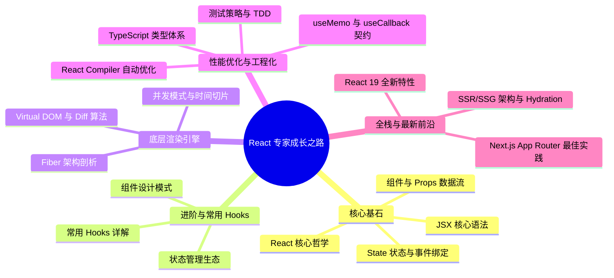

## React 19 现代化开发体系

欢迎来到 React 深度探索之旅。本体系旨在为追求极致性能、渴望从零构建高质量 React 项目并深度洞察 Fiber 底层渲染机制的工程师提供一套**系统化、源码级**的知识图谱，涵盖从小白入门到高级专家的完整路径。

---

## 🗺️ 前端工程师进阶路线图

---

## 第一阶段：零基础入门与核心基石 (Beginner: Core Foundations)

适合刚接触 React 的小白，建立声明式 UI 的基本直觉与开发习惯。

### 1.1 React 核心哲学

- [React 核心哲学](basic/philosophy.md)：声明式 UI、组件化、单向数据流与 $UI = f(state)$ 的数学映射模型。

### 1.2 JSX 语法与规范

- [JSX 语法与规范](basic/jsx-syntax.md)：探究 JSX 编译后的 JavaScript 本质；掌握闭合标签、单根节点、驼峰命名等书写规范；实战条件渲染（三元/逻辑与/if-else）与列表渲染（`key` 属性的最佳实践）。

### 1.3 组件与 Props 数据流

- [组件与 Props 数据流](basic/components-props.md)：理解函数组件声明；掌握 Props 的传递与解构；探究 Props 的只读特性与单向数据流；利用 `children` 属性设计高复用布局组件；初探 TypeScript 类型约束下的安全 Props。

### 1.4 State 状态与事件绑定

- [State 状态与事件绑定](basic/state-events.md)：深度辨析 State 与 Props 的本质区别；通过 `useState` Hook 激活组件心跳；理解状态更新的异步性与批处理（Batching）机制；学习函数式更新解决旧状态依赖；掌握 React 合成事件（SyntheticEvent）与状态提升（组件间通信）。

---

## 第二阶段：核心 Hooks 与应用开发 (Intermediate: Hooks & Ecosystem)

已能编写简单组件，开始接触复杂的企业级业务和开发范式。

### 2.1 常用 Hooks 深度解析

- [常用 Hooks 深度解析](basic/hooks.md)：深入掌握 `useState` 惰性初始化、`useEffect` 副作用及清理函数、`useRef` 跨周期共享引用、`useContext` 全局上下文等常用 Hooks 的开发技巧与闭包陷阱；揭秘底层 Fiber 单向链表机制以及为什么 Hooks 严禁在条件与循环中使用的技术内幕。

### 2.2 组件设计模式

- [组件设计模式与最佳实践](basic/component-patterns.md)：复合组件模式、Render Props、高阶组件 (HOC)、受控与非受控组件、组件组合 vs 继承等企业级组件设计范式。

### 2.3 状态管理生态

- [Context 与 useReducer 模式](advanced/context-reducer.md)：Context API 的订阅更新机制、性能陷阱与优化方案；结合 `useReducer` 构建复杂可预测状态机。
- [状态管理库选型与实践](advanced/state-management.md)：深度对比 Zustand 轻量方案、Redux Toolkit 经典方案、Jotai/Recoil 原子状态方案，探讨 React 19 时代的状态管理选型。

---

## 第三阶段：React 19 渲染引擎与底层原理 (Advanced: Rendering Engine)

洞察 React 底层运行规律，攻克面试与复杂性能调优关卡。

### 3.1 Fiber 架构剖析

- [Fiber 架构剖析](advanced/fiber-architecture.md)：全面解析 Fiber 底层结构与双缓冲树（Double Buffering）机制；深度拆解 Reconciliation 两个核心阶段：Render 阶段（递 beginWork 与归 completeWork 的可中断 workLoop）与 Commit 阶段（同步不可中断修改真实 DOM）；详解时间切片（Time Slicing）的运行逻辑。

### 3.2 虚拟 DOM 与 Diff 算法

- [Virtual DOM 与 Diff 算法优化](advanced/virtual-dom-diff.md)：分析 React 的 $O(n)$ 复杂度 Diff 算法三大策略：树分层比较、组件类型判断、`key` 属性优化。探究 `key` 的正确使用与反模式案例。

### 3.3 并发模式与调度器

- [并发模式与时间切片调度](advanced/concurrent-mode.md)：Concurrent Mode 的优先级调度机制、`startTransition` 与 `useDeferredValue` 的应用场景、Scheduler 包的 Lane 模型与任务中断恢复策略。

---

## 第四阶段：性能调优与企业级工程化 (Expert: Performance & Engineering)

将 React 应用的加载与渲染性能推向极致，建立一流工程化规范。

### 4.1 性能优化与 React Compiler

- [性能优化与 React Compiler](advanced/performance-optimization.md)：React 19 引入的自动 Memoization 编译器、`useMemo` 与 `useCallback` 的正确使用时机、React DevTools Profiler 性能分析、虚拟列表 (react-window) 与代码分割 (React.lazy) 等优化技术。

### 4.2 渲染优化与批量更新

- [批量更新与渲染优化策略](advanced/render-optimization.md)：自动批处理 (Automatic Batching)、`flushSync` 强制同步渲染、避免不必要的重渲染、组件拆分与状态提升策略。

### 4.3 TypeScript + React 类型系统

- [TypeScript 类型体系与泛型约束](advanced/typescript-react.md)：`React.FC` vs 普通函数组件、泛型组件设计、`PropsWithChildren`、Refs 类型标注、事件处理类型、自定义 Hooks 类型推导等高级类型技巧。

### 4.4 测试策略与 TDD

- [测试驱动开发与测试策略](advanced/testing-strategy.md)：React Testing Library 最佳实践、组件单元测试、集成测试、E2E 测试 (Playwright)、Mock 策略与测试覆盖率管理。

---

## 第五阶段：全栈架构、SSR 与 React 19 新特性 (Architect: Server & Future)

掌握服务端渲染与全栈化应用，跟进 React 团队最新前沿动向。

### 5.1 SSR/SSG 架构与 Hydration

- [SSR/SSG 架构与 Hydration 机制](advanced/ssr-ssg.md)：服务端渲染 (SSR) 与静态站点生成 (SSG) 的区别与适用场景、Hydration 注水过程与常见错误、`<BrowserOnly>` 防空设计、`useEffect` 在 SSG 中的执行时机。

### 5.2 Next.js 与 Docusaurus 实践

- [Next.js App Router 与 Docusaurus 定制](advanced/nextjs-docusaurus.md)：Next.js 14+ App Router 架构、Server Components vs Client Components、Docusaurus 主题 Swizzling、静态资源管理与 `useBaseUrl` 路径映射。

### 5.3 React 19 全新特性

- [React 19 全新特性与 API](advanced/react19-features.md)：深入实践 React 19 异步 Action 管理器 `useActionState`、无感表单状态获取 `useFormStatus`、条件性解析 Resource 与 Context 的 `use` 关键字、`useOptimistic` 乐观更新 Hook 以及移除了 `forwardRef` 后的新 ref 传参体验。

---

## 学习建议

1. **循序渐进**：建议按照路线图顺序学习，第一阶段建立直觉，第二阶段掌握应用，第三阶段吃透原理。
2. **源码探索**：鼓励结合 React 源码 (facebook/react) 进行深度学习，理解设计决策背后的权衡。
3. **性能为王**：始终关注应用性能，使用 React DevTools Profiler 进行性能剖析。
4. **类型安全**：在生产项目中全面拥抱 TypeScript，享受类型系统带来的开发效率提升。
