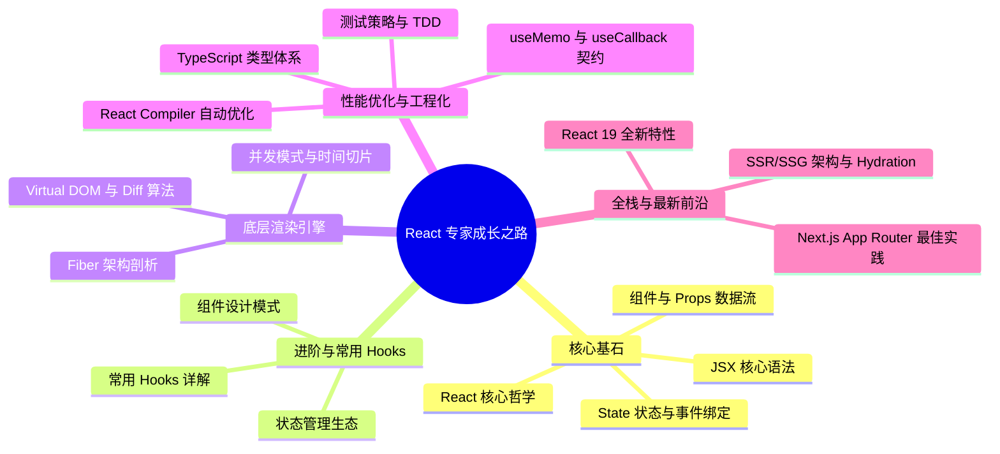

## React 19 现代化开发体系

欢迎来到 React 深度探索之旅。本体系旨在为追求极致性能、渴望从零构建高质量 React 项目并深度洞察 Fiber 底层渲染机制的工程师提供一套**系统化、源码级**的知识图谱，涵盖从小白入门到高级专家的完整路径。

---

## 🗺️ 前端工程师进阶路线图



---
## ⚡ 快速开始（推荐首先阅读）

> 🎯 **第一次接触 React？** 建议先花 **15 分钟** 完成 [快速开始指南](basic/quick-start.md)，在你的电脑上运行第一个 React 应用，然后再开始系统学习。

---
## 第一阶段：零基础入门与核心基石 (Beginner: Core Foundations)

### 1.1 React 核心哲学

- [React 核心哲学](basic/philosophy.md)：声明式 UI、组件化、单向数据流与 `UI = f(state)` 的数学映射模型。

#### 💡 核心示例：命令式 vs 声明式

```tsx
// 命令式 (Imperative)：手动操作 DOM
const container = document.getElementById('app');
const btn = document.createElement('button');
btn.innerText = `点击了 0 次`;
let count = 0;
btn.onclick = () => {
  count++;
  btn.innerText = `点击了 ${count} 次`;
};
container.appendChild(btn);

// 声明式 (Declarative)：描述 UI 与状态的关系，框架处理 DOM 变更
function Counter() {
  const [count, setCount] = useState(0);
  return <button onClick={() => setCount(count + 1)}>点击了 {count} 次</button>;
}
```

### 1.2 JSX 语法与规范

- [JSX 语法与规范](basic/jsx-syntax.md)：探究 JSX 编译后的 JavaScript 本质；掌握闭合标签、单根节点、驼峰命名等书写规范；实战条件渲染与列表渲染。

#### 💡 核心示例：条件与列表渲染

```tsx
interface Item {
  id: number;
  name: string;
}

function ListDemo({ items, showList }: { items: Item[]; showList: boolean }) {
  return (
    <div className="list-wrapper">
      {/* 1. 条件渲染 */}
      {showList ? <h3>展示数据列表</h3> : <p>列表已被隐藏</p>}
      
      {/* 2. 列表渲染 (必须带上唯一 key 属性) */}
      {showList && (
        <ul>
          {items.map(item => (
            <li key={item.id} className="item-style">
              {item.name}
            </li>
          ))}
        </ul>
      )}
    </div>
  );
}
```

### 1.3 组件与 Props 数据流

- [组件与 Props 数据流](basic/components-props.md)：理解函数组件声明；掌握 Props 的传递与解构；探究 Props 的只读特性与单向数据流；利用 `children` 属性设计高复用布局组件。

#### 💡 核心示例：只读 Props 与布局容器

```tsx
interface CardProps {
  title: string;
  children: React.ReactNode; // 接收子代 JSX
}

// 子组件：通过解构读取 Props，不允许在内部对其重新赋值修改
function Card({ title, children }: CardProps) {
  return (
    <div className="card-box">
      <div className="card-header"><h4>{title}</h4></div>
      <div className="card-body">{children}</div>
    </div>
  );
}

// 父组件使用：嵌套任意子内容
function App() {
  return (
    <Card title="最新公告">
      <p>系统已升级至 React 19，享受更快的加载速度！</p>
    </Card>
  );
}
```

### 1.4 State 状态与事件绑定

- [State 状态与事件绑定](basic/state-events.md)：通过 `useState` 激活组件心跳；理解状态更新的异步性与批处理（Batching）机制；学习函数式更新解决旧状态依赖；掌握 React 合成事件与状态提升。

#### 💡 核心示例：异步批处理与函数式更新

```tsx
function BatchingDemo() {
  const [count, setCount] = useState(0);

  const handleIncorrect = () => {
    setCount(count + 1); // 依赖当前周期的 count = 0
    setCount(count + 1); // 依赖当前周期的 count = 0
    // 执行完后 count 的值仅为 1
  };

  const handleCorrect = () => {
    // 传入函数，React 会将上一次更新的返回值作为下一次更新的参数传入
    setCount(prev => prev + 1); // prev = 0 -> 1
    setCount(prev => prev + 1); // prev = 1 -> 2
    // 执行完后 count 的值为 2
  };

  return (
    <div>
      <p>Count: {count}</p>
      <button onClick={handleCorrect}>函数式更新</button>
    </div>
  );
}
```

---

## 第二阶段：核心 Hooks 与应用开发 (Intermediate: Hooks & Ecosystem)

### 2.1 常用 Hooks 深度解析

- [常用 Hooks 深度解析](basic/hooks.md)：深入掌握 `useState` 惰性初始化、`useEffect` 副作用及清理函数、`useRef` 跨周期共享引用、`useContext` 全局上下文等常用 Hooks。

#### 💡 核心示例：useEffect 清理函数与 useRef 操作 DOM

```tsx
import { useEffect, useRef, useState } from 'react';

function TimerAndInput() {
  const [seconds, setSeconds] = useState(0);
  const inputRef = useRef<HTMLInputElement>(null); // 保存 DOM 节点

  // 1. useEffect 处理定时器副作用与清理工作
  useEffect(() => {
    const timer = setInterval(() => {
      setSeconds(s => s + 1);
    }, 1000);

    return () => clearInterval(timer); // 组件销毁或重跑 effect 时清理，防止内存泄漏
  }, []);

  // 2. 使用 ref 直接聚焦原生 input 元素
  const focusInput = () => {
    inputRef.current?.focus();
  };

  return (
    <div>
      <p>已运行秒数: {seconds}s</p>
      <input ref={inputRef} type="text" placeholder="点击按钮自动聚焦" />
      <button onClick={focusInput}>立刻聚焦</button>
    </div>
  );
}
```

### 2.2 组件设计模式

- [组件设计模式与最佳实践](basic/component-patterns.md)：复合组件模式、Render Props、高阶组件 (HOC)、受控与非受控组件、组件组合等企业级组件设计范式。

#### 💡 核心示例：复合组件模式 (Compound Components)

```tsx
import React, { createContext, useContext, useState } from 'react';

const ToggleContext = createContext<{ on: boolean; toggle: () => void } | null>(null);

// 1. 父容器组件维护状态
function Toggle({ children }: { children: React.ReactNode }) {
  const [on, setOn] = useState(false);
  const toggle = () => setOn(!on);
  return (
    <ToggleContext.Provider value={{ on, toggle }}>
      {children}
    </ToggleContext.Provider>
  );
}

// 2. 子组件消费状态，自由组合布局
Toggle.On = function ToggleOn({ children }: { children: React.ReactNode }) {
  const context = useContext(ToggleContext);
  return context?.on ? <>{children}</> : null;
};

Toggle.Off = function ToggleOff({ children }: { children: React.ReactNode }) {
  const context = useContext(ToggleContext);
  return !context?.on ? <>{children}</> : null;
};

Toggle.Button = function ToggleButton() {
  const context = useContext(ToggleContext);
  return <button onClick={context?.toggle}>切换状态</button>;
};

// 3. 外部组合使用
function PatternDemo() {
  return (
    <Toggle>
      <Toggle.On>开启状态：显示成功面板</Toggle.On>
      <Toggle.Off>关闭状态：显示警告面板</Toggle.Off>
      <div style={{ marginTop: '10px' }}>
        <Toggle.Button />
      </div>
    </Toggle>
  );
}
```

### 2.3 状态管理生态

- [Context 与 useReducer 模式](advanced/context-reducer.md)：Context API 的订阅更新机制、性能陷阱与优化方案；结合 `useReducer` 构建复杂可预测状态机。
- [状态管理库选型与实践](advanced/state-management.md)：对比 Zustand 轻量方案、Redux Toolkit 经典方案、Jotai/Recoil 原子状态方案。

#### 💡 核心示例：Zustand 轻量化全局状态管理

```tsx
import { create } from 'zustand';

// 1. 定义全局 Store，支持在外部独立定义，且没有 Provider 嵌套开销
interface BearState {
  bears: number;
  increasePopulation: () => void;
  removeAllBears: () => void;
}

const useBearStore = create<BearState>((set) => ({
  bears: 0,
  increasePopulation: () => set((state) => ({ bears: state.bears + 1 })),
  removeAllBears: () => set({ bears: 0 }),
}));

// 2. 在任意组件中消费状态
function BearCounter() {
  const bears = useBearStore((state) => state.bears);
  const increase = useBearStore((state) => state.increasePopulation);

  return (
    <div>
      <h3>熊的数量: {bears}</h3>
      <button onClick={increase}>孵化一只熊</button>
    </div>
  );
}
```

---

## 第三阶段：React 19 渲染引擎与底层原理 (Advanced: Rendering Engine)

### 3.1 Fiber 架构剖析

- [Fiber 架构剖析](advanced/fiber-architecture.md)：解析 Fiber 底层结构与双缓冲树机制；深度拆解 Reconciliation 两个核心阶段：Render 阶段与 Commit 阶段；详解时间切片调度机制。

#### 💡 核心示例：模拟 Fiber 工作循环 (workLoop) 原理

```javascript
// 极简版 Fiber 结构与任务中断恢复机制模拟
let nextUnitOfWork = null; // 指向当前正在计算的 WIP Fiber

function workLoop(deadline) {
  let shouldYield = false;
  
  // 只要还有工作，且没有超时（主线程还有剩余时间），就持续执行
  while (nextUnitOfWork !== null && !shouldYield) {
    nextUnitOfWork = performUnitOfWork(nextUnitOfWork);
    shouldYield = deadline.timeRemaining() < 1; // 剩余时间不足 1ms 则让出主线程
  }

  if (nextUnitOfWork === null) {
    commitRoot(); // 计算完成，进入 commit 阶段，同步渲染真实 DOM
  } else {
    requestIdleCallback(workLoop); // 时间切片被打断，在下一帧空闲时继续
  }
}

function performUnitOfWork(fiber) {
  // 1. 递阶段：构建子节点并返回 child 指针 (beginWork)
  if (fiber.child) {
    return fiber.child;
  }
  // 2. 归阶段：无子节点则处理兄弟节点，或向上返回父节点 (completeWork)
  let nextFiber = fiber;
  while (nextFiber) {
    if (nextFiber.sibling) {
      return nextFiber.sibling;
    }
    nextFiber = nextFiber.return; // 返回父节点
  }
  return null;
}
```

### 3.2 虚拟 DOM 与 Diff 算法

- [Virtual DOM 与 Diff 算法优化](advanced/virtual-dom-diff.md)：分析 React 的 $O(n)$ 复杂度 Diff 算法三大策略：树分层比较、组件类型判断、`key` 属性优化。

#### 💡 核心示例：Key 属性对于节点复用的重要性

```tsx
// 旧节点列表：[A (key="1"), B (key="2")]
// 新节点列表：[B (key="2"), A (key="1")] (仅发生位置移动)

// React 通过 key 复用原本的真实 DOM 实例：
// 1. 发现 key="2" 的新节点在旧节点中存在，直接执行 DOM 移动
// 2. 发现 key="1" 的新节点在旧节点中存在，直接执行 DOM 移动
// 3. 零销毁、零重新挂载。

// 反模式：不指定 key 或使用 Math.random()
// 每次渲染生成全新 key，导致 React 彻底卸载旧节点并重新生成真实 DOM，造成严重卡顿。
```

### 3.3 并发模式与调度器

- [并发模式与时间切片调度](advanced/concurrent-mode.md)：Concurrent Mode 的优先级调度机制、`startTransition` 与 `useDeferredValue` 的应用场景、Scheduler 包的任务中断恢复策略。

#### 💡 核心示例：startTransition 分离非紧急任务

```tsx
import { useState, startTransition } from 'react';

function SearchResults() {
  const [query, setQuery] = useState('');
  const [searchResults, setSearchResults] = useState<string[]>([]);

  const handleChange = (e: React.ChangeEvent<HTMLInputElement>) => {
    // 1. 紧急任务：用户的键盘输入必须得到即时响应
    setQuery(e.target.value);

    // 2. 非紧急任务：耗时的过滤与结果集计算，包裹在 startTransition 中
    startTransition(async () => {
      const results = await fetchLargeData(e.target.value);
      setSearchResults(results); // 如果有新输入进来，此更新会被打断，优先保障输入流畅
    });
  };

  return <input type="text" value={query} onChange={handleChange} />;
}
```

---

## 第四阶段：性能调优与企业级工程化 (Expert: Performance & Engineering)

### 4.1 性能优化与 React Compiler

- [性能优化与 React Compiler](advanced/performance-optimization.md)：React 19 自动 Memoization 编译器原理、`useMemo` 与 `useCallback` 的正确使用时机、React DevTools Profiler 性能分析。

#### 💡 核心示例：React.memo 与 useCallback 避免不必要重渲染

```tsx
import React, { useState, useCallback } from 'react';

// 使用 React.memo 包裹：只有 Props 发生浅比较变化时，子组件才会重渲染
const ExpensiveButton = React.memo(({ onClick }: { onClick: () => void }) => {
  console.log('按钮组件被渲染了！');
  return <button onClick={onClick}>提交</button>;
});

function ParentContainer() {
  const [text, setText] = useState('');
  const [count, setCount] = useState(0);

  // 使用 useCallback 缓存函数引用，防止 ParentContainer 渲染时重新生成新的 onClick 引用
  const handleButtonClick = useCallback(() => {
    setCount(c => c + 1);
  }, []); // 依赖项为空，引用始终不变

  return (
    <div>
      <input value={text} onChange={e => setText(e.target.value)} />
      {/* 改变 input 的 text 触发父组件更新，但由于 useCallback 的存在，ExpensiveButton 不会重新渲染 */}
      <ExpensiveButton onClick={handleButtonClick} />
    </div>
  );
}
```

### 4.2 渲染优化与批量更新

- [批量更新与渲染优化策略](advanced/render-optimization.md)：自动批处理 (Automatic Batching)、`flushSync` 强制同步渲染、避免不必要的重渲染。

#### 💡 核心示例：flushSync 强制同步获取最新 DOM 状态

```tsx
import { useState } from 'react';
import { flushSync } from 'react-dom';

function ScrollToBottom() {
  const [messages, setMessages] = useState<string[]>([]);

  const addMessage = () => {
    // 强制 React 立即同步更新 DOM，跳过异步批处理
    flushSync(() => {
      setMessages(m => [...m, '新消息']);
    });
    // DOM 已经更新完毕，在此处可以安全获取滚动高度并自动滚动到底部
    const listElement = document.getElementById('message-list');
    if (listElement) {
      listElement.scrollTop = listElement.scrollHeight;
    }
  };

  return (
    <div>
      <div id="message-list" style={{ height: '100px', overflowY: 'auto' }}>
        {messages.map((m, i) => <p key={i}>{m}</p>)}
      </div>
      <button onClick={addMessage}>发送</button>
    </div>
  );
}
```

### 4.3 TypeScript + React 类型系统

- [TypeScript 类型体系与泛型约束](advanced/typescript-react.md)：`React.FC` 与普通组件对比、泛型组件设计、事件处理类型、自定义 Hooks 类型推导。

#### 💡 核心示例：通用泛型表格组件与事件类型

```tsx
import React from 'react';

// 1. 定义泛型表格组件 Props
interface TableProps<T> {
  data: T[];
  renderRow: (item: T) => React.ReactNode;
}

// 2. 泛型声明，使得传入不同的 data 可以自动推导 item 类型
export function GenericTable<T>({ data, renderRow }: TableProps<T>) {
  return (
    <table>
      <tbody>
        {data.map((item, index) => (
          <tr key={index}>{renderRow(item)}</tr>
        ))}
      </tbody>
    </table>
  );
}

// 3. 键盘事件类型标注
function TypingInput() {
  const handleKeyDown = (event: React.KeyboardEvent<HTMLInputElement>) => {
    if (event.key === 'Enter') {
      console.log('按下了回车键，提交值：', event.currentTarget.value);
    }
  };

  return <input type="text" onKeyDown={handleKeyDown} />;
}
```

### 4.4 测试策略与 TDD

- [测试驱动开发与测试策略](advanced/testing-strategy.md)：React Testing Library 最佳实践、组件单元测试、集成测试、Mock 策略与测试覆盖率管理。

#### 💡 核心示例：RTL 进行交互单元测试

```tsx
import { render, screen } from '@testing-library/react';
import userEvent from '@testing-library/user-event';
import Counter from './Counter';

test('用户点击按钮，计数器应该递增', async () => {
  // 1. 渲染待测试的组件
  render(<Counter />);
  
  // 2. 寻找 DOM 元素
  const button = screen.getByRole('button', { name: /点击/i });
  const text = screen.getByText(/当前计数值: 0/i);
  expect(text).toBeInTheDocument();

  // 3. 模拟用户真实点击交互
  await userEvent.click(button);

  // 4. 断言验证期望结果
  expect(screen.getByText(/当前计数值: 1/i)).toBeInTheDocument();
});
```

---

## 第五阶段：全栈架构、SSR 与 React 19 新特性 (Architect: Server & Future)

### 5.1 SSR/SSG 架构与 Hydration

- [SSR/SSG 架构与 Hydration 机制](advanced/ssr-ssg.md)：服务端渲染 (SSR) 与静态站点生成 (SSG) 的区别与适用场景、Hydration 注水过程与常见错误、`<BrowserOnly>` 防空设计。

#### 💡 核心示例：BrowserOnly 规避服务端 Node.js 没有 window 对象的崩溃报错

```tsx
import BrowserOnly from '@docusaurus/BrowserOnly';

function ResponsiveWidget() {
  return (
    <BrowserOnly fallback={<div>正在检测视口...</div>}>
      {() => {
        // 这里的代码只会在客户端浏览器中执行，可以安全读取 window.innerWidth
        const width = window.innerWidth;
        return <div>当前屏幕宽度：{width}px</div>;
      }}
    </BrowserOnly>
  );
}
```

### 5.2 Next.js 与 Docusaurus 实践

- [Next.js App Router 与 Docusaurus 定制](advanced/nextjs-docusaurus.md)：Next.js 14+ App Router 架构、Server Components vs Client Components、Docusaurus 主题定制。

#### 💡 核心示例：RSC 服务端组件与客户端组件混合使用

```tsx
// 默认位于 App Router 下的文件均为 React Server Component (RSC)
// 直接在服务端执行，可以进行数据库直连或 API 安全请求
import { db } from '@/utils/db';
import LikeButton from './LikeButton'; // 引入客户端组件

export default async function ProductPage({ params }: { params: { id: string } }) {
  const product = await db.queryProduct(params.id); // 服务端直接获取数据，零客户端 JS

  return (
    <div className="product-page">
      <h1>{product.name}</h1>
      <p>{product.description}</p>
      
      {/* 交互式的部分交由客户端组件完成 */}
      <LikeButton productId={product.id} />
    </div>
  );
}

// ----------------------------------------------------
// LikeButton.tsx
// 'use client'; // 声明此模块为客户端组件边界，在浏览器中激活交互
// import { useState } from 'react';
// export default function LikeButton({ productId }) { ... }
```

### 5.3 React 19 全新特性

- [React 19 全新特性与 API](advanced/react19-features.md)：深入实践 React 19 异步 Action 管理器 `useActionState`、无感表单状态获取 `useFormStatus`、条件性解析 Resource 与 Context 的 `use` 关键字、`useOptimistic` 乐观更新 Hook。

#### 💡 核心示例：useActionState 自动托管表单提交 Loading 与 Error 状态

```tsx
import { useActionState } from 'react';

// 定义表单提交处理器
async function submitFeedback(prevState: any, formData: FormData) {
  const message = formData.get('message');
  try {
    await api.post('/feedback', { message });
    return { success: true, error: null };
  } catch (err: any) {
    return { success: false, error: err.message };
  }
}

function FeedbackForm() {
  // state: 接收 Action 返回的结果
  // formAction: 直接绑定到 <form action={...}> 的执行动作
  // isPending: 自动感知异步操作状态，网络传输中为 true，完成后为 false
  const [state, formAction, isPending] = useActionState(submitFeedback, {
    success: false,
    error: null
  });

  return (
    <form action={formAction}>
      <textarea name="message" required disabled={isPending} />
      <button type="submit" disabled={isPending}>
        {isPending ? '正在提交中...' : '提交反馈'}
      </button>
      {state.success && <p className="success">感谢您的宝贵意见！</p>}
      {state.error && <p className="error">提交失败：{state.error}</p>}
    </form>
  );
}
```

---

---

## 📚 实战练习与验证

每个阶段都配备了**循序渐进的练习题**，从简单到复杂逐步训练：

- [初级练习题](practice/beginner-exercises.md)：组件声明、Props 传递、State 管理、列表渲染
- [中级练习题](practice/intermediate-exercises.md)：自定义 Hooks、状态提升、Context 使用、表单处理
- [高级练习题](practice/advanced-exercises.md)：性能优化、渲染调试、TypeScript 约束、单元测试

> **💡 学习建议**：先理解理论，立刻动手做练习，在做题过程中调试与反思。

---

## 🎯 学习路线图详解与时间预期

### 第一阶段（2-3 周）：零基础到初级开发工程师

| 步骤 | 内容 | 时间 | 先修条件 |
|-----|------|------|--------|
| 1.1 | React 核心哲学与声明式 UI | 3h | JavaScript 基础 |
| 1.2 | JSX 语法、编译原理、条件/列表渲染 | 4h | 1.1 |
| 1.3 | 函数组件、Props 与单向数据流 | 4h | 1.2 |
| 1.4 | useState 与事件处理 | 4h | 1.3 |
| 练习 | 初级练习题：5-8 个小项目 | 8h | 1.1-1.4 |
| **验证** | ✅ 能独立构建简单的 TODO 应用 | - | - |

**第一阶段达成目标**：
- ✅ 理解 React 的核心设计哲学
- ✅ 熟练使用 JSX 语法进行 UI 描述
- ✅ 掌握组件组合与 Props 数据流
- ✅ 能够用 `useState` 管理组件内部状态
- ✅ 完成 5 个以上的小型项目（计数器、TODO、搜索过滤等）

---

### 第二阶段（3-4 周）：初级到中级开发工程师

| 步骤 | 内容 | 时间 | 先修条件 |
|-----|------|------|--------|
| 2.1 | useEffect 深度解析与副作用管理 | 5h | 1.4 |
| 2.2 | useRef、useContext 与更多 Hooks | 5h | 2.1 |
| 2.3 | 组件设计模式（复合组件、HOC、Render Props） | 6h | 2.1-2.2 |
| 2.4 | 状态管理生态（Context API vs Zustand vs Redux） | 6h | 2.3 |
| 2.5 | 表单处理与验证最佳实践 | 4h | 2.1-2.2 |
| 练习 | 中级练习题：3-5 个中型项目 | 12h | 2.1-2.5 |
| **验证** | ✅ 完成实战：用户管理系统、仪表板、电商购物车 | - | - |

**第二阶段达成目标**：
- ✅ 深入理解副作用与依赖项管理
- ✅ 掌握 Hooks 的链表机制与闭包陷阱
- ✅ 设计可复用、可维护的组件架构
- ✅ 选择合适的状态管理方案
- ✅ 完成 3+ 个中等规模的真实项目

---

### 第三阶段（4-5 周）：中级到高级开发工程师

| 步骤 | 内容 | 时间 | 先修条件 |
|-----|------|------|--------|
| 3.1 | Fiber 架构与渲染机制 | 8h | 2.1-2.5 |
| 3.2 | Virtual DOM 与 Diff 算法优化 | 6h | 3.1 |
| 3.3 | 并发模式、时间切片与调度器 | 7h | 3.1 |
| 3.4 | 性能分析与优化（React DevTools Profiler） | 6h | 3.1-3.3 |
| 3.5 | React Compiler 原理与 useMemo/useCallback 契约 | 5h | 3.4 |
| 练习 | 高级练习题：性能优化与底层调试 | 10h | 3.1-3.5 |
| **验证** | ✅ 优化一个真实项目的首屏加载时间 | - | - |

**第三阶段达成目标**：
- ✅ 深入理解 React 底层的渲染机制
- ✅ 能够诊断与解决性能问题
- ✅ 掌握并发特性与任务优先级调度
- ✅ 能够独立阅读与理解 React 源码
- ✅ 解决真实项目中的复杂性能问题

---

### 第四阶段（3-4 周）：高级到专家级工程师

| 步骤 | 内容 | 时间 | 先修条件 |
|-----|------|------|--------|
| 4.1 | TypeScript + React 类型体系 | 6h | 3.1-3.5 |
| 4.2 | 测试驱动开发（RTL、Jest、单元测试） | 7h | 3.1-3.5 |
| 4.3 | SSR/SSG 架构与 Hydration 机制 | 6h | 3.1-3.5 |
| 4.4 | Next.js 14+ App Router 深度应用 | 7h | 4.3 |
| 4.5 | React 19 异步 Action 与新 Hooks | 5h | 4.4 |
| 项目 | 全栈应用：Next.js 14 + TypeScript + TDD | 20h | 4.1-4.5 |
| **验证** | ✅ 完成一个企业级全栈应用 | - | - |

**第四阶段达成目标**：
- ✅ 精通 TypeScript 与 React 的类型系统
- ✅ 建立完善的测试体系与 TDD 工作流
- ✅ 掌握 SSR/SSG 与 Next.js 生产环境实践
- ✅ 跟进 React 19 的最新 API 与设计模式
- ✅ 能够构建与维护企业级 React 应用

---

## 🚀 快速开始三步走

### 步骤 1：搭建开发环境（15 分钟）

如果你还没有 React 开发环境，按照下面的快速指南搭建：

```bash
# 使用 Vite 快速创建 React + TypeScript 项目
npm create vite@latest my-react-app -- --template react-ts
cd my-react-app
npm install
npm run dev

# 或者使用 Next.js 创建全栈项目
npx create-next-app@latest --typescript --tailwind
cd my-next-app
npm run dev
```

打开 `http://localhost:5173`（或 Next.js 的 `http://localhost:3000`），你会看到初始界面。

### 步骤 2：完成第一个组件（30 分钟）

在 `src/components` 目录下创建 `Counter.tsx`：

```tsx
import { useState } from 'react';

interface CounterProps {
  initialValue?: number;
}

export function Counter({ initialValue = 0 }: CounterProps) {
  const [count, setCount] = useState(initialValue);

  const increment = () => setCount(c => c + 1);
  const decrement = () => setCount(c => c - 1);
  const reset = () => setCount(initialValue);

  return (
    <div className="counter-box">
      <h2>计数器: {count}</h2>
      <div className="button-group">
        <button onClick={decrement}>-1</button>
        <button onClick={increment}>+1</button>
        <button onClick={reset}>重置</button>
      </div>
    </div>
  );
}
```

然后在你的主页面引入并使用它：

```tsx
import { Counter } from './components/Counter';

export default function App() {
  return (
    <div>
      <h1>欢迎来到 React</h1>
      <Counter initialValue={5} />
    </div>
  );
}
```

保存后，你将在浏览器中看到一个可交互的计数器组件。恭喜！你已经完成了第一个 React 应用。

### 步骤 3：深入学习（按节奏推进）

1. 完成 [第一阶段](#第一阶段零基础入门与核心基石-beginner-core-foundations) 的所有内容
2. 做 [初级练习题](practice/beginner-exercises.md)
3. 根据时间与学习进度，逐步推进到后续阶段

---

## 📖 各阶段核心知识点速查表

### 第一阶段：核心基石
```
React 核心哲学
  ├─ 声明式 UI vs 指令式编程
  ├─ UI = f(state) 数学映射
  └─ 纯函数与副作用隔离

JSX 与组件
  ├─ JSX 编译原理与 React.createElement
  ├─ 组件声明与组合
  ├─ Props 单向数据流
  └─ 条件渲染与列表渲染

State 与交互
  ├─ useState 基本用法
  ├─ 状态更新的异步性与批处理
  ├─ 函数式更新解决闭包陷阱
  └─ React 合成事件
```

### 第二阶段：应用开发
```
Hooks 体系
  ├─ useEffect 副作用与依赖项
  ├─ useRef 跨渲染周期
  ├─ useContext 全局状态
  └─ 自定义 Hooks 逻辑复用

组件架构
  ├─ 复合组件模式
  ├─ HOC 与 Render Props
  ├─ 受控与非受控组件
  └─ 状态提升

状态管理
  ├─ Context API
  ├─ useReducer 复杂状态
  ├─ Zustand 轻量级方案
  └─ Redux Toolkit 标准方案
```

### 第三阶段：原理与优化
```
渲染引擎
  ├─ Fiber 节点结构与链表树
  ├─ 双缓冲树与 alternate 指针
  ├─ Render 阶段与 Commit 阶段
  └─ Virtual DOM Diff 算法

性能调优
  ├─ React.memo 与 useCallback 缓存
  ├─ 自动批处理与 flushSync
  ├─ React DevTools Profiler 分析
  └─ React Compiler 自动优化

并发特性
  ├─ Concurrent Mode 与时间切片
  ├─ startTransition 分离优先级
  ├─ useDeferredValue 延迟值
  └─ Scheduler 包的工作原理
```

### 第四阶段：专家级技能
```
类型系统
  ├─ React.FC 与泛型组件
  ├─ 事件处理类型
  ├─ 自定义 Hooks 类型推导
  └─ 约束条件与条件类型

测试与质量
  ├─ React Testing Library 最佳实践
  ├─ 组件单元测试
  ├─ 集成测试与 Mock 策略
  └─ 测试覆盖率管理

全栈开发
  ├─ SSR/SSG 架构
  ├─ Hydration 机制
  ├─ Next.js App Router
  └─ Server Components vs Client Components

React 19
  ├─ useActionState 表单管理
  ├─ useFormStatus 表单状态感知
  ├─ use() 条件解析 Resource
  └─ useOptimistic 乐观更新
```

---

## 💡 常见误区与解决方案

| 误区 | 问题表现 | 解决方案 |
|-----|--------|--------|
| **闭包陷阱** | `setCount(count + 1)` 多次调用仅 +1 | 使用函数式更新：`setCount(prev => prev + 1)` |
| **忘记依赖项** | effect 多次执行或数据未更新 | 仔细检查依赖项数组，使用 ESLint 插件 |
| **render 中副作用** | 无限渲染循环、数据请求重复 | 将副作用移至 useEffect 或事件处理器 |
| **列表渲染无 key** | DOM 复用错误、输入框状态混乱 | 每个列表项都要指定稳定唯一的 key |
| **过度 memoization** | 代码复杂但性能无改善 | 先测量后优化，只在真实性能问题处使用 |
| **Context 过度订阅** | 不必要的重渲染 | 拆分 Context 或使用 useMemo 缓存 value |
| **忘记清理定时器** | 内存泄漏与 console 警告 | 在 useEffect cleanup 函数中清理资源 |
| **直接修改 state** | React 未检测到变化 | 始终返回新对象，不要直接修改原对象 |

---

## 🔗 推荐资源

### 官方文档
- [React 官方文档](https://react.dev)（必读，新版本设计精妙）
- [React 源码仓库](https://github.com/facebook/react)（进阶必读）
- [Next.js 官方文档](https://nextjs.org/docs)

### 优质教程与博客
- [Dan Abramov 的深度讲解](https://overreacted.io/)：React Hooks、闭包陷阱等
- [Kent C. Dodds 的 Testing Library](https://kentcdodds.com/blog)：测试最佳实践
- [Josh Comeau 的 React 文章](https://www.joshwcomeau.com/)：动画与交互

### 学习工具与插件
- **React DevTools**：浏览器插件，实时查看组件树、Profiler 性能分析
- **ESLint 插件**：`eslint-plugin-react-hooks`，自动检测 Hooks 依赖项错误
- **Chrome DevTools**：Network 分析、Performance 录制、Lighthouse 审计

---

## 学习建议

1. **循序渐进**：建议按照路线图顺序学习，第一阶段建立直觉，第二阶段掌握应用，第三阶段吃透原理。
2. **源码探索**：鼓励结合 React 源码 (facebook/react) 进行深度学习，理解设计决策背后的权衡。
3. **性能为王**：始终关注应用性能，使用 React DevTools Profiler 进行性能剖析。
4. **类型安全**：在生产项目中全面拥抱 TypeScript，享受类型系统带来的开发效率提升。
5. **动手实践**：每个阶段都要有对应的项目实战，理论与代码相结合效果最佳。
6. **问题驱动**：遇到性能问题或奇怪现象时，深入调查根因，而不是快速修补。
