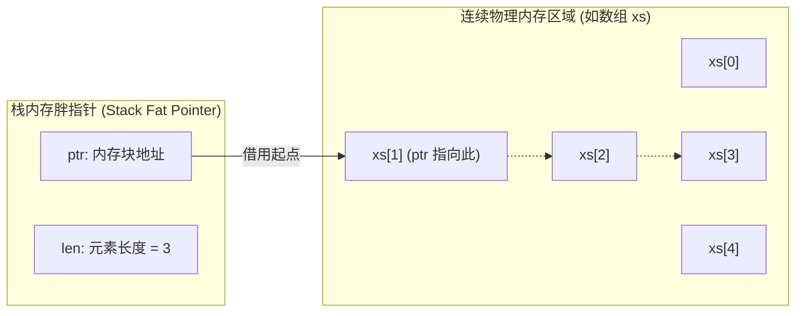

这是传统的 Hello World 程序的源码。Rust 程序的入口点是一个名为 `main` 的函数，通过 Rust 编译器 and 工具链，我们可以从最简单的程序开始，逐步掌握格式化输出、基本类型、流程控制等核心语法。

```rust
// 传统的 Hello World 入门源程序
fn main() {
    // 它是 Rust 的宏，负责向标准输出控制台打印一整行文本信息
    println!("Hello, World!");
}
```

> 🟢 **基础**：适合完全零基础的 Rust 初学者阅读。

---

## 🛠️ 第一步：环境配置与工具链

高效的开发离不开稳定强大的工具链。Rust 官方提供了一套完整的工具链管理系统。

### 1. 安装 Rust 与 `rustup`

`rustup` 是 Rust 的官方工具链安装器和管理器，支持跨平台管理不同的 Rust 版本（如 `stable`、`beta`、`nightly`）。

In macOS / Linux 上，打开终端执行以下命令进行安装：

```bash
curl --proto '=https' --tlsv1.2 -sSf https://sh.rustup.rs | sh
```

> [!TIP]
> **中国大陆镜像加速**：如果您在下载时遇到网络缓慢问题，可以在安装前在终端中配置环境变量使用国内镜像源（如清华大学或字节跳动镜像）：
>
> ```bash
> export RUSTUP_DIST_SERVER="https://rsproxy.cn"
> export RUSTUP_UPDATE_ROOT="https://rsproxy.cn/rustup"
> ```

安装完成后，验证安装结果：

```bash
rustc --version  # 查看编译器版本
cargo --version  # 查看包管理器版本
```

### 2. 核心组件介绍

安装 Rust 后，你的系统中会拥有以下几个核心组件：

- **`rustc`**：Rust 编译器，负责将 `.rs` 源代码编译成机器码。
- **`cargo`**：Rust 的构建系统和包管理器。日常开发中，我们几乎 99% 的工作都是与 Cargo 交互，而不需要直接调用 `rustc`。
- **`rustup`**：工具链管理器。例如，升级 Rust 只需要运行 `rustup update`。

---

## 📦 现代工程的起点：包管理器 Cargo

Cargo 是 Rust 备受赞誉的原因之一。它集成了编译、包管理、运行、测试和文档生成等所有日常功能。

### 1. 创建项目

创建一个名为 `hello_rust` 的新项目：

```bash
cargo new hello_rust --bin
```

*提示：`--bin` 表示创建一个可执行程序项目，如果是库项目，可使用 `--lib`。*

创建后的目录结构如下：

```text
hello_rust/
├── Cargo.toml      # 项目清单与依赖配置文件
└── src/
    └── main.rs     # 入口源文件
```

### 2. 认识 `Cargo.toml`

`Cargo.toml` 使用 TOML 格式，是项目的配置核心：

```toml
[package]
name = "hello_rust"      # 项目名称
version = "0.1.0"        # 项目版本
edition = "2021"         # Rust 语言大版本（如 2018, 2021）

[dependencies]
# 在此处添加第三方库依赖，例如：
# serde = "1.0"
```

### 3. 构建与运行命令

在项目根目录下，你可以使用以下指令：

| 命令 | 描述 | 适用场景 |
| :--- | :--- | :--- |
| `cargo build` | 编译当前项目，生成可执行文件在 `target/debug/` | 检查代码是否可编译 |
| `cargo run` | 编译并在一步之内直接运行生成的可执行文件 | 快速调试和运行代码 |
| `cargo check` | 快速检查代码语法和类型，但不生成可执行文件 | 编写代码时的高频实时语法验证（速度极快） |
| `cargo build --release` | 启用编译器终极优化进行编译，生成在 `target/release/` | 准备发布或部署生产环境 |

---

## 📝 经典起步：Hello World 与格式化输出

### 1. 注释

Rust 支持两种注释方式。注释会被编译器忽略：

```rust
// 这是单行注释。

/*
  这是多行注释。
  可以跨越多行。
*/
```

### 2. 格式化输出 (Formatted Print)

Rust 的格式化输出由 `std::fmt` 中定义的一系列宏（Macros）来处理。最常用的有：

- `format!`：将格式化文本写入到 `String` 中。
- `print!`：与 `format!` 类似，但将文本输出到控制台（stdout）。
- `println!`：与 `print!` 类似，但输出时会在末尾追加换行符。
- `eprintln!`：与 `println!` 类似，但文本输出到标准错误流（stderr）。

#### 基础语法与控制参数

```rust
fn main() {
    // 1. 最基本的占位符，由参数依次替换
    println!("{} days", 31);

    // 2. 位置参数：指定参数的索引
    println!("{0} 的生日是 {1}。{0} 很开心！", "Alice", "10月1日");

    // 3. 命名参数：直接使用变量名映射
    println!("{subject} {verb} {object}",
             object="the lazy dog",
             subject="the quick brown fox",
             verb="jumps over");

    // 4. 进制格式化
    println!("基数 10:       {}", 69420);
    println!("基数 2 (二进制): {:b}", 69420);
    println!("基数 8 (八进制): {:o}", 69420);
    println!("基数 16 (十六进制): {:x}", 69420);

    // 5. 对齐与宽度控制
    // 右对齐，宽度为 5，多余部分空格填充
    println!("{number:>5}", number=1);
    // 左对齐，多余部分使用字符 '0' 填充，结果为 "10000"
    println!("{number:0<5}", number=1);
    // 使用命名参数来动态指定宽度
    println!("{number:>width$}", number=1, width=5);
}
```

#### `Debug` 与 `Display`

所有希望打印输出的类型都必须实现格式化特征（Formatting Traits）。默认情况下，标准库类型实现了 `Display`（用于面向普通用户的 `{}`）或 `Debug`（用于面向开发者的 `{:?}`）。

对于自定义类型（例如结构体），默认是无法打印的，必须手动实现或通过派生（derive）引入特征：

```rust
// 1. 自动派生 Debug 特征。这使得该结构体可以使用 `{:?}` 打印
#[derive(Debug)]
struct Structure(i32);

// 2. 手动实现 Display 特征以自定义漂亮的用户界面打印输出
use std::fmt;

struct Point2D {
    x: f64,
    y: f64,
}

impl fmt::Display for Point2D {
    fn fmt(&self, f: &mut fmt::Formatter) -> fmt::Result {
        // 自定义打印格式：(x, y)
        write!(f, "x: {}, y: {}", self.x, self.y)
    }
}

fn main() {
    // Debug 打印
    println!("Debug 输出: {:?}", Structure(3));
    // 美化后的 Debug 打印，带有换行和缩进
    println!("美化 Debug:\n{:#?}", Structure(3));

    // Display 打印
    let point = Point2D { x: 3.3, y: 4.4 };
    println!("Display 输出: {}", point);
}
```

#### 测试实例：`List`

下面的例子展示了如何通过 `write!` 宏为包含 `Vec` 的结构体实现 `fmt::Display`：

```rust
use std::fmt;

struct List(Vec<i32>);

impl fmt::Display for List {
    fn fmt(&self, f: &mut fmt::Formatter) -> fmt::Result {
        // 解构内部 Vec
        let vec = &self.0;

        // 写入前缀字符 '['
        write!(f, "[")?;

        // 迭代 vec 中的所有项
        for (count, v) in vec.iter().enumerate() {
            // 在除第一项外的其他项前加入逗号
            if count != 0 { write!(f, ", ")?; }
            // 写入当前元素的值及索引
            write!(f, "{}: {}", count, v)?;
        }

        // 写入后缀字符 ']' 并返回结果
        write!(f, "]")
    }
}

fn main() {
    let v = List(vec![1, 2, 3]);
    println!("{}", v); // 输出: [0: 1, 1: 2, 2: 3]
}
```

#### 测试实例：`Color`

下面这个例子展示了如何通过 `fmt::Display` 格式化输出颜色值。我们使用特定的格式化参数 `{:02X}`（零填充，宽度为 2，十六进制大写）来打印其 RGB 与对应的十六进制颜色：

```rust
use std::fmt;

struct Color {
    red: u8,
    green: u8,
    blue: u8,
}

impl fmt::Display for Color {
    fn fmt(&self, f: &mut fmt::Formatter) -> fmt::Result {
        // 计算其十六进制值，并进行格式化输出。
        // :02X 表示十六进制大写，不足两位的左边补零
        write!(
            f,
            "RGB ({}, {}, {}) 0x{:02X}{:02X}{:02X}",
            self.red, self.green, self.blue, self.red, self.green, self.blue
        )
    }
}

fn main() {
    let color = Color { red: 128, green: 255, blue: 90 };
    println!("{}", color); // 输出: RGB (128, 255, 90) 0x80FF5A
}
```

---

## 🔤 原生类型与字面量

### 1. 原生类型分类

Rust 包含以下原生类型：

- **标量类型 (Scalar Types)**：
  - 整型：有符号（`i8`, `i16`, `i32`, `i64`, `i128`, `isize`）及无符号（`u8`, `u16`, `u32`, `u64`, `u128`, `usize`）。
  - 浮点型：`f32`, `f64`。
  - 布尔型：`bool`，取值为 `true` 或 `false`。
  - 字符型：`char`（4 字节 Unicode 标量值），例如 `'a'`、`'🦀'`。
- **复合类型 (Compound Types)**：
  - 元组：例如 `(500, 6.4, 1)`。
  - 数组：例如 `[1, 2, 3, 4, 5]`。

### 2. 字面量与运算符

Rust 拥有丰富的运算符，并且整型字面量支持添加后缀以显式指定类型。

```rust
fn main() {
    // 1. 带有类型后缀的字面量
    let x = 1u8;
    let y = 2u32;
    let z = 3.0f32;

    // 2. 运算符与位运算
    println!("1 + 2 = {}", 1u32 + 2u32);
    println!("1 - 2 = {}", 1i32 - 2i32);
    println!("0011 AND 0101 is {:04b}", 0b0011u32 & 0b0101u32);
    println!("0011 OR 0101 is {:04b}", 0b0011u32 | 0b0101u32);
    println!("0011 XOR 0101 is {:04b}", 0b0011u32 ^ 0b0101u32);
    println!("1 << 5 is {}", 1u32 << 5);
}
```

### 3. 元组 (Tuples) 深度解析

元组是不同类型值的集合。元组可以作为函数的参数和返回值。

#### 测试实例：矩阵转置

```rust
// 包含 4 个浮点数的结构体，表示 2x2 矩阵
#[derive(Debug)]
struct Matrix(f32, f32, f32, f32);

// 实现转置函数，交换右上和左下角元素
fn transpose(matrix: Matrix) -> Matrix {
    Matrix(matrix.0, matrix.2, matrix.1, matrix.3)
}

fn main() {
    let my_matrix = Matrix(1.0, 2.0, 3.0, 4.0);
    println!("原始矩阵: {:?}", my_matrix);
    println!("转置矩阵: {:?}", transpose(my_matrix));
}
```

### 4. 数组 (Arrays) 与切片 (Slices) 深入解析

在 Rust 中，数组和切片提供了对连续内存区域的访问能力，但它们的内存布局与生命周期表现有质的区别。

- **数组 (Array)**：签名形式为 `[T; N]`，在编译期大小已知。其元素被编译器紧凑地分配在**栈 (Stack)** 上（或作为宿主数据结构的内联数据）。
- **切片 (Slice)**：签名形式为 `&[T]` 或 `&mut [T]`，是一个**胖指针 (Fat Pointer)**，用于在运行时动态借用一段连续序列（如数组、`Vec` 或 `String`）的读写视图。

#### 核心结构：切片的胖指针模型

切片在底层结构上占用两个机器字长（如在 64 位系统上总是占用 16 字节）：
1. **`ptr`**：一个指向基础数据块特定起始地址的内存指针。
2. **`len`**：一个表示切片所截取元素数量的元数据字段（`usize` 长度）。



#### 安全防线与高阶越界处理

使用 `[start..end]` 创建切片时，区间逻辑是半开半闭的 $[start, end)$。Rust 具有刚性的边界检查（Bounds Checking），若索引越界将直接抛出恐慌（Panic）。要实现**零 Panic** 的生产级安全代码，必须使用 `get()` 族函数来获取 `Option<T>`。

```rust
// 入参为数组切片的不可变借用
fn analyze_slice(slice: &[i32]) {
    // ⚠️ 直接索引有隐患，仅在高度确定长度的局部逻辑中使用
    println!("切片第一个元素: {}", slice[0]);
    println!("切片长度: {}", slice.len());
}

fn main() {
    // 1. 固定长度数组，签名包含固定常量边界：[T; N]
    let xs: [i32; 5] = [1, 2, 3, 4, 5];

    // 2. 宏初始化语意：[初始化值; 长度]
    let ys: [i32; 500] = [0; 500];

    // 内存开销断言：验证数组完全占用的空间（此处 5 个 i32 就是确切的 20 字节）
    println!("数组 xs 占用字节数: {}", std::mem::size_of_val(&xs));

    // 3. 数组向切片隐式降格：传递全量引用，自动派生 `&[i32]`
    analyze_slice(&xs);

    // 4. 局部借用创建切片：产生基于原数组 [1, 2, 3] 区间的胖指针
    let sub_slice: &[i32] = &xs[1..4];
    analyze_slice(sub_slice);

    // 5. ★ 零 Panic 越界防御访问方案：利用 Get() 发起越界探测
    match xs.get(10) {
        Some(val) => println!("安全读取到: {}", val),
        None => println!("探测到非法越界访问，已被安全层拦截！"),
    }

    // 6. 可变切片操作与借用树限制
    let mut data_pool: [i32; 3] = [10, 20, 30];
    {
        // 通过可变切片改变原内存块的值，被借用期间 data_pool 无法被其它引用读取
        let mut_slice: &mut [i32] = &mut data_pool[1..3];
        mut_slice[0] = 99; // 物理修改了 data_pool[1] 的内存状态
    }
    println!("零成本直接原址突变完毕: {:?}", data_pool); // 输出: [10, 99, 30]
}
```

#### 深入字符串切片 (`&str`) 的本质

除了常见的泛型数组切片 `&[T]`，Rust 中最重要、最频繁交互的切片类型是不可变字符串切片：`&str`。

- 与 `String` 类型拥有独立的堆内存分配生命周期控制不同，`&str` 是所有权自由的视图。
- 绝不使用深拷贝来传递字符数据，由于底层完全复用了目标文本在内存中的分配（通常是只读内存段，或者借用自 `String` 的堆缓冲区），切片总是保持**零成本获取 (Zero-cost Access)**。

```rust
fn print_string_fragment(frag: &str) {
    println!("截取的字符串片段: {}", frag);
}

fn main() {
    // text_data 被分配在二进制的只读数据段，它是静态推导的 &'static str
    let text_data: &str = "Hello, Rust World!";
    
    // 字符串本身也是 UTF-8 编码的 u8 数组，同样通过半开半闭区间进行零成本切片借用
    // ⚠️ 警告：对字符串盲目使用切片极具危险性！由于中文字符可能占用 3 字节，若截割边界没有精确对齐字符边界，将导致运行时 Panic！
    // 这种操作被称为“物理字节对齐要求”。
    let rust_word: &str = &text_data[7..11];
    
    print_string_fragment(rust_word); // 输出: Rust
}
```

#### UTF-8 中文字符串的切片与长度度量

由于 Rust 字符串采用严格的 UTF-8 编码，字符占用的字节长度并不等宽：
- ASCII 字符（如 `a`, `B`, `1`）占用 **1 字节**。
- 绝大多数汉字（如 `中`, `华`, `蟹`）占用 **3 字节**。
- 部分特殊的 Emoji 表情、生僻字占用 **4 字节**。

这就要求开发者必须清晰区分如下两种度量：
1. **字节长度：`.len()`**，返回的是底层 UTF-8 编码所占的**物理字节数**（常数时间 $O(1)$ 复杂度）。
2. **字符个数：`.chars().count()`**，在运行时遍历并检索解码，返回真正的**逻辑字符个数**，其算法复杂度为 $O(n)$。

##### 安全切片与遍历的方法层级

对含有中文的字符串切片时，若随意指定数字范围（如 `&text[0..2]`）大概率触发编译期或运行时 Panic。更健壮安全的范式如下：

```rust
fn main() {
    let chinese_text = "Rust 程序员 🦀";

    // 1. 获取物理字节长度与逻辑字符个数的区别
    let byte_len = chinese_text.len();               // 19 字节
    let char_count = chinese_text.chars().count();    // 10 逻辑字符

    println!("字节数 len: {}, 真实字符数: {}", byte_len, char_count);

    // 2. ❌ 错误切片示范
    // let bad_slice = &chinese_text[0..6]; // Panic! 因为第 5 字节落在了"程"字 (占 3 字节) 的物理编码内

    // 3. ✅ 正确提取中文切片范式（方法一）：基于字符迭代器的跳步提取 (.chars())
    // 提取第 5 到第 8 个逻辑字符："程序员 "（左右闭开，底层零拷贝视图）
    let safe_slice: String = chinese_text.chars().skip(5).take(3).collect();
    println!("逻辑坐标截取: \"{}\"", safe_slice);

    // 4. ✅ 正确提取中文切片范式（方法二）：寻找合法的字节起止位置 (.char_indices())
    // 该迭代器产出 (byte_index, char_value)，保证定位到绝对安全的 UTF-8 物理截割边界
    let mut indices = chinese_text.char_indices();
    
    // 假定我们要安全截取前 4 个字符 "Rust"：
    let split_pos = chinese_text
        .char_indices()
        .map(|(idx, _)| idx)
        .nth(4) // 逻辑第 4 个字符的起始字节位置
        .unwrap_or(byte_len);

    let ascii_part = &chinese_text[..split_pos];
    let remain_part = &chinese_text[split_pos..];
    println!("切割结果 -> 前半部分: \"{}\", 后半部分: \"{}\"", ascii_part, remain_part);
}
```

---

## 🎨 自定义类型：结构体与枚举

### 1. 结构体 (Structs)

在 Rust 中，结构体是创建自定义类型的基石。根据其在字段组织、物理内存和表现语意上的差异，Rust 精准划分为三种结构体类型：

- **具名命名字段结构体 (Named-field Struct)**：清晰清晰、高度自解释，适合存储复杂的属性实体。
- **元组结构体 (Tuple Struct)**：字段没有名字而只有位置，常用于 **Newtype 模式** 来增强类型安全和进行轻量封装。
- **单元结构体 (Unit-like Struct)**：不占用任何物理内存 ($0$ 字节)，适合用于**泛型特征标记**，或定义不含内部状态的行为接口。

```rust
// 1. 经典命名结构体 (Named-field Struct)
// 适用场景：实体建模。例如数据库记录、配置项、网络节点属性等。
#[derive(Debug)]
struct Point {
    x: f32,
    y: f32,
}

// 2. 元组结构体 (Tuple Struct)
// 适用场景 1：多维空间坐标、元组简易封装。
#[derive(Debug)]
struct Pair(i32, f32);

// 适用场景 2：Newtype 模式（封装外部类型，强类型安全校验）。
// 比如即使底层都是 u32，我们也绝不准许把“用户ID”传值给“邮件ID”。
#[derive(Debug)]
struct UserId(u32);
#[derive(Debug)]
struct EmailId(u32);

// 3. 单元结构体 (Unit-like Struct)
// 适用场景：标记或实现特定行为特征（Traits）。不需要状态，只需要逻辑。
// 在内存中始终保持零成本开销（无内存对齐和分配大小）。
struct CpuLevelHighChecked; // 仅仅是个状态编译器标签

trait Benchmark {
    fn run(&self);
}

// 为单元结构体实现 Behavior 特征
impl Benchmark for CpuLevelHighChecked {
    fn run(&self) {
        println!("正在执行极限高规格 CPU 浮点数测试...");
    }
}

fn process_user_action(user: UserId, email: EmailId) {
    println!("用户 {:?} 正在阅读邮件 {:?}", user, email);
}

fn main() {
    // 实例化命名结构
    let origin = Point { x: 0.0, y: 10.5 };
    println!("二维坐标原点: x={}, y={}", origin.x, origin.y);

    // 结构体更新语法 (Struct Update Syntax)：复用基础结构体的其他字段
    let moved_point = Point { x: 5.5, ..origin };
    println!("位移后的坐标: {:?}", moved_point);

    // 实例化元组结构体并使用点运算符索引解构
    let pair = Pair(1, 2.0);
    println!("Pair 索引值为: {}, {}", pair.0, pair.1);

    // 使用 Newtype 规避将不同类型 ID 混淆的静态边界拦截
    let uid = UserId(1001);
    let eid = EmailId(99);
    process_user_action(uid, eid);
    // process_user_action(eid, uid); // ❌ 编译即报错：解耦两组不相容业务实体！

    // 为零大小单元结构体传递无开销实例
    let runner = CpuLevelHighChecked;
    runner.run();
}
```

### 2. 枚举 (Enums)

枚举允许一个类型只能是几种变体之一。与 C 语言等传统枚举仅作为整型标签不同，**Rust 的枚举（又称代数数据类型 Algebraic Data Types）极其强大**。它的每一个变体都可以承载完全不同格式和维度的数据。

#### 核心使用场景与模式

1. **无数据标签型枚举**：等同于 C 风格枚举，常用于简单状态机、配置项映射。
2. **元组类型包装变体**：适合用于承载结构简单、位置关系明确的相关参数（例如单属性参数定义）。
3. **结构体类型包装变体**：当某个分支携带的属性过于繁杂时，将其内联定义为类似匿名结构体的结构，保证属性高度自解释性。

```rust
// 1. 无数据标签枚举：简单状态标记
#[derive(Debug, Clone, Copy)]
enum NetworkState {
    Offline,
    Connecting,
    Online,
}

// 2. 代数数据类型高性能复合枚举：表现复杂的业务协议与运行时行为
// 极其适用于构建：解析 AST（抽象语法树）、网络协议解析、或者应用消息分发（Message Dispatcher）
#[derive(Debug)]
enum WebEvent {
    // 变体 1：无关联数据
    PageLoad,
    PageUnload,
    
    // 变体 2：元组包装：携带单体字符
    KeyPress(char),
    
    // 变体 3：元组包装：多字段
    Paste(String),
    
    // 变体 4：具名结构体包装：携带复杂的定位参数
    Click { x: i64, y: i64 },
}

// 接收不同特征的 WebEvent 动作并分发执行
fn inspect_event(event: WebEvent) {
    match event {
        WebEvent::PageLoad => println!("事件通知: 页面成功载入完毕。"),
        WebEvent::PageUnload => println!("事件通知: 页面已完全卸载释放。"),
        WebEvent::KeyPress(c) => println!("键盘交互: 用户按下了按键 '{}'", c),
        WebEvent::Paste(s) => println!("剪贴板操作: 粘贴文本为 \"{}\"", s),
        WebEvent::Click { x, y } => {
            println!("鼠标指针定位: 捕获到点击事件像素坐标 [X: {}, Y: {}]", x, y);
        }
    }
}

fn main() {
    // 实例化不同变体
    let ev_load   = WebEvent::PageLoad;
    let ev_press  = WebEvent::KeyPress('Q');
    let ev_paste  = WebEvent::Paste(String::from("Rust 零拷贝特征"));
    let ev_click  = WebEvent::Click { x: 1920, y: 1080 };

    inspect_event(ev_load);
    inspect_event(ev_press);
    inspect_event(ev_paste);
    inspect_event(ev_click);

    // 实例 2：状态流演进
    let mut state = NetworkState::Offline;
    state = NetworkState::Connecting;
    println!("当前连接状态: {:?}", state);
}
```

#### 使用 `use` 引入枚举变体

使用 `use` 声明可以让你省去书写冗长作用域的麻烦：

```rust
enum Status {
    Rich,
    Poor,
}

fn main() {
    // 显式导入枚举变体
    use crate::Status::{Rich, Poor};

    let status = Rich; // 不需要写 Status::Rich
}
```

#### C 风格枚举 (C-like enums)

在需要像 C 语言一样指定枚举变体的数值时，可以使用隐式或显式的整型值绑定：

```rust
// 显式指定整型值的枚举
enum Number {
    Zero, // 默认从 0 开始
    One,
    Two = 100, // 显式赋值为 100
    Three,     // 接着上一个值递增，为 101
}

fn main() {
    // 将枚举转换为 i32
    println!("Zero is {}", Number::Zero as i32);
    println!("Two is {}", Number::Two as i32);
    println!("Three is {}", Number::Three as i32);
}
```

#### 测试实例：递归链表

利用枚举实现一个经典的函数式单链表（Singly Linked List）：

```rust
use crate::List::{Cons, Nil};

enum List {
    // Cons: 包含一个元素和一个指向下一节点的 Box 指针
    Cons(u32, Box<List>),
    // Nil: 表示链表的末尾节点
    Nil,
}

impl List {
    // 创建一个空链表
    fn new() -> List {
        Nil
    }

    // 在链表头部插入元素，并返回新链表
    fn prepend(self, elem: u32) -> List {
        Cons(elem, Box::new(self))
    }

    // 计算链表长度
    fn len(&self) -> u32 {
        match self {
            // self 是不可变引用，因此对下一节点的 Box 只能借用 ref
            Cons(_, ref tail) => 1 + tail.len(),
            Nil => 0,
        }
    }
}

fn main() {
    let mut list = List::new();
    list = list.prepend(1);
    list = list.prepend(2);
    list = list.prepend(3);

    println!("链表长度: {}", list.len()); // 输出: 3
}
```

---

## 🔒 变量绑定与类型系统

### 1. 变量可变性与遮蔽

- **可变性**：变量默认不可变。使用 `mut` 关键字标记为可变。
- **变量遮蔽 (Shadowing)**：允许重新声明同名变量，从而暂时或永久遮蔽前一个变量绑定。

```rust
fn main() {
    let x = 5;
    // x = 6; // ❌ 默认不可变，编译报错

    let mut y = 10;
    y = 15; // ✅ 可变

    // 变量遮蔽
    let shadow = 1;
    let shadow = shadow + 1; // 遮蔽前的 shadow，新 shadow 为 2
    let shadow = "Now I am a string"; // 改变了类型，重新绑定
}
```

### 2. 变量先声明

Rust 允许先声明变量，再进行初始化。但是，**在使用未初始化的变量时，编译器会进行静态拦截**以防止未定义行为：

```rust
fn main() {
    let a; // 仅声明，不初始化
    a = 10; // 初始化
    println!("a = {}", a); // ✅ 合法

    let b: i32;
    // println!("b = {}", b); // ❌ 编译报错：use of possibly-uninitialized variable
}
```

### 3. 冻结 (Freezing)

当一个数据被**不可变借用**时，它在当前借用作用域内会被“冻结”。即使它被声明为可变变量，在冻结期间也无法对其执行写修改操作：

```rust
fn main() {
    let mut _mutable_integer = 7i32;

    {
        // 借用可变整数，数据在此作用域被冻结
        let _large_integer = &_mutable_integer;

        // _mutable_integer = 50; // ❌ 编译报错：cannot assign to `_mutable_integer` because it is borrowed
    } // 借用结束，冻结解除

    _mutable_integer = 50; // ✅ 合法
}
```

### 4. 类型系统进阶

- **`as` 强转**：用于原生类型之间的显式类型转换。
- **类型推断**：编译器非常聪明，能自动推导大多数类型。但在没有足够上下文时需借助类型标注或字面量后缀。
- **类型别名**：使用 `type` 关键字给类型赋予别名（通常用于简化长泛型签名）。

```rust
type NanoSecond = u64;

fn main() {
    // 1. as 强转
    let decimal = 65.4321_f32;
    let integer = decimal as u8; // 截断为 65
    let character = integer as char; // 65 对应 'A'

    // 2. 类型别名
    let ns: NanoSecond = 10000;
}
```

---

## ⚡ 表达式与流程控制

### 1. 表达式 (Expressions) vs 语句 (Statements)

在 Rust 中，大多数代码块都是表达式，即它们**有返回值**。

- **语句**：通常以分号 `;` 结尾，其值始终为单元类型 `()`（空元组）。
- **表达式**：如果不加分号，代码块的最后一行会被作为值返回。

```rust
fn main() {
    let x = 5;

    // 代码块是一个表达式
    let y = {
        let x_squared = x * x;
        let x_cube = x_squared * x;

        // 该行无分号，会被返回并赋值给 y
        x_cube + x_squared + x
    };

    println!("y = {}", y); // 输出: 155
}
```

### 2. 循环控制与标签

对于多层嵌套循环，可以使用生存期标签（Lifetime Label）在一层内部直接跳出外层循环：

```rust
fn main() {
    let mut count = 0;

    // 外层循环加上标签 'outer
    'outer: loop {
        println!("进入外层循环");

        loop {
            println!("进入内层循环");
            count += 1;

            if count == 3 {
                // 直接跳出最外层循环
                break 'outer;
            }
        }
    }
}
```

#### 从 `loop` 返回值

`loop` 可以在 `break` 之后返回一个值给外部绑定：

```rust
fn main() {
    let mut counter = 0;

    let result = loop {
        counter += 1;
        if counter == 10 {
            break counter * 2; // 返回 20
        }
    };
}
```

### 3. 深度模式匹配 (Pattern Matching)

`match` 分支必须穷尽所有可能性。它支持极强的解构能力：

#### 解构元组、枚举与结构体

```rust
struct Foo {
    x: (u32, u32),
    y: u32,
}

fn main() {
    // 1. 解构元组
    let triple = (0, -2, 3);
    match triple {
        (0, y, z) => println!("第一个元素是 0, y: {}, z: {}", y, z),
        _ => println!("其他情况"),
    }

    // 2. 解构结构体
    let foo = Foo { x: (1, 2), y: 3 };
    match foo {
        Foo { x: (1, b), y } => println!("匹配！b: {}, y: {}", b, y),
        Foo { y, .. } => println!("仅匹配 y: {}, 忽略 x", y),
    }
}
```

#### 解构指针与引用

当被匹配的变量是一个引用或指针时，解构有以下需要注意的映射逻辑（配合 `ref` 关键字）：

```rust
fn main() {
    let reference = &4;

    match reference {
        // 如果匹配 &val，得到的是解包后的 i32 拷贝值 val
        &val => println!("Got a value via destructuring: {:?}", val),
    }

    // 如果不想解构，可以利用 ref 关键字将未引用的变量绑定为引用类型
    let value = 5;
    match value {
        ref r => println!("Got a reference to value: {:?}", r), // r 类型为 &i32
    }
}
```

#### match 卫语句 (Guards)

可以用卫语句对匹配的分支加入更加灵活的 `if` 条件过滤：

```rust
fn main() {
    let pair = (2, -2);

    match pair {
        (x, y) if x == y => println!("x == y"),
        (x, y) if x + y == 0 => println!("互为相反数！"),
        (x, y) => println!("普通数值对 ({}, {})", x, y),
    }
}
```

#### 模式绑定 `@`

使用 `@` 可以在匹配模式的同时，将对应解构出的子项绑定到一个新的变量中：

```rust
fn main() {
    let age = 15;

    match age {
        // 匹配 13~19 的范围，并将匹配到的数值绑定到 n 变量上
        n @ 13..=19 => println!("青少年，年龄是: {}", n),
        n => println!("其他年龄: {}", n),
    }
}
```

### 4. `if let` 与 `while let`

当只需要处理一个特定的变体，而不在意其他情况时，`if let` 和 `while let` 是极好的语法糖：

```rust
fn main() {
    let optional = Some(7);

    // 替代了写冗长的 match 覆盖 None 分支
    if let Some(i) = optional {
        println!("Got Some: {}", i);
    }

    // while let 适用于循环消费迭代/变体
    let mut optional_stack = vec![Some(1), Some(2), None];
    while let Some(Some(value)) = optional_stack.pop() {
        println!("Popped: {}", value);
    }
}
```

> [!NOTE]
> **下一步建议**：掌握了 Rust 极其严格的基础语法与类型系统后，请继续阅读 [所有权与生命周期核心](5-ownership-lifetimes.md)，了解 Rust 独特的 Borrow Checker 是如何保障内存安全与高并发的。
