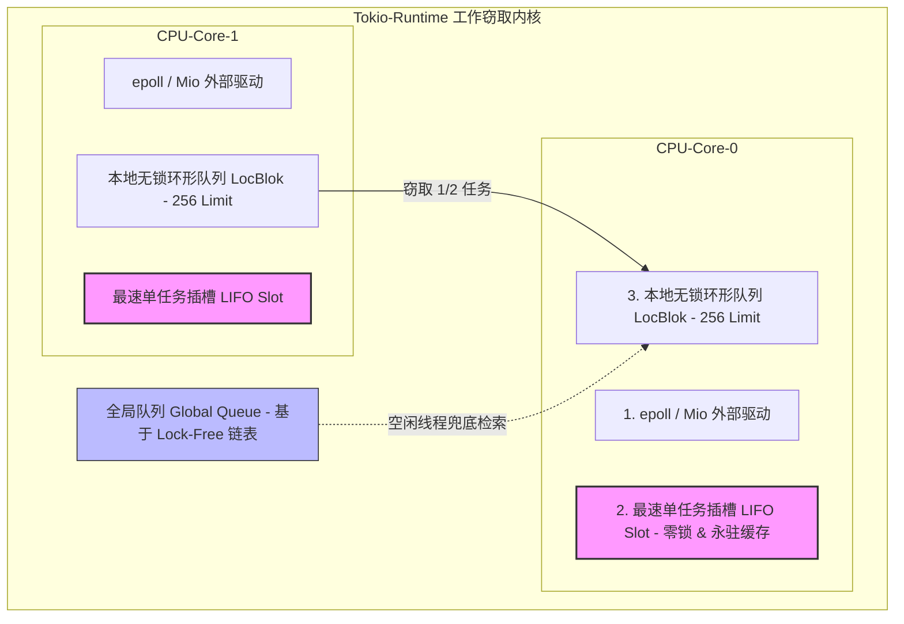
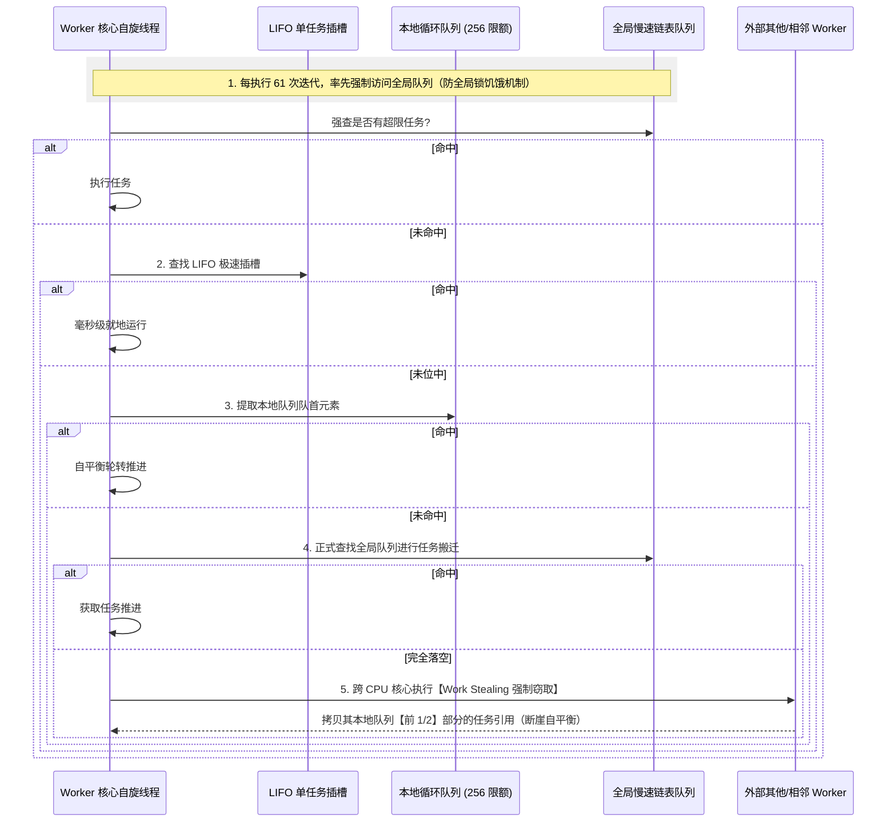
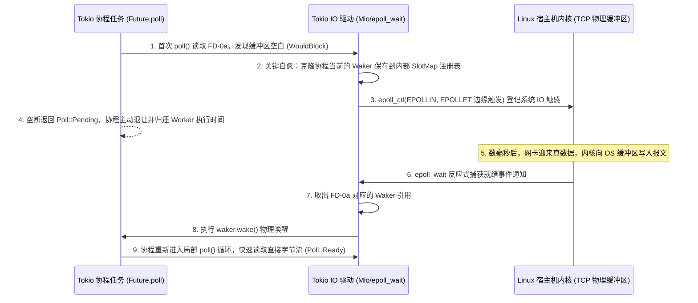

## Rust 进阶：Tokio 异步运行时工作窃取与微调度内核深剖

在传统的并发模型中，每个连接绑定有一条物理线程（Thread-per-Connection）。然而，当请求量突破至 10 万或百万级（C10M 问题）时，物理线程的高昂栈空间分配（Linux 默认约 8MB）和多核 CPU 间频繁破坏缓存行的上下文切换（Context Switch），会让服务瞬间陷入死锁与瘫痪。

Rust 的无损异步（Async/Await）通过 **有状态的 Future 状态机** 与 **零成本抽象 (Zero-Cost Abstractions)** 物理地剥离了操作系统线程的限制。
而在这个底座中，**Tokio** 凭借其极致高性能，成为了绝大部分高负载 Rust 服务端（如高性能网络网关、数据库存储层）事实上的异步系统守护运行内核。

本篇将深入 Tokio 源码深水区，全面解密其多核多线程 **工作窃取（Work-Stealing）微调度引擎**、内核网络事件循环（Mio 边缘触发拦截），以及 Future 在叶子节点与 Waker 状态机转变过程中的无分配（Bufferless）自愈链路。

---

## 一、 Tokio 工作窃取调度器（Work-Stealing）高能拓扑

当我们在 Tokio 中配置 `#[tokio::main]`（默认多线程多任务调度模式）时，Tokio 会在启动时克隆初始化与宿主机 CPU 核心数完全相等的物理 **Worker 线程**。

为了避免类似于传统 Java 线程池中上万线程抢夺同一个全局同步阻塞队列（Global Queue）导致的锁总线（Lock Bus）或严重 CAS 自旋空耗热点，Tokio 设计了极其清爽精妙的 **三级队列工作窃取拓扑**：



### 1. 核心级任务流转调度序列

1. **LIFO Slot（最速单进程单任务插槽）**：
   * **物理特征**：该插槽最大容量仅为 **1**（只能放置一个被 `spawn` 产生的最新 Task 任务引用），没有任何锁或并发，是属于当前 Worker 核心独享常驻的极深寄存器缓存行。
   * **高能原理**：当一个协程 `Task` 触发 A 并接着推进 B 时（极典型的网络级写后立读），最新唤醒的任务会被直接丢入 LIFO Slot。下一次执行器自旋提取时，**瞬间就地命中并由当前物理 CPU 核心执行**。这彻底避开了装入任何大缓存阵列导致的 CPU L1/L2 缓存行失效，执行速度快到极限。
2. **Local Circular Queue（本地无锁环形队列）**：
   * **物理特征**：每个 Worker 独享的一个长度上限为 **256** 的无锁环形数组。
   * **高能原理**：通过单生产者双消费者（Single-Producer Multi-Consumer）的无锁 CAS 模型。当前核心是唯一的“生产端”，可以在尾部进行无锁的 $O(1)$ 极速插入；而其他空闲 Worker 线程是“消费者”，充当着潜在的“窃取者”。
3. **Global Queue（全局共享队列）**：
   * 所有 Worker 共享的慢速、基于侵入式 Lock-Free 链表的超限任务存储器。

---

### 2. 完美的“饥饿自愈”工作窃取算法流

一个 Worker 线程在执行无休止的 `run()` 事件自旋循环时，其检索并执行 Task 的优先级别和检索算法有着极强的数学规律防御：



* **大厂考点：为什么要规定“每 61 次循环必须强行检索一次全局队列”？**
  * **原理解析**：如果本地队列里的协程发生大量的死循环或互相调用自旋，若没有这个阈值机制，
  由于工作窃取算法对“本地缓存”高优先级的绝对倾斜，导致**全局队列中的新任务将被无期无限地推迟（即发生系统线程饥饿）**。
  定频 61 次的强制清洗，能够保障在极高负载下，全局未分配任务在多核环境下的绝对公平调度与不退化。

---

## 二、 零成本抽象本质：Waker 状态机与 Mio 边缘触发（EPoll）拦截

Rust 异步编程的核心魅力在于其 **延迟计算（Lazy Evaluation）** 指标。
当你在 Rust 中写下 `let fut = my_async_func();` 时，**物理上不会执行任何哪怕是一个指令的代码**。它仅仅生成了一个干净的、实现了 `Future` 接口的结构体实例（即状态机对象）。

真正被推进和执行，依赖于最叶子节点的执行通知：**`std::task::Waker`（唤醒器）**。

### 1. 物理 Waker 状态机流转大底

我们以最底层的网络 IO（非阻塞 TCP Read）为例，拆解 `mio`、`epoll` 边缘触发与 Waker 的跨维互联进程：



### 2. 极致零成本：为什么 Waker 唤醒不用产生任何 JVM 级的线程高碎内存

如果你阅读 Rust 标准库中的 Waker 源码，会发现它的声明极其冷酷、没有使用任何复杂的重型 C 动态代理：

```rust
pub struct RawWaker {
    data: *const (), // 裸数据指针：物理指向协程状态机在堆中的绝对存储地址
    vtable: &'static RawWakerVTable, // 函数虚表：包含底层克隆、释放、唤醒的 C++ 级别函数指针
}
```

* **无动态虚拟机管理（Memory Efficient）**：`RawWaker` 的设计精细到了“字节级”。在其函数指针虚表中，`wake` 函数的实现直接是根据传入的 `data` 物理指针去将堆中处于 `Pending` 状态的 Future
所封包的 `Arc<Task>`
重新塞入 Tokio 的本地环形队列。
* 这中间**没有任何垃圾回收 (GC) 的跟踪损耗，没有多余的托管堆内存分配**，这也是为什么 Rust 书写的异步网关仅需 20MB 左右常驻内存的核心机密。

---

## 三、 实战：手动脱离运行库封装，实现自定义最简 Future 状态机与 Waker 发射

我们将动手从底层实现一个**手动状态机转换器（不借用任何编译期 `async/await` 魔法翻译，完全采用手动构造 poll、waker 计数反馈）**，直击异步的本源。

### 1. 手动脱离 async 拼装，重织 Future 执行链路

```rust
use std::future::Future;
use std::pin::Pin;
use std::task::{Context, Poll};
use std::sync::{Arc, Mutex};
use std::thread;
use std::time::Duration;

/// 1. 物理状态机结构体定义：底层的非阻塞共享资源
pub struct HeavyCalculationFuture {
    state: Arc<Mutex<FutureSharedState>>,
}

struct FutureSharedState {
    completed: bool,
    result: Option<u64>,
    waker: Option<std::task::Waker>, // 预留 Slot：保存用于在异步任务完成时物理呼救的 waker
}

impl HeavyCalculationFuture {
    pub fn new() -> Self {
        let state = Arc::new(Mutex::new(FutureSharedState {
            completed: false,
            result: None,
            waker: None,
        }));

        // 强行复制一份多线程执存指针，交由旁路后台常驻线程（模拟 Mio 事件或外置 OS 数据源）
        let thread_state = Arc::clone(&state);
        thread::spawn(move || {
            // 模拟高负荷网络 IO 异步等待 2 秒
            thread::sleep(Duration::from_secs(2));
            
            let mut guard = thread_state.lock().unwrap();
            guard.completed = true;
            guard.result = Some(4226); // 写入完成数据
            
            // 2. 关键节点：如果发现 poll() 已经预留并注册了 Waker，立刻执行 WAKE 唤醒。
            // 这会把底层的 Future 重新塞回 Tokio 执行队列
            if let Some(waker) = guard.waker.take() {
                println!("【Waker 发射】 物理计算就绪！触发 waker.wake() 反射回 Tokio 调度链路");
                waker.wake();
            }
        });

        HeavyCalculationFuture { state }
    }
}

/// 3. 二次淬炼：手动开发高能 Future 标准轮询接口
impl Future for HeavyCalculationFuture {
    type Output = u64;

    fn poll(self: Pin<&mut Self>, cx: &mut Context<'_>) -> Poll<Self::Output> {
        let mut guard = self.state.lock().unwrap();
        
        if guard.completed {
            // 判定完成：直接返回 Ready, 宣告数据到手
            Poll::Ready(guard.result.unwrap())
        } else {
            // 被迫挂起：将来自上层运行时（如 Tokio Worker 传导下的上下文句柄）的 waker 克隆保存入库
            // 极其利于后台线程在未来精准发射
            guard.waker = Some(cx.waker().clone());
            
            println!("【Future.poll】 数据未到达，注册并缓存 Waker，返回 Pending 挂起并释放当前 CPU 核心资源");
            Poll::Pending
        }
    }
}
```

---

### 2. 绑定 Tokio 多线程运行时进行并发验证

我们将通过标准的 Tokio 异步底座拉起这个纯粹手动生成的，处于微秒层的高维 Future 实例：

```rust
#[tokio::main(flavor = "multi_thread", worker_threads = 4)]
async fn main() {
    println!("【主协程】 启动！创建自定义 Future 实例");
    
    let heavy_future = HeavyCalculationFuture::new();
    
    // 异步无阻等待：
    // 在这里 await 发生时，当前协程会在第一次 poll 返回 Pending 时，直接将控制权交还给 Tokio 4 核心 Worker 池，
    // 使该核心可以无阻塞抢先处理其他连接的 HTTP 请求。
    let result = heavy_future.await;
    
    println!("【主协程】 成功获取异步最终运算结果: {}", result);
}
```

### 3. 可视化状态执行打印盘点

当你运行上述测试时，其控制台将展现出高度完美的流水自愈图：
1. `【主协程】 启动！创建自定义 Future 实例`
2. `【Future.poll】 数据未到达，注册并缓存 Waker，返回 Pending 挂起并释放当前 CPU 核心资源`（当前核心立刻去处理别的并发连接，没有产生核心锁死）
3. `【Waker 发射】 物理计算就绪！触发 waker.wake() 反射回 Tokio 调度链路`（底层 Mio 触发唤醒）
4. `【主协程】 成功获取异步最终运算结果: 4226`

这正是 Rust Tokio 对并发资源微调度精细化设计到物理底标的绝对体现。相比 Java 动辄数万空跑自旋的线程，这种能够对 Waker 状态进行零成本、极细粒度按需调度回压的工作窃取（Work-Stealing）拓扑，是打造全球顶级高性能网络基建的终极秘密武器。
