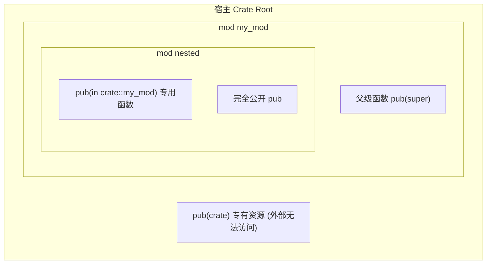

## Rust 项目结构与模块化

随着项目规模的增长，我们需要使用模块来组织代码，并在文件系统上进行清晰的分层。本篇将详细介绍 Rust 中的模块系统、可见性控制、Cargo 包管理器的进阶机制以及属性（Attributes）的应用。

> 🟢 **基础**：掌握基本语法即可阅读。

---

## 📂 Rust 模块系统 (Modules)

模块系统允许我们将代码划分为逻辑单元（Modules），并显式控制其**可见性**（Visibility）。

### 1. 可见性控制系统与封装边界

在 Rust 中，可见性（Visibility）遵循**默认私有 (Default Private)** 的硬规则：所有定义在模块级、Crate 级或结构体中的项（如函数、类型定义、字段、静态变量、特征、常量）默认都在定义它们的当前模块及其子模块内部可见，而对父模块或外部 Crate 严格不可见。这就是 Rust 精妙的内置强胶囊化设计。

为了打破这一边界，使项可见，Rust 提供了多层细腻的可见性说明符：

#### 可见性描述符一览与应用场景

- `pub`：**完全公共可见**。一旦被标记为 `pub`，该项就可以被当前 Crate 乃至任何依赖此 Crate 的外部工程在符合路径解析的情况下引用。
- `pub(crate)`：**Crate 内部公共可见**。表示该项仅在当前宿主 Crate 中可见并被随意访问，一旦超出当前编译边界（即被打包为第三方模块供别人调用时），此字段/函数会自动对外部调用者隐形。
- `pub(self)`：**当前模块可见**。等同于默认的私有规则（也就是不加任何可见性修饰符），在当前模逻辑树作用域内可用。
- `pub(super)`：**父级模块可见**。表示该项不仅在当前模块及子模块内可见，同时专门向该模块的直接双亲父模块公开可视权限，便于父子模块内紧密耦合逻辑的低成本通信。
- `pub(in path)`：**限定特定作用域可见**。最强大的高级限定符。必须提供一个以 `crate`、`self` 或 `super` 起头的绝对/相对祖先模块路径。该项在该指定的模块路径树之外的任何地方都自动降级为私有。

#### 模块可见性拓扑示图



#### 可见性契约代码范式

```rust
// 一组模块可见性体系设计
mod my_mod {
    // 1. 完全私有函数，仅允许在 my_mod 内部和其子模块中被直接调用
    fn private_function() {
        println!("called `my_mod::private_function()`");
    }

    // 2. 完全公共可见函数
    pub fn function() {
        println!("called `my_mod::function()`");
    }

    // 3. 限定仅在当前宿主 Crate 内部任意位置可见
    pub(crate) fn crate_visible_function() {
        println!("called `my_mod::crate_visible_function()`");
    }

    // 4. 限定对父模块 (这里 my_mod 的父模块就是 crate 顶层) 可见
    pub(super) fn parent_visible_function() {
        println!("called `my_mod::parent_visible_function()`");
    }

    // 嵌套模块
    pub mod nested {
        // 5. 局限到特定模块边界：仅在 my_mod 内部与其子模块内可见
        pub(in crate::my_mod) fn module_restricted_function() {
            println!("called `my_mod::nested::module_restricted_function()`");
        }

        pub fn function() {
            // 子模块可以直接访问其祖先模块的所有私有项 ── 无视 private 限制！
            super::private_function(); 
            println!("called `my_mod::nested::function()`");
        }
    }
}

fn test_execution() {
    // 成功调用：my_mod 对 crate root 同级可见
    my_mod::function();
    my_mod::crate_visible_function();
    my_mod::parent_visible_function();

    // my_mod::private_function(); // ❌ 编译报错：private_function 是私有的

    my_mod::nested::function();
    // my_mod::nested::module_restricted_function(); // ❌ 编译报错：module_restricted_function 限制仅在 my_mod 内可见
}
```

### 2. 结构体与枚举的可见性差异

- **结构体**：结构体的字段默认是私有的，即使结构体本身是 `pub` 的。我们需要在各个需要公开的字段前单独添加 `pub`：

  ```rust
  pub struct ClosedBox<T> {
      pub contents: T, // 公开字段
      metadata: String, // 私有字段
  }
  ```

- **枚举**：如果一个枚举被声明为 `pub`，那么它所有的变体（Variants）都会自动变为 `pub`，不需要（也不能）在变体前加 `pub`：

  ```rust
  pub enum Role {
      Admin, // 自动为 pub
      User,  // 自动为 pub
  }
  ```

### 3. `use` 声明

使用 `use` 关键字可以将特定的路径引入到当前作用域中，甚至可以使用 `as` 关键字进行重命名：

```rust
use deeply::nested::function as other_function;

fn main() {
    other_function(); // 相当于调用 deeply::nested::function()
}
```

### 4. `super` 与 `self`

- **`self`**：表示当前的模块。
- **`super`**：表示父级模块（可以方便地用于调用父级作用域的同名项，或在写测试模块时引用父模块定义）。

```rust
fn function() {
    println!("called `function()`");
}

mod cool {
    pub fn function() {
        println!("called `cool::function()`");
    }

    pub fn indirect_call() {
        // 访问当前模块中的 function
        self::function();

        // 访问父模块中的 function
        super::function();
    }
}
```

### 5. 文件分层管理 (File Hierarchy)

对于大型模块，将其内容全部写在一个源文件中会难以维护。Rust 允许我们将模块拆分到不同的文件中。

假设我们在 `main.rs` 中声明模块 `mod my_mod;`：

```rust
// main.rs
mod my_mod; // 编译器会寻找 my_mod.rs 或 my_mod/mod.rs 文件

fn main() {
    my_mod::hello();
}
```

在同级目录下，我们创建 `my_mod.rs` 文件：

```rust
// my_mod.rs
pub fn hello() {
    println!("Hello from my_mod file!");
}
```

---

## 📦 Crate 与 Cargo

- **Crate**：是 Rust 的编译单元。Crate 可以是一个二进制可执行文件（Binary Crate，如 `main.rs` 作为入口），也可以是一个库（Library Crate，以 `lib.rs` 作为入口）。
- **Cargo**：是 Rust 的包管理器，用于自动下载和构建项目依赖。

### 1. 依赖管理 (`Cargo.toml`)

我们可以直接在 `Cargo.toml` 的 `[dependencies]` 下声明依赖：

```toml
[dependencies]
# 1. 声明来自 crates.io 托管站点的依赖与对应版本
serde = "1.0"

# 2. 声明来自本地路径的依赖
my_local_utils = { path = "../my_local_utils" }

# 3. 声明来自 Git 仓库的依赖
tokio = { git = "https://github.com/tokio-rs/tokio", branch = "master" }
```

### 2. 构建脚本 (Build Scripts)

如果在编译前需要执行一些特殊的构建任务（例如编译 C 语言底层库、生成代码或进行系统级探针），可以在项目根目录下创建 `build.rs`。Cargo 在编译当前项目前会自动编译并执行该脚本。

```rust
// build.rs
fn main() {
    // 告诉 Cargo 在 src/hello.c 发生改变时重新运行此构建脚本
    println!("cargo:rerun-if-changed=src/hello.c");
}
```

---

## 🏷️ 属性 (Attributes)

属性是应用于某些模块、crate 或项的元数据（Metadata），它们使用 `#[attribute]` 声明，或者使用 `#![attribute]`（带感叹号，作用于当前整个文件或模块）。

### 1. 条件编译 `#[cfg(...)]`

通过 `cfg` 属性，我们可以控制代码仅在满足特定编译条件时才进行编译：

```rust
// 仅在目标操作系统为 linux 时编译此函数
#[cfg(target_os = "linux")]
fn are_you_on_linux() {
    println!("Yes, this is Linux!");
}

// 仅在执行测试（cargo test）时编译此模块
#[cfg(test)]
mod tests {
    // ...
}
```

#### 自定义条件编译

除了系统默认提供的 `target_os` 等条件外，我们还可以通过自定义条件标签来控制编译。

在代码中，我们可以使用自定义标志：

```rust
#[cfg(some_custom_flag)]
fn conditional_function() {
    println!("仅在 some_custom_flag 启用时，该函数才会被编译！");
}
```

在编译时，我们可以通过传参启用该标志：

- 使用 `rustc` 编译时：`rustc --cfg some_custom_flag main.rs`。
- 使用 Cargo 时：在 `Cargo.toml` 中配置 `[features]`，或者在运行时通过环境变量/参数传递。

### 2. 常见属性

- `#[allow(dead_code)]`：允许存在未使用的代码，编译器不会对此进行警告。
- `#[derive(...)]`：为类型自动派生常用特征（如 `Clone`, `Debug` 等）。
- `#[inline]`：向编译器建议将该函数进行内联展开，以优化性能。

---

## 🌐 兼容性与补充

### 1. 原始标识符 (Raw Identifiers)

Rust 拥有许多保留字（关键字），例如 `try`、`match`、`fn` 等。如果你的外部底层库（或者老版本代码）中使用了这些关键字作为函数或变量名，你可以使用 `r#` 原始标识符来绕过编译限制：

```rust
fn r#match() {
    println!("This function is named `match`!");
}

fn main() {
    r#match(); // 正常调用
}
```

### 2. 文档注释 (Doc Comments)

Rust 支持使用特定的文档注释，运行 `cargo doc --open` 可以自动生成 HTML 文档：

- `///`：为它之后的项生成文档。
- `//!`：为包含它的项（如整个模块或 Crate 文件头部）生成文档。

```rust
//! # My Awesome Utility Crate
//!
//! 提供了一系列基础的数学运算。

/// 计算两个整数的和。
///
/// # 示例
///
/// ```
/// let result = hello_rust::add(2, 3);
/// assert_eq!(result, 5);
/// ```
pub fn add(a: i32, b: i32) -> i32 {
    a + b
}
```

> [!NOTE]
> **下一步建议**：掌握了项目的组织与分层设计后，请继续阅读 [所有权与生命周期核心](5-ownership-lifetimes.md)，深入了解 Rust 在处理复杂模块架构时的内存所有权与生命周期治理。
