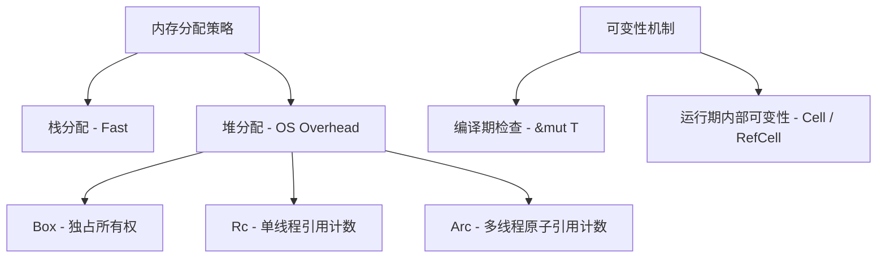

## Rust 内存布局与零拷贝优化

在 Rust 中，要写出极致性能的代码，必须深入理解数据的内存布局以及如何避免不必要的内存分配和拷贝。通过充分利用编译器对数据结构的优化以及借用检查器提供的安全保障，我们可以在保持内存安全的同时达到甚至超越 C/C++ 的运行效率。

> 🟢 **基础**：掌握基本语法即可阅读 ｜ 🟡 **进阶**：需要有一定 Rust 开发经验 ｜ 🔴 **高级**：面向系统级开发者与性能工程师

---

## 🟢 智能指针与容器的运行开销

高级 Rust 编程不可避免地会频繁遭遇智能指针。然而，每一种智能指针都携带着特定的内存和运行时成本。



### 1. `Box<T>`：最纯粹的堆分配

`Box<T>` 是 Rust 中最简单的堆分配智能指针，它拥有对堆内存的**独占所有权**。当离开作用域时，堆内存自动释放，无需手动 `free`。

如果 `T` 是固定大小类型（`Sized`），`Box<T>` 在栈上仅占 1 个 `usize`（即一个原始堆地址指针）。

```rust
fn box_demo() {
    let b = Box::new(5); // 5 存储在堆上，b 是一个栈上的指针
    println!("b = {}", b); // 自动解引用，打印 5
    // 离开作用域，堆内存自动释放
}
```

`Box<dyn Trait>` 和 `Box<[T]>` 是动态大小类型（DST），此时 `Box` 在栈上会跃升为**胖指针（Fat Pointer）**，占 2 个 `usize`：

1. 指向堆上数据的指针。
2. 指向虚函数表（vtable）的指针，或切片的实际长度（length）。

### 2. `Rc<T>` / `Arc<T>`：引用计数多路访问

`Rc<T>`（单线程）和 `Arc<T>`（多线程原子安全）允许多个地方"共同拥有"同一份堆数据。很多人误以为引用计数存储在栈上，其实**引用计数完全常驻在堆上**。

当调用 `Arc::new(T)` 时，会在堆上一次性分配一整块连续内存：

```rust
// 伪代码：Arc 堆上的真实底层结构
struct ArcInner<T> {
    strong: AtomicUsize, // 强引用计数器
    weak: AtomicUsize,   // 弱引用计数器
    data: T,             // 被包裹的用户数据
}
```

每次 `.clone()` 只需对原子计数器自增，**不发生对 `T` 的任何拷贝**。

---

## 🟢 内部可变性容器

Rust 的借用规则在编译期强制执行，但有时需要在运行期才能确定是否需要修改数据。此时可以使用内部可变性容器。

### 1. `Cell<T>`：零成本单值替换

`Cell<T>` 通过**值的整体替换（Move/Copy）**来实现内部可变，不允许借出内部引用。由于不持有任何引用，完全绕开了借用检查器，也没有任何运行时锁开销。适合轻量级 `Copy` 类型（如 `i32`、`bool`）。

```rust
use std::cell::Cell;

let cell = Cell::new(5);
cell.set(10); // 直接替换值，无需 mut 绑定
println!("{}", cell.get()); // 10
```

### 2. `RefCell<T>`：运行时借用检查

`RefCell<T>` 在运行时通过引用计数器模拟编译期的借用规则。如果同时获取两个可变引用，会在运行时触发 `panic!`。

```rust
use std::cell::RefCell;

let data = RefCell::new(vec![1, 2, 3]);
data.borrow_mut().push(4); // 运行时检查：OK
println!("{:?}", data.borrow()); // [1, 2, 3, 4]
```

---

## 🟡 零拷贝实践 (Zero-copy Optimization)

零拷贝意味着在内存反序列化、字符串裁剪、数据传递时，全程用引用和生命周期串联，**拒绝产生任何深拷贝（Deep Copy）**。

### 1. 使用 `Cow<'a, T>` 实现写时复制 (Copy-on-Write)

`Cow<'a, T>` 是一个枚举，表示数据要么是借用的（`Borrowed`），要么是拥有的（`Owned`）。当需要进行修改时，它才会执行分配并进行拷贝，绝大多数只读路径完全零分配。

```rust
use std::borrow::Cow;

pub fn sanitize_log<'a>(input: &'a str) -> Cow<'a, str> {
    if input.contains("PASSWORD=") {
        // 只有包含敏感词才进行深拷贝和替换
        let sanitized = input.replace("PASSWORD=", "STARTS=");
        Cow::Owned(sanitized)
    } else {
        // 绝大多数健康日志，直接采用引用，零内存重分配开销
        Cow::Borrowed(input)
    }
}
```

### 2. `AsRef<T>` 与 `Borrow<T>`：通用借用转换

- **`AsRef<T>`**：表达极其廉价的借用转换，通常只是强制转换指针类型，不产生额外开销。
- **`Borrow<T>`**：比 `AsRef` 拥有更加严密的数学语义。`Borrow` 约定：如果一个类型实现了 `Borrow<Q>`，那么它和 `Q` 的 `Hash`、`Ord` 以及 `Eq` 结果必须完全保持一致。

```rust
use std::borrow::Borrow;
use std::collections::HashMap;

fn find_value<K, V, Q>(map: &HashMap<K, V>, key: &Q) -> Option<&V>
where
    K: Borrow<Q> + std::hash::Hash + Eq,
    Q: std::hash::Hash + Eq + ?Sized,
{
    map.get(key)
}
```

通过这种设计，`HashMap<String, i32>` 可以直接用 `&str` 作为检索主键，完美消除了通过生成 `&String` 而产生的额外不必要深拷贝。

---

## 🟡 动态尺寸类型 (DST) 与 Sized 特征

在 Rust 中，大多数类型在编译期都有已知且固定的内存大小，这些类型都隐式实现了 `std::marker::Sized` 特征。然而，Rust 还支持在编译期无法确定大小的类型，即**动态尺寸类型 (Dynamic Sized Types, DST)**。

### 1. 常见的 DST

- **切片类型**：例如 `[u8]`（裸字节数组切片）或 `str`（UTF-8 字符串切片）。它们只代表一段连续内存，没有长度信息。
- **特征对象 (Trait Object)**：例如 `dyn MyTrait`。它代表实现了特定特征的某种具体类型，但在编译期无法预知具体类型是哪一个，其大小自然也是未知的。

由于 DST 的大小不确定，**我们无法在栈上直接声明 DST 变量，也不能将它们直接作为函数参数或返回值传递**：

```rust
// ❌ 编译报错：编译期大小未知
// let slice: [u8] = [1, 2, 3]; 
// let string: str = *"hello";
```

### 2. 胖指针 (Fat Pointer) 机制

为了操作 DST，我们必须通过引用或智能指针（如 `&[u8]`、`&str`、`Box<dyn MyTrait>`）将其包裹起来。这些指针被称为**胖指针（Fat Pointer）**，在栈上占用 2 个 `usize`：
- **数据指针**：指向堆或栈上具体数据的起始地址。
- **元数据指针**：对于切片是其**元素个数（Length）**；对于特征对象则是指向**虚函数表（vtable）**的指针。

```rust
// 栈上胖指针占用 2 个 usize (16 字节在 64 位系统上)
assert_eq!(std::mem::size_of::<&[u8]>(), 16);
assert_eq!(std::mem::size_of::<Box<dyn std::any::Any>>(), 16);
```

### 3. `?Sized` 特征约束与泛型放宽

默认情况下，Rust 的所有泛型参数都隐式携带一个 `T: Sized` 约束。这意味着泛型只能用于编译期大小确定的类型。

如果希望泛型可以接收 DST，必须显式使用 `?Sized` 语法（意为“可能不是 Sized 的”）：

```rust
// 默认带有 T: Sized 约束，不能接收 &[u8] 指向的 [u8] 或 dyn Trait
fn print_val<T>(val: &T) { 
    // ... 
}

// 通过 ?Sized 放宽限制，使其可以接收动态尺寸类型的引用
fn print_dst<T: ?Sized>(val: &T) {
    // ...
}
```

由于 `T` 可能是动态尺寸的，我们在函数内只能通过引用 `&T`、指针 `*const T` 或智能指针 `Box<T>` 间接操作 `val`，无法直接传值所有权。

---

## 🔴 数据的内存布局与对齐

理解底层内存布局对于控制内存碎片、提高缓存命中率以及安全进行 FFI/零拷贝至关重要。

### 1. 结构体内存布局与 repr 属性控制

默认情况下，Rust 编译器采用 `#[repr(Rust)]` 契约，拥有**完全自由度在编译期重排结构体字段顺序**，以便在保障最大对齐的基础上，把 Padding（对齐填充气泡）压缩至最小。

```rust
struct BadLayout {
    a: u8,   // 1 字节
    b: u32,  // 4 字节
    c: u8,   // 1 字节
} // 编译器可能将其重排为 a, c 放在一起，优化为 8 字节大小

struct GoodLayout {
    b: u32,
    a: u8,
    c: u8,
} // 直接占 8 字节（2 字节填充）
```

对于需要与外部 C 交互、网络协议解析或极致性能调优的场景，Rust 提供了多种布局指示属性：

- **`#[repr(C)]`**：强制编译器按照 C 语言的标准对齐方式排列字段，提供完全可预测的字段偏移量，以便于 FFI（外部函数接口）跨语言内存交互。
- **`#[repr(transparent)]`**：只能用于**只包含一个非零大小字段（以及可能有的零大小字段，如 `PhantomData`）**的结构体。它保证该包装类型在 ABI（应用二进制接口）级别与内部那个单一字段的底层表示完全一致，是零成本抽象（Newtype 模式）在 FFI 场景下的坚实保障。
- **`#[repr(packed)]`**：去除所有为了对齐留出的 Padding，使所有字段在内存中无缝相连。这在硬件驱动或解析紧凑的网络包格式时非常有用。

```rust
// 内存对齐控制示例
#[repr(transparent)]
struct Wrapper(u32); // 保证在 ABI 级别就是一个原生的 u32

#[repr(packed)]
struct CompactHeader {
    version: u8,
    payload_len: u32, // 不会有 Padding，紧跟在 version 后面，导致 payload_len 偏移量为 1（未对齐）
}
```

> [!WARNING]
> 使用 `#[repr(packed)]` 去除 Padding 后，访问未对齐字段（如 `CompactHeader.payload_len`）可能在许多 CPU 架构上导致解引用非对齐指针的未定义行为（UB）。在安全代码中必须通过值拷贝（例如 `std::ptr::read_unaligned`）来访问。

### 2. 空指针优化 (Null Pointer Optimization)

针对某些特殊类型，Rust 进行了空指针优化（NPO）。利用这一优化，`Option<T>` 能够达到与原始指针完全等同的内存占用，这也是零成本抽象（Zero-cost Abstraction）的典型例子。

```rust
use std::num::NonZeroU32;

// 大小：4 字节。因为 0 并不是 NonZeroU32 的有效值，Option 可以利用 0 代表 None
assert_eq!(std::mem::size_of::<Option<NonZeroU32>>(), 4);

// 大小：8 字节。Box 内部是指针，永远不为 null，因此 Option 可以用 0x0 表达 None
assert_eq!(std::mem::size_of::<Option<Box<i32>>>(), 8);
```

---

## 🔴 工业级内存分配器：jemalloc / mimalloc 调优

在工业级高吞吐（每秒处理百万级别网络请求）场景下，操作系统的默认分配器（如 Linux 的 glibc 默认 ptmalloc）往往会因为激烈的多线程全局锁竞争以及大量无序小碎块导致严重的性能坍塌。

### 1. 为何选用 jemalloc 或 mimalloc

- **`jemalloc`**：采用多级线程缓存（tcache）、以及将内存精细化切分成大量不同尺寸"面饼"（Slabs/Arenas）的方法，彻底实现了线程级无冲突分配，对持久大内存高并发服务器极其友好。
- **`mimalloc`**：微软出品的极速轻量级分配器，在各类性能跑分中经常超越 `jemalloc`。其基于页自由链（page local free list）以及精简的分区归并算法，在面对生命周期极其短暂的小对象高负荷高频进出堆空间的场景下，可以带来甚至翻倍的吞吐飞跃。

### 2. 在 Rust 项目中无缝集成高性能分配器

只需极其简单的步骤（修改 `Cargo.toml` 后在入口注册全局变量），即可完成底层分配器的物理拦截和替换：

```rust
// 使用 mimalloc 分配器的典型实践
use mimalloc::MiMalloc;

#[global_allocator]
static GLOBAL: MiMalloc = MiMalloc;

fn main() {
    // 后续程序运行中所有通过 Box::new、Vec::with_capacity 触发的任何物理堆分配，
    // 都将完全交由极速的 mimalloc 分配引擎接管，享用无锁化线程级堆空间腾挪！
    println!("High performance allocator mimalloc initialized successfully!");
}
```

---

## 🟡 弱引用：打破循环引用

`Rc<T>` 和 `Arc<T>` 的引用计数只有降到 0 时才会释放内存。如果两个对象互相持有对方的 `Rc`，就会产生**循环引用（Reference Cycle）**，导致内存永远无法回收（内存泄漏）。

解决方案是使用**弱引用（Weak Reference）**：`Rc::downgrade` / `Arc::downgrade`。弱引用**不增加强引用计数**，不阻止对象被释放。使用弱引用时，需要先调用 `.upgrade()` 升级为 `Option<Rc<T>>`，若对象已被释放则返回 `None`。

```rust
use std::rc::{Rc, Weak};
use std::cell::RefCell;

#[derive(Debug)]
struct Node {
    value: i32,
    // 子节点用强引用（拥有所有权）
    children: Vec<Rc<RefCell<Node>>>,
    // 父节点用弱引用（避免循环引用）
    parent: Option<Weak<RefCell<Node>>>,
}

fn main() {
    let root = Rc::new(RefCell::new(Node {
        value: 1,
        children: vec![],
        parent: None,
    }));

    let child = Rc::new(RefCell::new(Node {
        value: 2,
        children: vec![],
        // 子节点通过弱引用指向父节点
        parent: Some(Rc::downgrade(&root)),
    }));

    root.borrow_mut().children.push(Rc::clone(&child));

    // 访问父节点：通过 upgrade() 尝试获取
    if let Some(parent_weak) = &child.borrow().parent {
        match parent_weak.upgrade() {
            Some(parent) => println!("父节点值: {}", parent.borrow().value),
            None => println!("父节点已被释放"),
        }
    }

    // 强引用计数：root=1, child=2（root 的 children 持有一份）
    println!("root 强引用数: {}", Rc::strong_count(&root)); // 1
    println!("child 强引用数: {}", Rc::strong_count(&child)); // 2
    println!("root 弱引用数: {}", Rc::weak_count(&root));   // 1 (child.parent)
}
```

多线程场景下使用 `Arc::downgrade` 与 `Arc::upgrade`，API 完全相同。

---

## 🟡 延迟初始化：OnceCell / OnceLock / LazyLock

标准库（自 Rust 1.70+）提供了三个用于延迟初始化（Lazy Initialization）的类型，避免全局可变静态变量的 `unsafe` 问题：

### 1. `OnceCell<T>` — 单线程延迟初始化

`OnceCell` 只能被写入一次，之后始终返回同一个值。适合单线程场景：

```rust
use std::cell::OnceCell;

struct Config {
    database_url: OnceCell<String>,
}

impl Config {
    fn new() -> Self {
        Config { database_url: OnceCell::new() }
    }

    fn database_url(&self) -> &str {
        self.database_url.get_or_init(|| {
            std::env::var("DATABASE_URL")
                .unwrap_or_else(|_| "postgres://localhost/dev".to_string())
        })
    }
}

fn main() {
    let cfg = Config::new();
    println!("{}", cfg.database_url()); // 首次调用：初始化
    println!("{}", cfg.database_url()); // 后续调用：直接返回缓存值
}
```

### 2. `OnceLock<T>` — 多线程安全的延迟初始化

`OnceLock` 是 `OnceCell` 的线程安全版本（实现了 `Sync`），适合全局单例：

```rust
use std::sync::OnceLock;

static INSTANCE: OnceLock<String> = OnceLock::new();

fn get_config() -> &'static str {
    INSTANCE.get_or_init(|| {
        println!("首次初始化！");
        "production_config".to_string()
    })
}

fn main() {
    // 多线程并发调用，初始化只发生一次
    let handles: Vec<_> = (0..4).map(|_| {
        std::thread::spawn(|| println!("config: {}", get_config()))
    }).collect();

    for h in handles { h.join().unwrap(); }
}
```

### 3. `LazyLock<T>` — 自动延迟初始化（推荐）

`LazyLock` 是 `OnceLock` + 闭包的组合，是最简洁的全局延迟初始化方案：

```rust
use std::sync::LazyLock;
use std::collections::HashMap;

// 全局只读配置表，仅在第一次访问时初始化
static SETTINGS: LazyLock<HashMap<&str, &str>> = LazyLock::new(|| {
    let mut m = HashMap::new();
    m.insert("host", "localhost");
    m.insert("port", "8080");
    m
});

fn main() {
    println!("host: {}", SETTINGS["host"]);
    println!("port: {}", SETTINGS["port"]);
}
```

> [!TIP]
> 选择指南：`OnceCell` 用于结构体字段单线程场景，`OnceLock` 用于全局静态变量多线程场景，`LazyLock` 是 `OnceLock` 的语法糖，优先选用。
