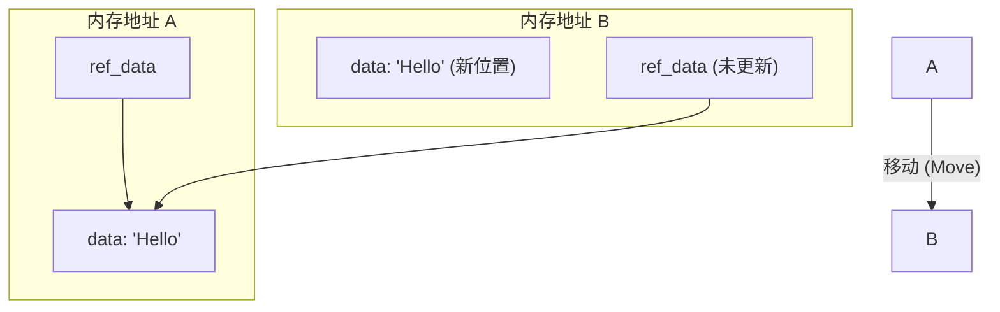

# 异步底层剖析：Future 与 Pin 机制

在 Rust 中，`async/await` 绝非简单的语法糖，而是一套编译期状态机变换与精心设计的类型系统约束。本章将解密 Rust 异步的核心原理，深入解析为什么需要 `Pin` 机制，以及它如何保障内存安全。

---

## 1. Future 的本质与 Polling 模型

在许多现代语言（如 JavaScript、Go）中，异步任务是由运行时（Runtime）以抢占或事件循环机制隐式调度的。而 Rust 的异步是**惰性的（Lazy）**：

> [!IMPORTANT]
> Rust 中的 `async` 函数在被调用时不会执行任何代码，而是返回一个实现了 `Future` 特征的匿名状态机。只有当该 `Future` 被 `poll` 轮询时，它才会开始执行，直到遇到阻塞点让出控制权。

### Future 特征的定义

标准库中的 `Future` 接口极其精炼：

```rust
pub trait Future {
    type Output;

    // poll 方法是驱动 Future 前进的唯一方式
    fn poll(self: Pin<&mut Self>, cx: &mut Context<'_>) -> Poll<Self::Output>;
}

pub enum Poll<T> {
    Ready(T),
    Pending,
}
```

* `poll` 接收的不是 `&mut Self`，而是 `Pin<&mut Self>`，这是为了确保 Future 在挂起期间不会在内存中被移动。
* `cx: &mut Context` 包含了当前任务的 `Waker`。当异步 I/O 事件就绪时，底层驱动会调用 `Waker::wake()`，通知执行器（Executor）重新调度并 poll 该任务。

---

## 2. 状态机转换与自引用难题

当编译器遇到 `async` 块时，它会将其改写为一个包含所有挂起状态（即在 `await` 之间存活的变量）的**状态机枚举**。

例如，以下异步代码：

```rust
async fn read_and_process() -> String {
    let mut data = "Hello".to_string();
    let ref_data = &data; // 跨越了 await 点的引用！
    some_async_io().await; 
    println!("{}", ref_data);
    data
}
```

在编译期会被转换为类似下面的状态机：

```rust
enum ReadAndProcessState {
    Start,
    WaitingForIo {
        data: String,
        ref_data: *const String, // 指向同一结构内部的 data！
    },
    Done,
}
```

### 自引用结构（Self-referential Struct）的内存移动漏洞

注意上面的 `WaitingForIo` 状态：`ref_data` 指向了结构体内部的 `data` 字段。这就是**自引用结构**。

自引用结构在内存中被**移动（Move）**时，会发生毁灭性的未定义行为（UB）：



1. **移动前**：`ref_data` 的地址正确指向 `data` 的地址（位于地址 A）。
2. **移动后**：整个状态机结构体被拷贝到了地址 B（例如，通过 `std::mem::replace` 或者将 Future 传入另一个线程的通道）。
3. **灾难发生**：`ref_data` 的地址依旧保留着地址 A 的旧指针，但地址 A 处的内存可能已被重用。此时解引用 `ref_data` 将读取野指针，导致内存安全漏洞！

---

## 3. Pin 与 Unpin 的救赎

为了彻底解决自引用结构的内存移动问题，Rust 1.33 引入了 `Pin` 机制。

### 什么是 Pin？

`Pin` 是一个包裹指针（如 `&mut T`、`Box<T>`）的包装器，它承诺：**被指向的数据在生命周期结束前，绝对不会被移动到其它内存地址。**

```rust
pub struct Pin<P> {
    pointer: P,
}
```

一旦一个指针被 `Pin` 包装成 `Pin<&mut T>`，使用者就再也无法通过安全代码获得 `&mut T`（因为有了 `&mut T` 就可以使用 `std::mem::swap` 移动它）。你只能通过 `Pin` 提供的受限接口与数据交互。

### Unpin 特征

并非所有数据都怕被移动。像 `i32`、`String`、或者是没有包含自引用指针的普通结构体，在内存中任意移动都是安全的。

为了区分它们，Rust 引入了一个自动特征（Auto Trait）`Unpin`：

* **实现了 `Unpin` 的类型**：即使被 `Pin` 包裹，也可以随时通过 `Pin::into_inner` 或获取 `&mut T` 随意移动它。几乎所有标准库类型都实现了 `Unpin`。
* **未实现 `Unpin` 的类型（`!Unpin`）**：在被 `Pin` 包裹后，**无法**安全地获取其可变引用，因而无法移动它。编译器生成的 `async` Future 状态机就是 `!Unpin` 的。

如果想让你自己的结构体变成 `!Unpin`，可以使用 `PhantomPinned` 占位：

```rust
use std::marker::PhantomPinned;

struct MySelfReferential {
    data: String,
    ref_to_data: *const String,
    _marker: PhantomPinned, // 阻止该结构体自动实现 Unpin
}
```

---

## 4. 实战：栈 Pin vs. 堆 Pin

把数据 Pin 住有两种主要方式：

### 1. 堆上 Pin (`Box::pin`) — 最常用

将数据存放在堆上，堆内存的地址在 Box 移动时是保持恒定不动的。

```rust
use std::future::Future;
use std::pin::Pin;

fn pin_on_heap() {
    let my_future = async { println!("Hello from Box::pin"); };
    // Box::pin 返回 Pin<Box<dyn Future<Output = ()>>>
    let mut pinned_future: Pin<Box<dyn Future<Output = ()>>> = Box::pin(my_future);
    
    // 现在可以安全地进行 poll 轮询了
}
```

### 2. 栈上 Pin (`pin_utils::pin_mut!` 或 `tokio::pin!`)

如果不想付出堆分配的性能代价，可以使用宏在栈上安全地 Pin 住数据。

> [!WARNING]
> 不要手动使用非安全的 `unsafe { Pin::new_unchecked(&mut val) }` 进行栈 Pin，除非你百分之百确定 `val` 在作用域结束前不会被隐式 drop 或移动。推荐使用经过社区验证的宏。

```rust
use tokio::pin; // 需要 tokio 依赖

async fn process() {
    let my_future = async { /* ... */ };
    
    // 展开为隐藏的 shadow 变量和安全声明
    pin!(my_future); 
    
    // 现在 my_future 的类型变成了 Pin<&mut MyFutureType>
    // 我们可以直接传递或 poll 它
}
```

---

## 5. 手写一个简易定时器 Future

通过手写一个完整的 `Future` 实例，来直观感受 `Waker` 与 `poll` 的协同工作：

```rust
use std::future::Future;
use std::pin::Pin;
use std::task::{Context, Poll};
use std::time::{Duration, Instant};
use std::thread;
use std::sync::{Arc, Mutex};

pub struct TimerFuture {
    shared_state: Arc<Mutex<SharedState>>,
}

struct SharedState {
    completed: bool,
    waker: Option<std::task::Waker>,
}

impl Future for TimerFuture {
    type Output = &'static str;

    fn poll(self: Pin<&mut Self>, cx: &mut Context<'_>) -> Poll<Self::Output> {
        let mut shared_state = self.shared_state.lock().unwrap();
        if shared_state.completed {
            Poll::Ready("Timer finished!")
        } else {
            // 设置当前任务的 waker，以便在计时结束后通知执行器重新 poll
            shared_state.waker = Some(cx.waker().clone());
            Poll::Pending
        }
    }
}

impl TimerFuture {
    pub fn new(duration: Duration) -> Self {
        let shared_state = Arc::new(Mutex::new(SharedState {
            completed: false,
            waker: None,
        }));

        // 产生一个新线程模拟底层操作系统定时事件
        let thread_shared_state = shared_state.clone();
        thread::spawn(move || {
            thread::sleep(duration);
            let mut shared_state = thread_shared_state.lock().unwrap();
            shared_state.completed = true;
            if let Some(waker) = shared_state.waker.take() {
                waker.wake(); // 唤醒执行器
            }
        });

        TimerFuture { shared_state }
    }
}
```

---

## 6. 总结：何时关注 Pin 与 Unpin？

在日常的业务开发中（例如使用 Axum 或 Actix-web 编写 Web 服务），你几乎不需要直接面对 `Pin`。但在以下场景，`Pin` 将是你的必修课：

1. **手写自定义 `Future`**：例如需要手动实现流量控制、自定义超时逻辑或底层轮询协议时。
2. **在 `async` 上下文中复用流（Streams）或多个 Future**：例如使用 `tokio::select!` 或 `futures::stream::StreamExt` 轮询时，必须先使用 `tokio::pin!` 将它们 Pin 在栈上。
3. **实现复杂的零拷贝（Zero-copy）网络协议栈**。
