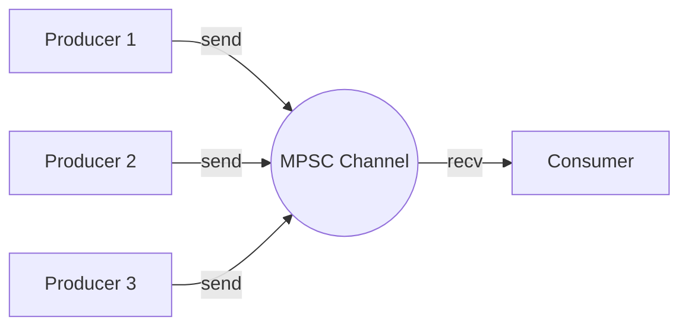
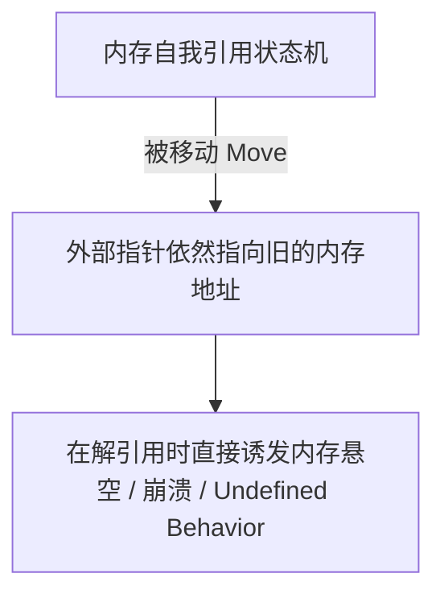

# Rust 并发编程与 Tokio 异步运行时

在面对高并发、多线程系统或海量网络连接的 I/O 密集型系统（例如高并发 API 网关、分布式键值存储）时，如何构建安全且极速的并发机制是核心痛点。Rust 提供了“无畏并发”（Fearless Concurrency）的能力，既可以通过标准的系统级多线程与消息传递通道，也可以基于最底层的 `Future` 无栈协程状态机及 Tokio 工业级异步生态，实现逼近硬件极限的并发吞吐。

---

## 认识多线程并发基础与控制

Rust 标准库提供的线程属于**操作系统 1:1 原生线程**（每一个 `std::thread` 对应一个轻量级进程/系统内核线程）。

### 1. `std::thread::spawn` 与 `move` 闭包

由于线程的生命周期在编译期是**无法预测的**（可能存活得比启动它的主线程还要长久），Rust 必须确保线程内部访问的数据在其生存期内绝对有效。

```rust
fn spawn_demo() {
    let message = String::from("Hello, thread!");
    
    // 错误示范（编译不通过）：
    // let handle = std::thread::spawn(|| {
    //     println!("{}", message); // 借用借不走！线程生命周期可能大于当前函数
    // });

    // 正确示范：强制将变量所有权通过 move 移动进线程闭包中
    let handle = std::thread::spawn(move || {
        println!("{}", message); // 所有权已转移，堆内存不会产生悬垂指针
    });

    handle.join().unwrap();
}
```

### 2. 作用域线程 (Scoped Threads)

在 Rust 1.63 之前，如果不希望通过 `move` 发生所有权转移（让多个并发线程同时借用栈上的不可变数据），我们只能依赖外部的第三方库。现在，标准库提供了极其优雅的 `std::thread::scope`：

```rust
fn scoped_threads() {
    let mut vec = vec![1, 2, 3];
    let shared = "hello";

    // 作用域线程可以保证在 scope 闭包结束前，所有子线程必定 join 完毕
    std::thread::scope(|s| {
        // 线程一借用不可变数据
        s.spawn(|| {
            println!("Thread 1: shared = {}", shared);
        });

        // 线程二允许安全地借用并修改 vec 的部分数据
        s.spawn(|| {
            println!("Thread 2: vec len = {}", vec.len());
        });
    });

    // 离开 scope 后，继续在主线程安全使用 vec
    vec.push(4);
}
```

---

## 消息传递通道 (Channels) 的高级设计

Rust 基于 “**不要通过共享内存来通信，而要通过通信来共享内存**” 的著名哲学，在标准库中内置了 `std::sync::mpsc`（Multi-producer, Single-consumer，即多生产者单消费者通道）。



### 1. 异步通道与同步通道的后压控制

`mpsc` 的生成方式决定了其底层的通信缓冲策略与后压（Backpressure）机制：

- **异步未限流通道 (`channel::<T>()`)**：

  拥有无限吞吐容量。发送方 `send` 永远是无阻塞的，即使接收方消费缓慢。如果生产速度远胜于消费速度，堆内存将不断攀升直至爆仓。

- **配置容量边界的同步通道 (`sync_channel::<T>(bound)`)**：

  拥有确定的容量上限。如果缓冲区满了，发送方的 `send` 方法会引发**阻塞**，从而优雅地实现后压控制，避免进程耗尽系统资源。若 `bound` 设为 `0`，则变为会合型通道（Rendezvous Channel），每一次发送都必须同步等待接收方准备完毕。

### 2. 零内存搬运的零拷贝通道传递

当我们要利用通道在多线程之间传输庞大的、生命周期漫长的数据包时，直接传递大对象（即使是一大块 `Vec<u8>`）也会在通道内发生元数据所有权转移的浅拷贝。若频繁调用可能会造成 L1/L2 缓存抖动（Cache lines bouncing）。

对于千兆级吞吐的消息处理，应优先考虑结合智能指针来进行“零内存搬运”的零拷贝通道传递：

```rust
use std::sync::mpsc;
use std::sync::Arc;

struct HeavyPayload {
    data: Vec<u8>, // 数兆大小
}

fn high_performance_dispatch() {
    let (tx, rx) = mpsc::channel();

    let big_data = Arc::new(HeavyPayload {
        data: vec![0u8; 1024 * 1024 * 10], // 10MB
    });

    for _ in 0..4 {
        let tx_clone = tx.clone();
        let payload_ref = Arc::clone(&big_data);
        
        std::thread::spawn(move || {
            // 通过传输 Arc 智能指针，我们在多线程通道中仅仅拷贝了 8 字节的指针！
            // 堆上的 10MB 真实内存未发生任何拷贝，完美实现用户态的零内存重分配
            tx_clone.send(payload_ref).unwrap();
        });
    }

    drop(tx); // 释放主 Sender

    while let Ok(msg) = rx.recv() {
        println!("Received 10MB package reference, RefCount: {}", Arc::strong_count(&msg));
    }
}
```

---

## 异步基石：无栈协程与 Pin 机制

与其他采用有栈协程（如 Go 的 goroutine）或内置事件循环的语言不同，`async`/`await` 在 Rust 中是**惰性的（Lazy）**，这意味着不主动执行 `poll` 操作，任何 `Future` 都不会自动运行。

### 1. `Future` 特征与状态机编译

在底层，编译器会将带有 `async` 关键字修饰的块或函数重构为一个**隐藏的状态机结构体**。

```rust
use std::future::Future;
use std::pin::Pin;
use std::task::{Context, Poll};

struct SimpleFuture {
    state: usize,
}

impl Future for SimpleFuture {
    type Output = String;

    fn poll(mut self: Pin<&mut Self>, cx: &mut Context<'_>) -> Poll<Self::Output> {
         match self.state {
             0 => {
                 self.state = 1;
                 // 模拟未就绪，保存 waker，以便事件循环通知
                 cx.waker().wake_by_ref();
                 Poll::Pending
             }
             1 => {
                 self.state = 2;
                 Poll::Ready(String::from("Done"))
             }
             _ => panic!("Future polled after completion!"),
         }
    }
}
```

- **无分配特权**：因为状态机在编译期其大小便已确定，所以它能够直接分配在局部调用栈上，消除了额外的动态内存分配开销。
- **`Waker` 唤醒通知机制**：相比于自旋轮询（Spin Loop）浪费大量 CPU 周期，底层的 `Waker` 会在 I/O 事件真正就绪时，通知 Reactor，进而通知 Executor 重新派发 `poll` 命令。

### 2. 钉住内存与 Pin 机制

由于编译器将异步函数内的局部引用的生命周期跨越了所有的 `.await` 挂起点，导致生成的状态机结构体成为了一个**自我引用结构体（Self-Referential Struct）**。如果它在内存中被自由移动（Move），包含指针指向自身内部的数据便会立刻指向一处脏内存：



为了彻底封堵这种不可抗力的内存崩溃隐患，Rust 引进了 `Pin` 与 `Unpin` 特征：

- **`Pin<P>`**：包裹住指针（如 `Pin<&mut T>` 或 `Pin<Box<T>>`），从而安全地向外界宣告：**无论发生什么，被包裹并在堆/栈空间的数据在生命周期终结前是绝对无法被移位的**。
- **`Unpin`**：绝大多数基本标量或完全不含任何自我参照引用的类型本身均自动实现 `Unpin` 标记特征。这些类型被 `Pin` 包裹后仍然被允许自由移动。

---

## Tokio 工业级运行时架设

`Tokio` 是 Rust 社区首屈一指的多线程、高性能、全功能异步运行时，专注于生产级别的超快速网络 I/O。

### 1. 核心工作窃取机制 (Work-stealing)

Tokio 的多线程模式默认采用工作窃取算法。每一个处理核心绑定一个专属工作线程，该线程内置独立任务队列。当某核心的任务全部出栈后，它能极其高效地去别的核心队列中自动窃取任务进行处理，进而将全核利用率压榨到极限。

### 2. 多核并发任务派遣：`tokio::spawn` vs `tokio::join!`

```rust
use tokio::time::{sleep, Duration};

async fn handle_connection(id: u32) {
    sleep(Duration::from_millis(50)).await;
    println!("Connection {} handled", id);
}

#[tokio::main]
async fn main() {
    // 1. `tokio::spawn`：绿色线程
    // 类似于 std::thread::spawn，将任务直接投递入 Tokio 底层工作核心并行队列中。
    // 该任务必须拥有 'static 保证，需要通过 move 转移外部所有权。
    let handle = tokio::spawn(async move {
        handle_connection(1).await;
    });

    // 2. `tokio::join!`：单线程下的多路复用
    // 在同一个操作系统线程（当前工作队列）里并发协作轮询这两个 Future，不需要多线程跨核心投递！
    // 完美的零同步同步屏障，运行效率处于最高峰。
    tokio::join!(
        handle_connection(2),
        handle_connection(3)
    );

    handle.await.unwrap();
}
```

---

## 异步高吞吐下的锁选择与无锁优化

在大吞吐的网络循环中，把连接状态分配并传递给每一个异步并发协程时，直接用 `Arc<Mutex<T>>` 会带来不必要的互斥锁开销。

### 1. 异步锁与同步锁的选择策略

这是一个在异步开发中极其容易出错的关键决策点。

- **法则一**：如果在整个同步上下文和普通临界区内，你要修改的数据**绝不跨越任何 `.await` 语句**（在获取 Lock 后直接完成自增或写入，接着立刻退出作用域），应当**毫不犹豫地使用普通的 `std::sync::Mutex`**（或性能更好的 `parking_lot::Mutex`）。由于它不含任何复杂的异步轮询状态，速度通常比异步锁高一个层次，只要小心其生命周期约束即可。
- **法则二**：唯有当你在获取 Lock 之后，必须要**跨越运行 `.await` 执行长耗时网络或文件操作**（此时当前协程会让出控制权被挂起，如果持锁则会导致系统陷入死锁或线程积压），此时**必须选用 `tokio::sync::Mutex`**。它能在不阻塞线程的情况下，安全地在异步任务间转移锁的所有权。

### 2. 通过无锁引用（零拷贝借用）彻底避开任何 Mutex 开销

我们可以让连接状态、全局只读配置通过 `'static` 或作用域生命周期传递给所有的并行协程，实现无任何互斥开销的极致通信：

```rust
use std::sync::Arc;

struct ReadOnlyConfig {
    api_key: String,
}

async fn fetch_resource(config: Arc<ReadOnlyConfig>, id: u32) {
    // Arc 仅仅提供极度轻量且无需加锁的共享内存，各异步小协程纯并发只读读取。
    println!("Fetch resource {} with API key: {}", id, config.api_key);
}

#[tokio::main]
async fn main() {
    let global_config = Arc::new(ReadOnlyConfig {
        api_key: "AI_DOCS_KEY".to_string(),
    });

    let mut handles = vec![];
    for i in 0..10 {
        let conf = Arc::clone(&global_config);
        handles.push(tokio::spawn(async move {
            fetch_resource(conf, i).await;
        }));
    }

    for h in handles {
        h.await.unwrap();
    }
}
```
