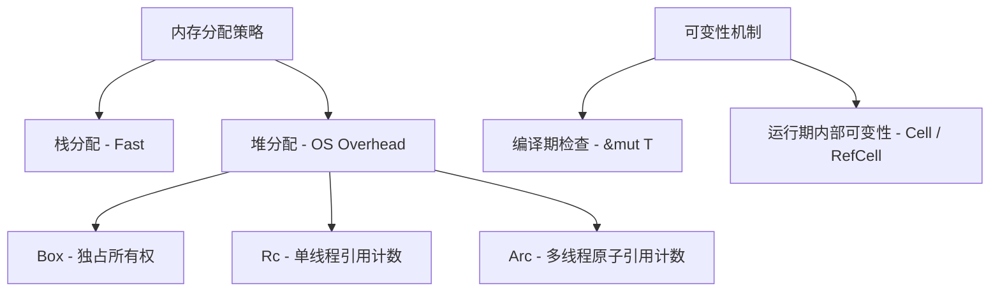

## Rust 内存布局与零拷贝优化

在 Rust 中，要写出极致性能的代码，必须深入理解数据的内存布局以及如何避免不必要的内存分配和拷贝。通过充分利用编译器对数据结构的优化以及借用检查器提供的安全保障，我们可以在保持内存安全的同时达到甚至超越 C/C++ 的运行效率。

---

## 数据的内存布局与对齐

Rust 中所有值都拥有确定的内存大小 and 布局。理解这些底层规则对于控制内存碎片、提高缓存命中率以及安全进行底层 FFI/零拷贝至关重要。

### 1. 结构体内存对齐 (Struct Alignment) 与 Padding

默认情况下，Rust 编译器为了榨取最高的硬件物理并发（对齐访问的存储效率），会采用 `Rust` 契约（即默认的 `#[repr(Rust)]`）。这意味着编译器**拥有完全自由度在编译期去重排结构体中的字段顺序，以便在保障最大对齐的基础上，把 Padding（对齐填充气泡）压缩至最小**。

例如，下面的两个结构体：

```rust
struct BadLayout {
    a: u8,   // 1 字节
    b: u32,  // 4 字节
    c: u8,   // 1 字节
} // 编译器可能将其重排为 a, c 放在一起，优化为 8 字节大小

struct GoodLayout {
    b: u32,
    a: u8,
    c: u8,
} // 直接占 8 字节（2 字节填充）
```

如果你在进行零拷贝解析（如将原始的网络/文件字节流直接 Cast 成 Rust 结构体指针），必须使用 `#[repr(C)]` 或 `#[repr(packed)]` 来保证字段布局的跨平台一致性及严格对齐：

- `#[repr(C)]`：按照 C 语言的标准进行对齐，提供可预测的字段偏移量，但会有内存对齐留出的空隙（Padding）。
- `#[repr(packed)]`：去除所有对齐留出的空隙，结构体成员紧挨在一起。这显著缩小了内存体积，但在某些硬件上读取未对齐的数据可能会产生显著的 CPU 性能惩罚或硬件异常。

> **注意 (未对齐访问的惩罚)**：使用 `#[repr(packed)]` 虽极大地节省了内存空间并杜绝了 Padding，但是在绝大多数架构 of CPU 上，直接解引用一个未对齐的指针（例如在奇数地址上读取 4 字节 `u32`）会导致 CPU 分多次读取、拼接，产生显著的运行时性能损耗，在某些严苛的嵌入式硬件上甚至会直接触发硬件崩溃异常。

### 2. 生存期和空指针优化 (Null Pointer Optimization)

针对某些特殊类型，Rust 进行了空指针优化（NPO / Null Pointer Optimization）。利用这一优化，包装类型（如 `Option<T>`）能够达到与原始指针完全等同的内存占用，这也是零门槛抽象（Zero-cost Abstraction）的典型例子。

```rust
use std::num::NonZeroU32;

// 大小：4 字节。因为 0 并不是 NonZeroU32 的有效值，所以 Option 可以利用 0 代表 None
assert_eq!(std::mem::size_of::<Option<NonZeroU32>>(), 4);

// 大小：8 字节。Box 内部是指针，永远不为 null，因此 Option 可以用 0x0 表达 None
assert_eq!(std::mem::size_of::<Option<Box<i32>>>(), 8);
```

---

## 智能指针与容器的运行开销

高级 Rust 编程不可避免地会频繁遭遇智能指针。然而，每一种智能指针都携带着特定的内存和运行时成本。



### 1. 堆分配指针的内存排布

- **`Box<T>`**：最纯粹的堆分配，在堆上分配存储空间并拥有其独占所有权。如果 `T` 是 `Sized`（编译期大小明确），`Box<T>` 在栈上仅仅占据 1 个 `usize` 宽度（即原始堆指针地址）。如果是 `Box<dyn Trait>` 或者是 `Box<[T]>`（动态大小类型，DST），它在栈中便会跃升为两个 `usize` 大小的**胖指针（Fat Pointer）**：
  1. 指向堆上真实数据的指针。
  2. 指向虚函数表（vtable）的指针，或者是表示切片真实长度（Length）的 `usize` 并行元数据。
- **`Rc<T>`** / **`Arc<T>`**：基于引用计数的多路访问指针。很多人误以为它们的引用计数是存储在栈上的，其实，**引用计数完全常驻在堆上**。当调用 `Arc::new(T)` 时，会在堆上一次性分配一整块连续内存，其物理布局类似于：

```rust
// 伪代码：表示堆上 Arc 内存分配的真实底层结构
struct ArcInner<T> {
    strong: AtomicUsize, // 强引用计数器
    weak: AtomicUsize,   // 弱引用计数器
    data: T,             // 被包裹的用户实体数据
}
```

这意味着其每一次进行 `.clone()` 操作时，都只需通过栈指针寻址到堆上的特定原子内存计数中，利用 CPU 最底层的硬件级原子锁同步自增，完全不发生任何对 `T` 物理字段的浅拷贝或深拷贝。

### 2. 内部可变性容器 (`Cell<T>`, `RefCell<T>`)

- **`Cell<T>`**：几乎没有运行时成本。它不依靠锁或引用标记，而是通过**在对应存储空间直接进行值的移动（Move）或拷贝（Copy）**来实现运行时内部可变。由于不能借用内部的直接指针，它避开了借用检查器（极其安全且适合轻量级 `Copy` 类型）。
- **`RefCell<T>`**：在运行时通过一个引用计数（`Ref` 和 `RefMut` 守卫）来模拟编译期的借用检查规律。如果尝试同时获取两个可变引用，运行时将直接引发崩溃（`panic`）。其开销主要体现在每个字段多出了运行时状态同步的开销。

---

## 零拷贝实践 (Zero-copy Optimization)

零拷贝不仅意味着避免在用户态与内核态之间拷贝数据，对于应用层的高性能组件来说，更意味着**在内存反序列化、字符串裁剪、数据传递时，全程用引用和生命周期串联，拒绝产生任何深拷贝（Deep Copy）**。

### 1. 使用 `Cow<'a, T>` 实现写时复制 (Copy-on-Write)

`Cow<'a, T>` 是一个极具威力的智能指针，它是一个枚举，表示数据要么是借用的（`Borrowed`），要么是拥有的（`Owned`）。当需要进行修改时，它才会执行分配并进行拷贝。

下面是一个针对系统配置文件中变量进行转义替换的高效零拷贝解析实践：

```rust
use std::borrow::Cow;

pub fn sanitize_log<'a>(input: &'a str) -> Cow<'a, str> {
    if input.contains("PASSWORD=") {
        // 如果包含敏感词，我们需要进行深拷贝并过滤替换
        let sanitized = input.replace("PASSWORD=", "STARTS=");
        Cow::Owned(sanitized)
    } else {
        // 绝大多数健康日志，直接采用引用，零内存重分配开销！
        Cow::Borrowed(input)
    }
}
```

### 2. 通过 `std::borrow::Borrow` 与 `std::convert::AsRef` 获得高泛型性能

- `AsRef<T>`：表达极其廉价的借用转换，通常只是强制转换指针类型，返回一个引用指针，不产生额外开销。
- `Borrow<T>`：相较于 `AsRef` 拥有更加严密的数学语义要求。`Borrow` 约定：**如果一个类型实现了 `Borrow<Q>`，那么它和 `Q` 的 `Hash`、`Ord` 以及 `Eq` 的结果必须完全保持一致**。

```rust
use std::borrow::Borrow;
use std::collections::HashMap;

fn find_value<K, V, Q>(map: &HashMap<K, V>, key: &Q) -> Option<&V>
where
    K: Borrow<Q> + std::hash::Hash + Eq,
    Q: std::hash::Hash + Eq + ?Sized,
{
    map.get(key)
}
```

通过上面这种设计，我们可以直接将 `HashMap<String, i32>` 作为入参，同时支持传入 `&str` 作为检索主键，完美消成了通过生成 `&String` 而产生的额外不必要深拷贝。

---

## 工业级内存分配器：生产环境下的 jemalloc / mimalloc 调优

在工业级高吞吐（每秒处理百万级别网络请求）场景下，操作系统的默认分配器（如 Linux 的 `glibc` 默认 `ptmalloc`）往往会因为激烈的多线程全局锁竞争、以及产生大量无序小碎块导致严重的性能坍塌。

### 1. 为何选用 `jemalloc` 或 `mimalloc`？

- **`jemalloc`**：采用多级线程缓存（tcache）、以及将内存精细化切分成大量不同尺寸“面饼”（Slabs/Arenas）的方法，彻底实现了线程级无冲突分配，对持久大内存高并发服务器极其友好。
- **`mimalloc`**：微软出品的极速轻量级分配器，在各类性能跑分中经常超越 `jemalloc`。其基于页自由链（page local free list）以及精简的分区归并算法，在面对生命周期极其短暂的小对象高负荷高频进出堆空间的场景下，可以带来甚至翻倍的吞吐飞跃。

### 2. 在 Rust 项目中无缝集成与启用高性能分配器

只需极其简单的步骤（修改 `Cargo.toml` 后在入口注册全局变量），即可完成底层分配器的物理拦截 and 替换：

```rust
// 使用 mimalloc 分配器的典型实践
use mimalloc::MiMalloc;

#[global_allocator]
static GLOBAL: MiMalloc = MiMalloc;

fn main() {
    // 后续程序运行中所有通过 Box::new、Vec::with_capacity 触发的任何物理堆分配，
    // 都将完全交由极速的 mimalloc 分配引擎接管，享用无锁化线程级堆空间腾挪！
    println!("High performance allocator mimalloc initialized successfully!");
}
```
