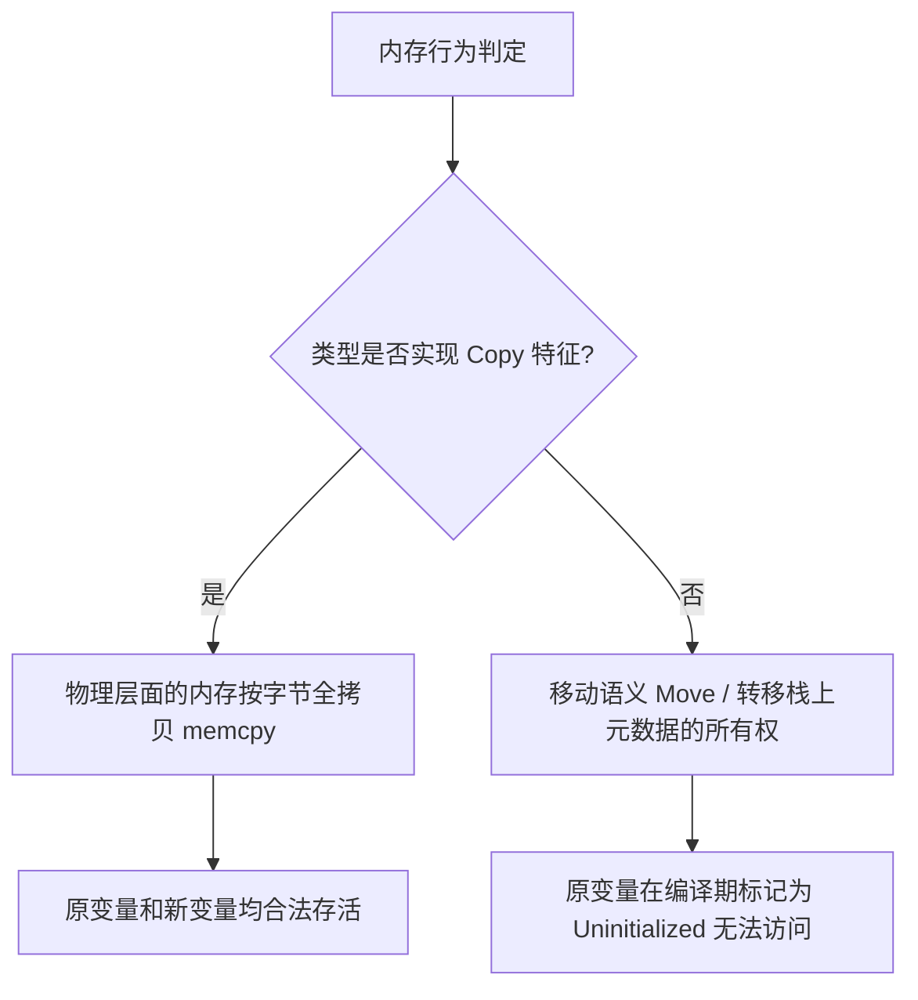

## Rust 所有权与生命周期

学习 Rust 的第一步，同时也是贯穿其整个生态系统设计的最硬核屏障，便是由编译器（Borrow Checker）强制执行的**所有权（Ownership）与生命周期（Lifetimes）系统**。本篇将从最基础的黄金法则出发，逐步深入到静态编译分析、控制流图（CFG）以及底层内存模型的视角，深入解构这套保障系统。

> 🟢 **基础**：掌握基本语法即可阅读 ｜ 🟡 **进阶**：需要有一定 Rust 开发经验 ｜ 🔴 **高级**：面向系统级开发者与性能工程师

---

## 🟢 所有权的三大黄金法则

Rust 的生命科学和内存安全，完全建立在以下三条简单而绝对的法则之上：

1. Rust 中的每一个值都有一个被称为其**所有者**（Owner）的变量。
2. 值在任一时刻有且只有一个所有者。
3. 当所有者（变量）离开作用域，这个值将被丢弃（释放其占有的堆栈内存）。

## 🟢 引用与借阅法则 (Borrowing Rules)

在实际开发中，我们不可能总是转移所有权。因此，Rust 提供了“借用”机制，允许我们通过指针（引用）去访问数据，但必须严格遵守以下法则：

- **不可变引用**（`&T`）：允许同时存在多个对同一数据的不可变引用（共享读）。
- **可变引用**（`&mut T`）：在特定作用域内，只能存在唯一一个可变引用（独占写）。
- **读写互斥**：在同一个值的作用域中，不可变引用与可变引用不能同时并存。

---

## 🟢 编译器的魔法：生命周期省略规则 (Lifetime Elision Rules)

在学习生命周期前，你可能会疑惑：为什么我们写了这么多带引用的函数，却很少需要手动写像 `'a` 这样的生命周期参数？

这是因为 Rust 编译器有一套**生命周期省略规则**。编译器会在幕后按照三条规则为我们的函数自动补全生命周期标注：

1. **规则一**：每一个是引用的输入参数都有它自己的生命周期参数。例如，`fn foo(x: &i32)` 会被补全为 `fn foo<'a>(x: &'a i32)`；而 `fn foo(x: &i32, y: &i32)` 则补全为 `fn foo<'a, 'b>(x: &'a i32, y: &'b i32)`。
2. **规则二**：如果只有一个输入生命周期参数（无论它是否是结构体的一部分），那么该生命周期将被赋予所有输出引用。例如，`fn foo(x: &i32) -> &i32` 自动补全为 `fn foo<'a>(x: &'a i32) -> &'a i32`。
3. **规则三**：如果有多个输入生命周期参数，但其中一个是 `&self` 或 `&mut self`（即这是一个方法），那么 `self` 的生命周期将被赋予所有输出引用。这使得方法定义非常简洁。

```rust
// 省略前的写法：
fn first_word<'a>(s: &'a str) -> &'a str { ... }

// 编译器自动省略后的写法（小白友好）：
fn first_word(s: &str) -> &str { ... }
```

如果编译器应用这三条规则后，仍有无法确定的输出生命周期，编译器就会报错并要求我们显式标注。

---

## 🟡 静态编译下的内存行为分析

所有权并非在运行时运行的垃圾回收代理，而是编译器在编译期对内存分配与释放进行的一套**静态追踪系统**。

### 1. 移动语义 (Move Semantics) vs 拷贝语义 (Copy Semantics)

在 Rust 中，每个值都有对应的内存空间（局部变量分配在栈上，动态数据通过指针关联在堆上）。当一个变量被赋给另一个变量，或者作为参数传递给函数时，内存流转会经历不同的分支判断：



- **移动语义 (Move Semantics)**：所有未实现 `Copy` 特征的类型（如 `String`、`Vec<T>`、自定义结构体）在进行赋值或传参时，编译器只是将其在栈上的控制元数据（指针、容量、长度，通常为 24 字节）拷贝过去，同时**在静态分析中将原变量标志为不可再访问**。
- **拷贝语义 (Copy Semantics)**：对于基本标量类型（如 `i32`、`f64`、`bool`、包含基本类型的固定数组或元组等），编译器会自动进行浅度内存对拷（`memcpy`）。它们不受所有权流转的单向限制，原变量仍然完全可用。

### 2. 生存期与 `Drop` 的安全编排

一旦超出某个绑定的定义域（Scope），在进入右大括号 `}` 的绝对瞬间，编译器便自动生成 `std::ops::Drop::drop` 指令。由于所有权系统的专一性原理（任意时刻只能存在唯一所有者），Rust 巧妙地避免了二次释放（Double Free）与悬垂指针。

---

## 🟡 非词法作用域生命周期 NLL (Non-Lexical Lifetimes)

在 Rust 早期的历史版本（1.31 之前）中，生命周期完全遵循“词法作用域”（单纯按大括号范围判断生存性）。这经常导致借用检查器过于严苛而拦截合法的代码。现代 Rust 引入了 **非词法作用域生命周期 (NLL)**，让编译器进入了图论分析阶段。

### 控制流图 (CFG) 与活跃度分析 (Liveness Analysis)

NLL 不再依照大括号界定引用的作用域，而是通过**控制流图中该引用的最后一次真实访问位置（Liveness）**来精确定位。

```rust
fn nll_demo() {
    let mut map = std::collections::HashMap::new();
    map.insert("key", "value");

    // 获取不可变借用
    let val = map.get("key"); 

    // 在传统词法作用域中，val 持续借用至函数末尾，
    // 导致这行 map.insert 产生冲突报错。
    // 但是在 NLL 下，val 最晚活跃期在 println!
    println!("Value is: {:?}", val); 

    // 从此处开始，val 的 Liveness 不存在了，借用自动解除！
    map.insert("key2", "value2"); // 完美通过编译！
}
```

---

## 🔴 高阶生命周期标注实战

生命周期参数等同于泛型类型参数。有三个永恒铁律必须牢记在心：

1. 生命周期 `'a` **绝不会**以任何方式延长一个引用的物理生命周期。
2. 它仅仅是向编译器陈述并**约束**传入多个引用之间的生存期关联。
3. 它通过将各引用的生存上限与下限挂钩，保证返回对象的指针生存期绝不长于源头引用的生存期。

### 1. 结构体中的生命周期参数

在高性能零拷贝系统设计中（例如，一个不执行任何堆内存复制的数据解析器），我们的结构体必须带有借用引用：

```rust
// 告诉编译器，Parser 实例本身的期望寿命绝不能超过内部源字节流 &str 的寿命 'a
pub struct ZeroCopyParser<'a> {
    pub raw_data: &'a str,
    pub current_chunk: &'a str,
}

impl<'a> ZeroCopyParser<'a> {
    pub fn next_token(&mut self) -> Option<&'a str> {
        // ... 精密的字符串分割逻辑 ...
        Some(self.current_chunk)
    }
}
```

### 2. 协变、逆变与不变性 (Variance)

当你深度封装自己的高性能 Traits 甚至底层的 `unsafe` 操作时，引用的可替代性（Subtyping）问题便开始浮出水面。我们把生命周期的子类型关系理解为：如果 `'a: 'b`（生存期 `'a` 长于或等于 `'b`），那么 `'a` 就是 `'b` 的子类型。

| 关系类型 (Variance) | 针对生命周期参数 `'a` | 直观解释（替代规则） |
| :--- | :--- | :--- |
| **协变 (Covariant)** | `&'a T` | 入参较长的生命周期（子类型）可以安全地代替较短的生命周期。 |
| **逆变 (Contravariant)** | `fn(&'a T)` | 函数的可替代性正好颠倒。期望接收短生存引用的函数可以接收生命长的引用。 |
| **不变 (Invariant)** | `&mut &'a T` 或 `Cell<&'a T>` | **绝对不替换**。必须严格要求生命周期参数完全等效，无法宽限，防止通过可变借用写入长生命周期变量而引发空指针。 |

---

## 🔴 精通静态生命周期：`'static` 与 `T: 'static` 的本质区别

这是开发者极易混淆的概念之一：

- **`'static` 生命周期（生命周期标注）**：

  直接指向其修饰的引用在**主进程运行期间自始至终绝对有效**。例如硬编码在程序二进制文件里的只读字符串字面量 `&'static str`，或者被 `Box::leak` 主动泄漏并在堆上静态存活的引用。

- **`T: 'static` 约束限制（泛型特征限界）**：

  不限于它本身的物理生命究竟有多长，而是表明：**类型 `T` 必须有能力在必要时做到在运行期间完全不包含任何动态的、生存期不确定的引用借用**。所有拥有的类型（如 `String`、`Vec<i32>`、`i32` 实体本身）都完美满足 `T: 'static`。然而对于任何包含局部引用的非拥有的类型（如 `&'a str`），一旦外部超出 `'a` 它便无法常驻。

```rust
use std::fmt::Debug;

// 这里泛型约束 T: 'static 
fn log_static_struct<T: Debug + 'static>(item: T) {
    println!("{:?}", item);
}

fn test_diff() {
    let owned_string = String::from("I am owned");
    // owned_string 仅仅活在 test_diff 局部
    // 但因为它已经拥有其全部生命的所有权（不包含外部局部引用），它满足 : 'static 约束！
    log_static_struct(owned_string); // 正确！

    let local_val = String::from("Local heap");
    let borrowing: &str = &local_val; // 指向本地栈帧/局部的引用
    
    // log_static_struct(borrowing); 
    // 错误！因为 borrowing 类型是 &'a str，其生命周期是有限度的，无法满足 'static 限界。
}
```

---

## 🔴 现代 Rust 中的生命周期捕获 (1.75+ RPITIT)

在 Rust 1.75 之后，标准库支持了 **RPITIT (Return Position Impl Trait In Trait)** 和 **AFIT (Async Fn In Trait)**，这引入了全新的生命周期捕获机制，是迈向高级 Rust 工程师的必修课。

### 1. `impl Trait` 隐式生命周期捕获

在旧版本 Rust 中，当函数返回 `impl Trait` 时，如果返回值类型中隐式使用了参数的借用生命周期 `'a`，编译器会抱怨无法推导，我们需要显式声明 `+ 'a`。

在现代 Rust 中，**返回的 `impl Trait` 会自动捕获入参中涉及的所有生命周期参数**。这意味着：

```rust
// 现代 Rust (1.75+)：
fn process_data(data: &str) -> impl Iterator<Item = &str> {
    data.split_whitespace() // 自动捕获 data 借用的生命周期！
}
```

### 2. 异步特征方法 (AFIT) 中的生命周期捕获

当你写一个 trait 并声明异步方法时：

```rust
trait Database {
    async fn query(&self, sql: &str) -> Result<String, std::io::Error>;
}
```

编译器在幕后会将其重写为返回 `impl Future` 状态机的方法。该 Future 状态机**隐式地捕获了 `&self` 和 `sql` 的生命周期**。

因此，这个异步 Future 的生存期是受限于传入参数的生命周期的。这意味着调用 `db.query(sql)` 返回的 Future 不能在 `sql` 或 `db` 被释放后继续存活。这解释了为什么在写高级异步 Rust 代码时，很多异步并发任务（如 `tokio::spawn`）会要求 `T: 'static`，导致我们不得不将 `sql` 或 `db` 变成 `Arc` 或者拥有所有权的类型。
