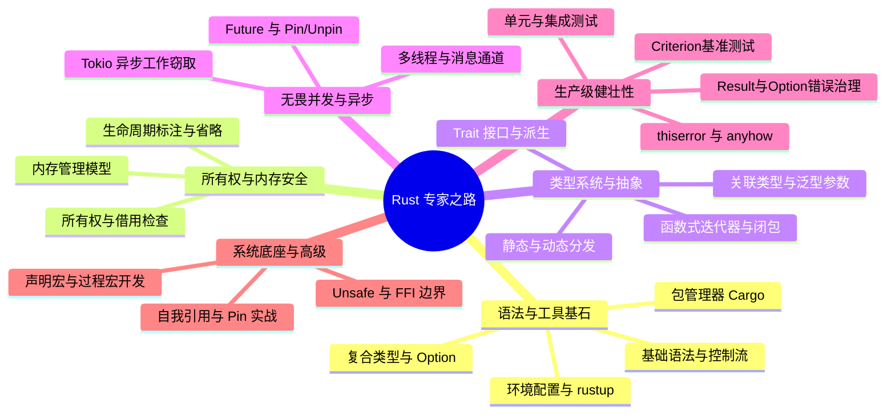

## Rust 专家成长之路

欢迎来到 Rust 的世界。本专题旨在帮助开发者构建对 Rust 的系统认知，从开发环境与语法基石起步，跨越所有权、特征系统、无畏并发与异步生态，最终深入系统底座与元编程的深水区。

---

## 🗺️ Rust 学习路线图

---

## 🚀 第一阶段：语法与工具基石 (Getting Started)

万丈高楼平地起，本阶段帮助零基础读者搭建环境，掌握工程管理与基础语法。

- [语法基石与工具链](getting-started.md)：快速配置 Rust 环境，玩转 Cargo 工业级包管理器，掌握变量、控制流及复合类型基础。

---

## 🧠 第二阶段：所有权与内存安全 (Memory Safety)

理解 Rust 区别于其他垃圾回收语言的核心竞争力，也是 Rust 编译器的核心精髓。

- [所有权与生命周期核心](ownership-lifetimes.md)：深入生命周期借用检查器、省略规则、协变与逆变，以及 `'static` 约束的本质。
- [内存管理深度解析](memory-management.md)：堆栈分配、`Box<T>`、`Arc<T>` 与引用计数。

---

## 🏗️ 第三阶段：类型系统与抽象 (Abstraction)

利用 Trait 实现高阶代码抽象，领略零成本抽象的魅力。

- [Trait 与泛型系统](traits-generics.md)：解耦合与静态/动态分发（Dynamic Dispatch）、关联类型、扩展特征模式与内置特征派生。
- [函数式编程特性](functional-rust.md)：闭包、迭代器高级组合链、`move` 逃逸闭包与模式匹配新语法。

---

## ⚡ 第四阶段：无畏并发与异步编程 (Concurrency)

突破传统多线程的复杂性，使用现代异步模型压榨系统吞吐极限。

- [Rust 并发编程与 Tokio](concurrency.md)：多线程同步、消息传递通道（Channels）的高级设计，以及 `async/await` 异步生态与 Tokio 工作窃取机制。

---

## 🛠️ 第五阶段：生产级健壮性 (Robustness)

构建能够应对复杂工程环境的系统。错误处理和测试是不妥协的要求。

- [错误处理艺术](error-handling.md)：`Result` 链式调用、自定义错误类型、`thiserror` / `anyhow` 工业级方案与 Panic 边界防护。
- [测试与性能分析](testing-benchmarking.md)：单元/集成/文档测试架构、`pretty_assertions` 强化断言与 `criterion` 高精度基准测试。

---

## ⚙️ 第六阶段：系统底座与高级特性 (Advanced Systems)

进入高级开发者的深水区，掌控底层硬件与元编程魔法。

- [Unsafe Rust 与内存安全边界](unsafe-rust.md)：裸指针与未定义行为、安全抽象封装、FFI 跨语言交互与 Miri 检测工具。
- [宏与元编程系统](macros-metaprogramming.md)：声明宏 `macro_rules!` 深度解析、过程宏开发（Derive 宏/属性宏）与 `syn`/`quote` 工具链实战。
