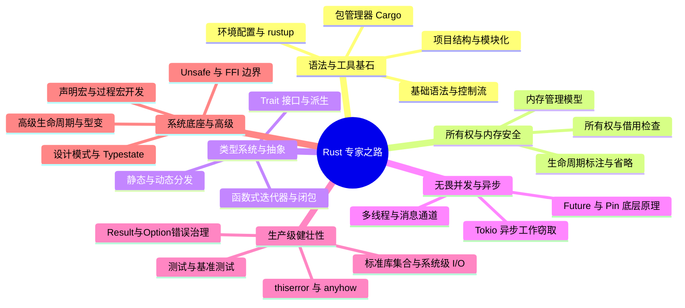

## Rust 专家成长之路

欢迎来到 Rust 的世界。本专题旨在帮助开发者构建对 Rust 的系统认知，从开发环境与语法基石起步，跨越所有权、特征系统、无畏并发与异步生态，最终深入系统底座与元编程的深水区。

---

## 🗺️ Rust 学习路线图

---

## 🚀 第一阶段：语法与工具基石 (Getting Started)

万丈高楼平地起，本阶段帮助零基础读者搭建环境，掌握工程管理、基础语法与模块化组织。

- [语法基石与工具链](getting-started.md)：快速配置 Rust 环境，玩转 Cargo 工业级包管理器，掌握变量、控制流、复合类型及基础控制流匹配。
- [项目结构与模块化](project-structure.md)：详解 Rust 模块系统（visibility、use、super/self）、文件分层、Crate 与 Cargo 进阶，以及属性（Attributes）与兼容性配置。

---

## 🧠 第二阶段：所有权与内存安全 (Memory Safety)

理解 Rust 区别于其他垃圾回收语言的核心竞争力，也是 Rust 编译器的核心精髓。

- [所有权与生命周期核心](ownership-lifetimes.md)：深入 RAII 资源释放、生命周期借用检查器、部分移动与 `ref` 模式、省略规则，以及 `'static` 约束的本质。
- [内存管理深度解析](memory-management.md)：堆栈分配、`Box<T>`、`Arc<T>` 与引用计数。

---

## 🏗️ 第三阶段：类型系统与抽象 (Abstraction)

利用 Trait 实现高阶代码抽象，领略零成本抽象的魅力。

- [Trait 与泛型系统](traits-generics.md)：泛型约束与 `where` 子句、关联类型、`newtype` 惯用语、虚类型参数。标准库常用转换特征（From/Into, TryFrom/TryInto, ToString/FromStr），以及静态与动态分发、特征派生、重载与父 trait 消除冲突。
- [函数式编程特性](functional-rust.md)：普通方法、发散函数与高阶函数，闭包高级捕获与迭代器高级组合链。

---

## ⚡ 第四阶段：无畏并发与异步编程 (Concurrency)

突破传统多线程的复杂性，使用现代异步模型压榨系统吞吐极限。

- [Rust 并发编程与 Tokio](concurrency.md)：多线程同步、消息传递通道（Channels）与 Map-Reduce 实战，以及 `async/await` 异步生态与 Tokio 工作窃取机制。
- [异步底层剖析：Future 与 Pin 机制](async-under-the-hood.md)：深入讲解 `Future` 的轮询模型、自引用结构体的内存移动漏洞，以及 `Pin` 和 `Unpin` 的底层安全保证与手写实践。

---

## 🛠️ 第五阶段：生产级健壮性 (Robustness)

构建能够应对复杂工程环境的系统。错误处理和测试是不妥协的要求。

- [错误处理艺术](error-handling.md)：`Result` 与 `Option` 链式组合算子、传播机制 `?`、自定义错误类型、装箱 `Box<dyn Error>`、`thiserror` / `anyhow` 方案与早停机制。
- [标准库集合与系统级 I/O](std-collections-io.md)：深入常用集合类型（Vec, String, HashMap, HashSet），以及系统级路径处理、文件 I/O、管道子进程及 FFI 交互。
- [测试与性能分析](testing-benchmarking.md)：单元/集成/文档测试架构、开发依赖、`pretty_assertions` 强化断言与 `criterion` 高精度基准测试。

---

## ⚙️ 第六阶段：系统底座与高级特性 (Advanced Systems)

进入高级开发者的深水区，掌控底层硬件与元编程魔法。

- [Unsafe Rust 与内存安全边界](unsafe-rust.md)：裸指针与未定义行为、安全抽象封装、FFI 跨语言交互、Unsafe 经典场景与 Miri 检测工具。
- [宏与元编程系统](macros-metaprogramming.md)：声明宏 `macro_rules!` 指示符与重复匹配、过程宏开发（Derive 宏/属性宏）与 `syn`/`quote` 工具链实战。
- [高级生命周期与设计模式](advanced-patterns.md)：探究型变（协变、逆变、不变）的本质与 `PhantomData` 应用，高阶生命周期绑定（HRTB, `for<'a>`），以及 Typestate 状态模式与 RAII Guard 等 Rust 独有的设计模式。
