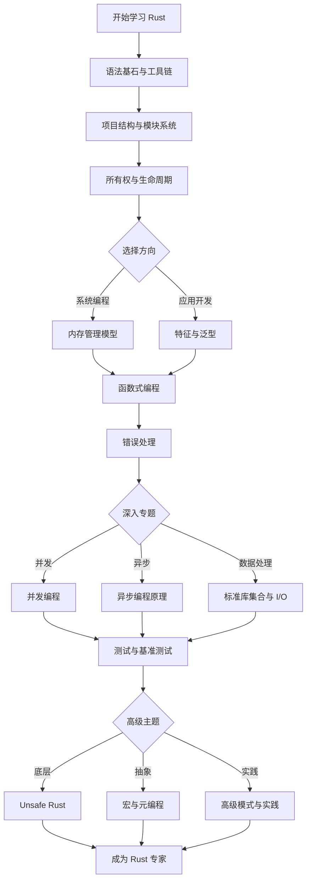

# 通过实例学 Rust

[Rust](https://www.rust-lang.org/) 是一门注重安全性、速度和并发性的现代系统编程语言。Rust 通过零成本抽象、内存安全保证和无畏并发来实现这些目标，并且不使用垃圾回收器。

本专题采用**实例驱动**的方式，通过大量可运行的示例代码，帮助你快速掌握 Rust 的核心概念和实战技巧。无论你是初学者还是有经验的开发者，都能在这里找到适合自己的学习路径。

---

## 🎯 学习目标

通过本专题，你将学会：

- ✅ **快速上手**：搭建开发环境，编写第一个 Rust 程序
- ✅ **掌握核心**：理解所有权、借用检查、生命周期等核心概念
- ✅ **构建类型系统**：熟练使用 Trait、泛型和类型转换
- ✅ **编写高质量代码**：掌握错误处理、测试和文档编写
- ✅ **并发编程**：使用线程、消息传递和异步运行时
- ✅ **系统级开发**：深入 Unsafe Rust、宏编程和高级模式

---

## 📚 内容结构

本专题内容按照**从基础到高级**的顺序组织，每个主题都包含详细的代码示例：

### 🟢 基础篇

**适合完全零基础的 Rust 初学者**

- [语法基石与工具链](./getting-started) - 环境搭建、Cargo 使用、基础语法
- [项目结构与模块系统](./project-structure) - 模块组织、可见性、包管理

### 🟡 核心篇

**需要有一定 Rust 开发经验**

- [所有权与生命周期](./ownership-lifetimes) - Rust 最核心的概念
- [内存管理模型](./memory-management) - 栈与堆、智能指针、RAII
- [特征与泛型](./traits-generics) - 类型抽象、trait 对象、泛型约束
- [函数式编程](./functional-rust) - 闭包、迭代器、高阶函数
- [错误处理](./error-handling) - Result、Option、自定义错误类型

### 🔴 高级篇

**面向系统级开发者与性能工程师**

- [并发编程](./concurrency) - 线程、消息传递、Arc 与 Mutex
- [异步编程原理](./async-under-the-hood) - Future、Pin、异步运行时
- [标准库集合与 I/O](./std-collections-io) - Vec、HashMap、文件操作
- [测试与基准测试](./testing-benchmarking) - 单元测试、集成测试、性能测试
- [Unsafe Rust](./unsafe-rust) - 原始指针、FFI、内联汇编
- [宏与元编程](./macros-metaprogramming) - 声明宏、过程宏
- [高级模式与实践](./advanced-patterns) - 设计模式、高级类型、性能优化

---

## 🗺️ 学习路线图

---

## 🚀 第一阶段：语法与工具基石 (Getting Started)

万丈高楼平地起，本阶段帮助零基础读者搭建环境，掌握工程管理、基础语法与模块化组织。

- [语法基石与工具链](getting-started.md)：快速配置 Rust 环境，玩转 Cargo 工业级包管理器，掌握变量、控制流、复合类型及基础控制流匹配。
- [项目结构与模块化](project-structure.md)：详解 Rust 模块系统（visibility、use、super/self）、文件分层、Crate 与 Cargo 进阶，以及属性（Attributes）与兼容性配置。

---

## 🧠 第二阶段：所有权与内存安全 (Memory Safety)

理解 Rust 区别于其他垃圾回收语言的核心竞争力，也是 Rust 编译器的核心精髓。

- [所有权与生命周期核心](ownership-lifetimes.md)：深入 RAII 资源释放、生命周期借用检查器、部分移动与 `ref` 模式、省略规则，以及 `'static` 约束的本质。
- [内存管理深度解析](memory-management.md)：堆栈分配、`Box<T>`、`Arc<T>` 与引用计数。

---

## 🏗️ 第三阶段：类型系统与抽象 (Abstraction)

利用 Trait 实现高阶代码抽象，领略零成本抽象的魅力。

- [Trait 与泛型系统](traits-generics.md)：泛型约束与 `where` 子句、关联类型、`newtype` 惯用语、虚类型参数。标准库常用转换特征（From/Into, TryFrom/TryInto, ToString/FromStr），以及静态与动态分发、特征派生、重载与父 trait 消除冲突。
- [函数式编程特性](functional-rust.md)：普通方法、发散函数与高阶函数，闭包高级捕获与迭代器高级组合链。

---

## ⚡ 第四阶段：无畏并发与异步编程 (Concurrency)

突破传统多线程的复杂性，使用现代异步模型压榨系统吞吐极限。

- [Rust 并发编程与 Tokio](concurrency.md)：多线程同步、消息传递通道（Channels）与 Map-Reduce 实战，以及 `async/await` 异步生态与 Tokio 工作窃取机制。
- [异步底层剖析：Future 与 Pin 机制](async-under-the-hood.md)：深入讲解 `Future` 的轮询模型、自引用结构体的内存移动漏洞，以及 `Pin` 和 `Unpin` 的底层安全保证与手写实践。

---

## 🛠️ 第五阶段：生产级健壮性 (Robustness)

构建能够应对复杂工程环境的系统。错误处理和测试是不妥协的要求。

- [错误处理艺术](error-handling.md)：`Result` 与 `Option` 链式组合算子、传播机制 `?`、自定义错误类型、装箱 `Box<dyn Error>`、`thiserror` / `anyhow` 方案与早停机制。
- [标准库集合与系统级 I/O](std-collections-io.md)：深入常用集合类型（Vec, String, HashMap, HashSet），以及系统级路径处理、文件 I/O、管道子进程及 FFI 交互。
- [测试与性能分析](testing-benchmarking.md)：单元/集成/文档测试架构、开发依赖、`pretty_assertions` 强化断言与 `criterion` 高精度基准测试。

---

## ⚙️ 第六阶段：系统底座与高级特性 (Advanced Systems)

进入高级开发者的深水区，掌控底层硬件与元编程魔法。

- [Unsafe Rust 与内存安全边界](unsafe-rust.md)：裸指针与未定义行为、安全抽象封装、FFI 跨语言交互、Unsafe 经典场景与 Miri 检测工具。
- [宏与元编程系统](macros-metaprogramming.md)：声明宏 `macro_rules!` 指示符与重复匹配、过程宏开发（Derive 宏/属性宏）与 `syn`/`quote` 工具链实战。
- [高级生命周期与设计模式](advanced-patterns.md)：探究型变（协变、逆变、不变）的本质与 `PhantomData` 应用，高阶生命周期绑定（HRTB, `for<'a>`），以及 Typestate 状态模式与 RAII Guard 等 Rust 独有的设计模式。
