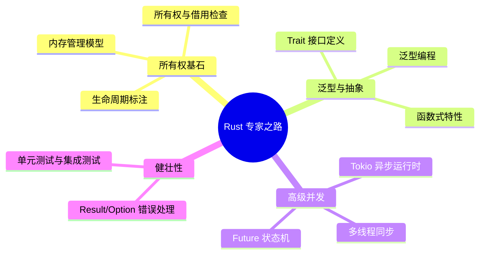

## Rust 现代系统级编程体系

欢迎来到 Rust 的世界。本专题旨在帮助开发者从内存安全、零成本抽象及无畏并发三个维度，构建对高性能系统级编程的深度认知。

---

## 🗺️ Rust 学习路线图

---

## 🚀 第一阶段：所有权与内存安全 (Memory Safety)

理解 Rust 区别于其他语言的核心竞争力。

- [所有权与生命周期核心](ownership-lifetimes.md)：深入生命周期借用检查器与 `'static`。
- [内存管理深度解析](memory-management.md)：堆栈分配、`Box<T>`、`Arc<T>` 与引用计数。

---

## 🏗️ 第二阶段：类型系统与抽象 (Abstraction)

- [Trait 与泛型系统](traits-generics.md)：解耦合与静态/动态分发（Dynamic Dispatch）。
- [函数式编程特性](functional-rust.md)：闭包、迭代器与不可变性。

---

## ⚡ 第三阶段：无畏并发与异步编程 (Concurrency)

- [Rust 并发编程与 Tokio](concurrency.md)：多线程消息传递与 `async/await` 异步生态。

---

## 🛠️ 第四阶段：生产级健壮性 (Robustness)

- [错误处理艺术](error-handling.md)：`Result` 链式调用与自定义错误类型。
