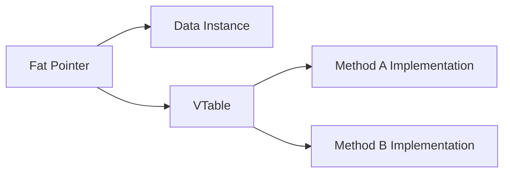

## Rust 特征系统与零成本抽象

在 Rust 中，特征（Trait）是定义共享行为的唯一保障。它不仅仅是接口（Interface），更是 Rust 实现零成本抽象（Zero-cost Abstractions）的核心，支撑着泛型（Generics）、算符重载以及动态派发等高级特性。

---

## 静态派发：单态化编译 (Monomorphization)

当你在函数中使用泛型约束（如 `fn process<T: Clone>(arg: T)`）时，Rust 编译器会进行单态化处理。

### 1. 物理层面的代码膨胀

对于每一个调用该泛型函数的具体类型，编译器都会生成一份专属的二进制代码拷贝：

- **优点**：运行效率极高。由于类型在编译期已知，编译器可以进行内联优化（Inlining），不存在任何运行时开销。
- **缺点**：如果泛型函数被大量不同类型调用，会导致生成的二进制文件体积（Binary Bloat）膨胀，并增加编译时间。

### 2. 泛型约束与全覆盖实现 (Blanket Implementations)

我们可以为所有实现了某个特征的类型，自动实现另一个特征，这被称为 Blanket Implementation。

```rust
// 如果 T 实现了 Display，那么它自动获得 ToString (标准库示例)
impl<T: Display> ToString for T {
    // ...
}
```

---

## 动态派发：Trait 对象与 VTable

在某些场景下（如处理包含不同类型元素的集合），我们无法在编译期确定所有类型。此时需要使用 Trait 对象（`dyn Trait`）。

### 1. 指针的二元性 (Fat Pointer)

Trait 对象在内存中是一个**胖指针（Fat Pointer）**，由两个部分组成：
1. **数据指针**：指向堆或栈上的具体对象实例。
2. **虚表指针 (vpointer)**：指向该类型的虚函数表（VTable）。



### 2. 对象安全性 (Object Safety)

并非所有特征都能转化为 Trait 对象。必须满足对象安全性约束，例如：
- 返回类型不能是 `Self`。
- 方法不能带有泛型参数。

---

## 孤儿规则与 Newtype 模式

为了保证 crate 生态的相容性，Rust 强制执行**孤儿规则（Orphan Rules）**：只有当特征或类型中至少有一个是在当前 crate 内定义时，你才能为类型实现特征。

- **困境**：无法直接为 `std::vec::Vec` 实现 `std::fmt::Display`。
- **破解之道**：使用 **Newtype 模式**。

```rust
struct MyVec(Vec<i32>);

impl std::fmt::Display for MyVec {
    fn fmt(&self, f: &mut std::fmt::Formatter) -> std::fmt::Result {
        write!(f, "Count: {}", self.0.len())
    }
}
```

> **架构建议**：优先使用静态派发以获得极致性能；仅在需要多态集合或缩减编译时间时，考虑使用 `Box<dyn Trait>`。
