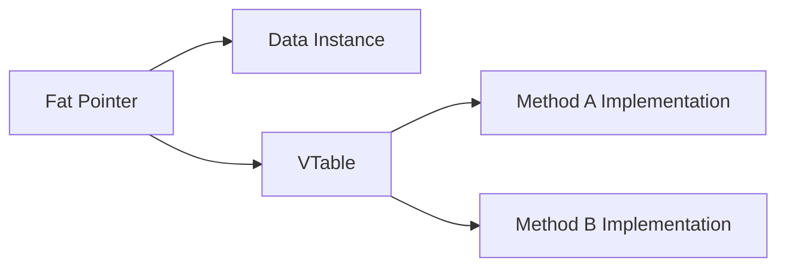

## Rust 特征系统与零成本抽象

在 Rust 中，特征（Trait）是定义共享行为的唯一保障。它不仅仅是接口（Interface），更是 Rust 实现零成本抽象（Zero-cost Abstractions）的核心，支撑着泛型（Generics）、算符重载以及动态派发等高级特性。

> 🟢 **基础**：掌握基本语法即可阅读 ｜ 🟡 **进阶**：需要有一定 Rust 开发经验 ｜ 🔴 **高级**：面向系统级开发者与性能工程师

---

## 🟢 Trait 是什么

Trait 是 Rust 中定义一组**共享行为**的机制——类似于其他语言中的接口（Interface）或抽象类。当多个不同类型拥有相同的行为时，就可以用 Trait 来描述它们。

```rust
// 定义一个 Trait
trait Greet {
    fn greet(&self) -> String; // 抽象方法：不提供实现
    fn greet_loudly(&self) -> String { // 默认方法：提供默认实现
        self.greet().to_uppercase()
    }
}

struct English;
struct Chinese;

impl Greet for English {
    fn greet(&self) -> String {
        "Hello!".to_string()
    }
}

impl Greet for Chinese {
    fn greet(&self) -> String {
        "你好！".to_string()
    }
}

fn main() {
    let e = English;
    println!("{}", e.greet());         // Hello!
    println!("{}", e.greet_loudly());  // HELLO!
}
```

---

## 🟢 常用特征的派生 (Derive) 与手动实现

在实际开发中，有几个标准库特征（Traits）几乎无处不在。Rust 编译器提供了一种极度便利的机制——**属性宏 `#[derive(...)]`**，可以为我们的结构体或枚举自动生成这些常用特征的默认实现。

### 1. 核心派生特征 (Derivable Traits)
- **`Debug`**：允许使用 `{:?}` 或 `{:#?}` 格式化输出该类型以供调试。
- **`Clone` 与 `Copy`**：控制类型的复制行为。`Clone` 表示显式深拷贝；`Copy` 表示隐式的按字节浅拷贝（`memcpy`，必须在所有字段都实现 `Copy` 时才可用）。
- **`PartialEq` 与 `Eq`**：控制等值比较。`PartialEq` 允许进行 `==` 比较，`Eq` 代表自反的等价关系（如 `x == x` 恒成立，浮点数 `f32`/`f64` 因含有 `NaN` 而只实现了 `PartialEq`，未实现 `Eq`）。
- **`Default`**：提供一个“零值”或默认构造状态。

```rust
// 编译器将自动为我们的类型实现上述所有行为！
#[derive(Debug, Clone, Copy, PartialEq, Eq, Default)]
struct Point {
    x: i32,
    y: i32,
}

fn main() {
    let p1 = Point::default(); // 自动初始化为 x: 0, y: 0
    let p2 = Point { x: 10, y: 20 };
    println!("Point 1: {:?}", p1); // Point 1: Point { x: 0, y: 0 }
    
    // 如果没有使用 #[derive(Copy)]，p2 在赋值给 p3 后将无法再使用
    let p3 = p2; 
    assert_ne!(p1, p3); // 自动生成 PartialEq 比较
}
```

### 2. 何时必须手动实现特征？

派生宏生成的逻辑非常死板。在有些场景下，我们需要手动编写 `impl`：
- **自定义默认状态**：如果你的结构体的 `Default` 不想是数值零。比如，我们希望端口 `port` 默认是 `8080`，而不是 `0`。
- **排除特定字段**：进行等值比较时忽略某些缓存字段或时间戳。

```rust
struct Connection {
    id: u64,
    last_ping: std::time::Instant, // 比较时忽略该字段
}

impl PartialEq for Connection {
    fn eq(&self, other: &Self) -> bool {
        self.id == other.id // 仅通过 id 判定是否是同一个连接
    }
}
```

---

## 🟢 孤儿规则与 Newtype 模式

为了保证 crate 生态的相容性，Rust 强制执行**孤儿规则（Orphan Rules）**：只有当特征或类型中至少有一个是在当前 crate 内定义时，才能为类型实现特征。

- **困境**：无法直接为 `Vec` 实现 `std::fmt::Display`（两者都来自标准库）。
- **破解之道**：使用 **Newtype 模式**——用一个元组结构体包裹目标类型。

```rust
struct MyVec(Vec<i32>);

impl std::fmt::Display for MyVec {
    fn fmt(&self, f: &mut std::fmt::Formatter) -> std::fmt::Result {
        write!(f, "Count: {}", self.0.len())
    }
}

fn main() {
    let v = MyVec(vec![1, 2, 3]);
    println!("{}", v); // Count: 3
}
```

---

## 🟡 静态派发：单态化编译 (Monomorphization)

当你在函数中使用泛型约束（如 `fn process<T: Clone>(arg: T)`）时，Rust 编译器会进行**单态化处理**：为每一个调用该泛型函数的具体类型，生成一份专属的二进制代码拷贝。

- **优点**：运行效率极高。类型在编译期已知，编译器可以进行内联优化（Inlining），不存在任何运行时开销。
- **缺点**：如果泛型函数被大量不同类型调用，会导致二进制文件体积（Binary Bloat）膨胀，并增加编译时间。

### 全覆盖实现 (Blanket Implementations)

我们可以为所有实现了某个特征的类型，自动实现另一个特征：

```rust
// 如果 T 实现了 Display，那么它自动获得 ToString（标准库示例）
impl<T: std::fmt::Display> ToString for T {
    // ...
}
```

---

## 🟡 关联类型 vs 泛型参数

这是 Rust Trait 设计中最常见的决策点之一。两者在表达能力上有本质的区别。

### 1. 关联类型 (Associated Types)

关联类型将类型参数作为特征自身的"输出"，每个具体实现只有**唯一一种**输出类型。这极大地简化了调用时的类型推导，是"一对一"的关系。`Iterator` 特征就是典型代表：

```rust
pub trait Iterator {
    type Item; // 关联类型：每个实现者只对应一种 Item 类型
    fn next(&mut self) -> Option<Self::Item>;
}
```

### 2. 泛型参数 (Generic Type Parameters)

泛型参数允许一个类型**对同一特征有多种实现**（"一对多"的关系）。`Add` 特征就是典型案例——可以为 `Vector2D` 同时实现 `Add<Vector2D>` 和 `Add<f64>`：

```rust
use std::ops::Add;

#[derive(Debug, Clone, Copy)]
struct Vector2D { x: f64, y: f64 }

// 向量 + 向量
impl Add<Vector2D> for Vector2D {
    type Output = Vector2D;
    fn add(self, rhs: Vector2D) -> Vector2D {
        Vector2D { x: self.x + rhs.x, y: self.y + rhs.y }
    }
}

// 向量 + 标量（不同的 Rhs 类型参数，同一类型可多实现）
impl Add<f64> for Vector2D {
    type Output = Vector2D;
    fn add(self, scalar: f64) -> Vector2D {
        Vector2D { x: self.x + scalar, y: self.y + scalar }
    }
}
```

| 特性 | 关联类型 | 泛型参数 |
| :--- | :--- | :--- |
| 实现数量 | 每个类型唯一 | 每个类型可多实现 |
| 调用时推导 | 自动推导，无歧义 | 通常需要标注 |
| 典型代表 | `Iterator::Item` | `Add<Rhs>` |

---

## 🟡 动态派发：Trait 对象与 VTable

在某些场景下（如处理包含不同类型元素的集合），我们无法在编译期确定所有类型。此时需要使用 Trait 对象（`dyn Trait`）。

### 1. 胖指针 (Fat Pointer)

Trait 对象在内存中是一个**胖指针（Fat Pointer）**，由两个部分组成：

1. **数据指针**：指向堆或栈上的具体对象实例。
2. **虚表指针 (vpointer)**：指向该类型的虚函数表（VTable）。



```rust
// 使用 Box<dyn Trait> 存储不同类型的实现
fn make_greeters() -> Vec<Box<dyn Greet>> {
    vec![Box::new(English), Box::new(Chinese)]
}
```

---

## 🔴 高级限界：超类特征与扩展特征

### 1. 超类特征约束 (Supertraits)

Supertrait 表达了一种"继承"依赖关系：实现特征 `B` 必须同时实现特征 `A`。

```rust
use std::fmt;

// 若要实现 Printable，必须同时实现 fmt::Display
trait Printable: fmt::Display {
    fn print_self(&self) {
        println!("Value: {}", self); // 因为有 Display 约束，可以直接使用 {}
    }
}
```

### 2. 扩展特征模式 (Extension Traits)

这是 Rust 生态中广泛使用的设计模式，用于为外部类型增加更便捷的辅助方法，同时遵守孤儿规则。

```rust
// 为标准库的 &str 类型扩展一个 is_valid_email 方法
trait StrExt {
    fn is_valid_email(&self) -> bool;
}

impl StrExt for str {
    fn is_valid_email(&self) -> bool {
        self.contains('@') && self.contains('.')
    }
}

fn main() {
    println!("{}", "user@example.com".is_valid_email()); // true
}
```

---

## 🔴 `impl Trait` 的静态分发本质

`impl Trait` 是泛型约束的语法糖，但在入参和返回值位置上有不同的语义。

### 1. 作为参数（输入位置）

`fn foo(x: impl Display)` 等价于 `fn foo<T: Display>(x: T)`。两者都是静态分发，没有任何运行时开销。

### 2. 作为返回值（输出位置）

允许函数返回一个**编译器在内部知晓但对外不透明**的具体类型，实现了类型擦除而不引入堆分配的 vtable 开销，是零成本的"类型隐藏"。

```rust
// 返回某个实现了 Fn(i32) -> i32 的具体类型，调用者无需关心其是哪种闭包
fn make_adder(n: i32) -> impl Fn(i32) -> i32 {
    move |x| x + n
}

fn main() {
    let add5 = make_adder(5);
    println!("{}", add5(3)); // 8
}
```

---

## 🔴 对象安全性 (Object Safety)

并非所有特征都能转化为 Trait 对象（`dyn Trait`）。必须满足**对象安全性**约束，否则编译器会报错。

不满足对象安全的情况包括：

- 方法的返回类型是 `Self`（如 `Clone::clone`）。
- 方法带有泛型参数（如 `fn process<T>(&self, x: T)`）。

若一个特征整体不满足对象安全，但仍需要为其创建 Trait 对象，可以使用 `where Self: Sized` 将不满足条件的方法从 vtable 中排除：

```rust
trait MyTrait {
    fn object_safe_method(&self);

    // 用 where Self: Sized 标记的方法不进入 vtable，不影响对象安全性
    fn non_object_safe<T>(&self, _x: T) where Self: Sized {}
}
```

> [!NOTE]
> **架构建议**：优先使用静态派发（泛型/`impl Trait`）以获得极致性能；仅在需要多态集合或运行时多态时，考虑使用 `Box<dyn Trait>`。
