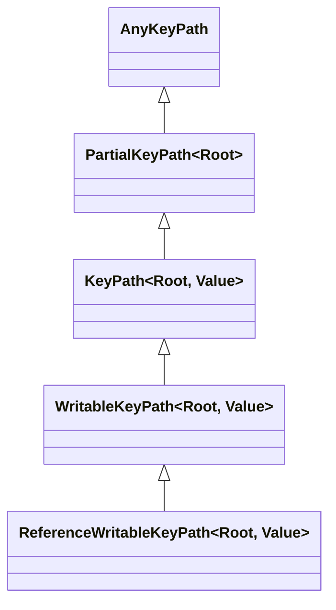

# KeyPath、反射与 Result Builders

Swift 提供了强类型的 **KeyPath（属性路径）** 与 **`@dynamicMemberLookup`** 动态属性路由能力，兼顾了类型安全与元编程的便利性。同时，通过 **`Mirror` 反射机制**，开发者可以在运行时检查任意实例的内部结构。而 **Result Builders（结果建造者）** 更是 SwiftUI 声明式 UI 语法的基石。

---

## 1. KeyPath (强类型属性引用)

与字符串形式的 Key-Value Coding (KVC) 不同，Swift 的 `KeyPath` 具备完整的类型检查，在编译期即可验证属性路径的合法性。

### 1.1 KeyPath 继承层级矩阵



- **`KeyPath<Root, Value>`**：只读属性路径（适用于结构体与类）。
- **`WritableKeyPath<Root, Value>`**：可变属性路径（适用于结构体中的 `var` 属性）。
- **`ReferenceWritableKeyPath<Root, Value>`**：引用可变属性路径（适用于类中的 `var` 属性）。

### 1.2 高阶函数应用与高质简化

可以在 `map`、`filter`、`sorted` 等高阶函数中直接传入 KeyPath (`\Root.value`)：

```swift
struct Product {
    let name: String
    var price: Double
}

let products = [
    Product(name: "MacBook Pro", price: 1999.0),
    Product(name: "iPad Air", price: 599.0)
]

// 使用 KeyPath 直接提取属性或排序
let names = products.map(\.name) // ["MacBook Pro", "iPad Air"]
let sortedProducts = products.sorted(by: \.price) // 按价格升序
```

---

## 2. 动态路由：`@dynamicMemberLookup`

通过在类型声明上标注 `@dynamicMemberLookup`，可以使用点语法访问未显式定义的属性。Swift 会在编译期将其重定向为对 `subscript(dynamicMember:)` 下标方法的调用：

```swift
@dynamicMemberLookup
struct DynamicSettings {
    private var dictionary = ["theme": "dark", "fontSize": "16"]

    // 接受 KeyPath 级别的重定向（保持类型安全）
    subscript(dynamicMember member: String) -> String {
        return dictionary[member] ?? ""
    }
}

let settings = DynamicSettings()
print(settings.theme)    // 输出 "dark"（自动转译为 settings[dynamicMember: "theme"]）
print(settings.fontSize) // 输出 "16"
```

---

## 3. `Mirror` 动态反射原理与性能开销

Swift 的 `Mirror` 能够提取任意实例的类型信息、属性名称及对应值。这常用于 JSON 自动序列化、调试打印或 Mock 数据生成。

### 3.1 运行时遍历结构体属性

```swift
struct User {
    let id: Int
    let name: String
    let isVip: Bool
}

let user = User(id: 101, name: "Alice", isVip: true)
let mirror = Mirror(reflecting: user)

print("类型名称:", mirror.subjectType) // User
for child in mirror.children {
    if let propertyName = child.label {
        print("属性名: \(propertyName), 值: \(child.value)")
    }
}
```

:::warning 反射性能与黑盒代价
`Mirror` 依赖 Swift Metadata 的运行时剖析。与静态派发相比，`Mirror` 反射性能低 1~2 个数量级。在高性能热点路径（如每秒数万次的循环）中应尽量避免使用 `Mirror`，优先使用 `Codable` 编译器自动生成的代码。
:::

---

## 4. 自定义 `@resultBuilder` (结果建造者)

`@resultBuilder` 允许开发者使用控制流（如 `if`、`for`）与内嵌列表语法构建简洁的领域专用语言（DSL）。SwiftUI 的 `@ViewBuilder` 正是基于此实现。

### 4.1 实现自定义 HTML/标记语言 DSL

```swift
@resultBuilder
struct HTMLBuilder {
    // 组合多个子节点
    static func buildBlock(_ components: String...) -> String {
        return components.joined(separator: "\n")
    }

    // 支持条件判断 (if)
    static func buildOptional(_ component: String?) -> String {
        return component ?? ""
    }
}

// 辅助 Tag 函数
func div(@HTMLBuilder content: () -> String) -> String {
    return "<div>\n\(content())\n</div>"
}

func p(_ text: String) -> String {
    return "  <p>\(text)</p>"
}

// 使用 DSL 构建 HTML 结构
let isAuthorized = true
let htmlResult = div {
    p("Welcome to Swift Guide!")
    if isAuthorized {
        p("User status: Authenticated")
    }
}

print(htmlResult)
/*
<div>
  <p>Welcome to Swift Guide!</p>
  <p>User status: Authenticated</p>
</div>
*/
```

Through `@resultBuilder`, Swift compiler transforms multi-line expression statements in the trailing closure into statically generated code, eliminating runtime parsing overhead.
