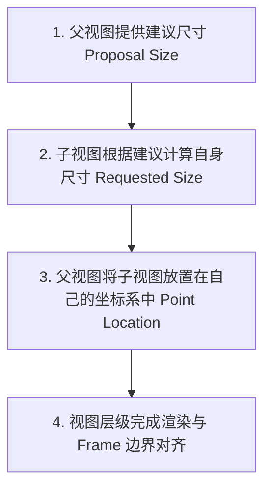

# SwiftUI 布局与 UIKit 桥接

SwiftUI 采用了声明式的布局协商（Layout Negotiation）算法，并从 iOS 16 开始引入了 **`Layout` 协议**，允许开发者实现复杂的高性能自定义容器布局。而在工程实战中，通过 **`UIViewRepresentable`** 与 **`UIHostingController`** 可以轻松实现 SwiftUI 与 UIKit 的双向混编桥接。

---

## 1. SwiftUI 布局三步协商算法

SwiftUI 的视图树布局计算遵循固定的**自顶向下协商，自底向上确定**的原则：



1. **父视图提供建议尺寸（Proposed Size）**：父视图询问子视图：“在给定的宽高范围内，你希望占据多大空间？”
2. **子视图计算决定真实尺寸（Requested Size）**：子视图根据自身内容（如文本长度、图片原始尺寸）决定最终所需的几何大小，并返回给父视图。
3. **父视图摆放子视图（Placement）**：父视图根据子视图返回的大小，将其放置在父视图坐标系中的特定位置（如居中或左对齐）。

---

## 2. 自定义布局：`Layout` 协议 (iOS 16+)

在 iOS 16 之前，创建瀑布流或流式布局（FlowLayout）需要依赖复杂的 `GeometryReader` 与 `Preference` 传递。iOS 16 引入了 `Layout` 协议，使自定义布局的性能提升至原生级别。

### 2.1 实现自定义流式布局 (FlowLayout)

实现 `Layout` 协议必须提供两个核心方法：`sizeThatFits`（计算总尺寸）与 `placeSubviews`（放置子视图）：

```swift
import SwiftUI

struct FlowLayout: Layout {
    var spacing: CGFloat = 8

    func sizeThatFits(proposal: ProposedViewSize, subviews: Subviews, cache: inout ()) -> CGSize {
        let width = proposal.width ?? .infinity
        var currentX: CGFloat = 0
        var currentY: CGFloat = 0
        var lineHeight: CGFloat = 0

        for subview in subviews {
            let size = subview.sizeThatFits(.unspecified)
            if currentX + size.width > width {
                currentX = 0
                currentY += lineHeight + spacing
                lineHeight = 0
            }
            currentX += size.width + spacing
            lineHeight = max(lineHeight, size.height)
        }

        return CGSize(width: width, height: currentY + lineHeight)
    }

    func placeSubviews(in bounds: CGRect, proposal: ProposedViewSize, subviews: Subviews, cache: inout ()) {
        var currentX = bounds.minX
        var currentY = bounds.minY
        var lineHeight: CGFloat = 0

        for subview in subviews {
            let size = subview.sizeThatFits(.unspecified)
            if currentX + size.width > bounds.maxX {
                currentX = bounds.minX
                currentY += lineHeight + spacing
                lineHeight = 0
            }
            subview.place(at: CGPoint(x: currentX, y: currentY), proposal: .unspecified)
            currentX += size.width + spacing
            lineHeight = max(lineHeight, size.height)
        }
    }
}
```

---

## 3. 视图标识：结构标识 vs 显式标识

SwiftUI 依赖视图标识（View Identity）在状态更新时判断是重绘现有视图还是创建新视图：

- **结构标识 (Structural Identity)**：通过视图在条件语句（如 `if-else` 或 `switch`）中的分支位置识别。过度嵌套的分支会导致 SwiftUI 丢失视图状态或破坏动画连续性。
- **显式标识 (Explicit Identity)**：使用 `.id(value)` 显式绑定唯一标识。当 `value` 改变时，SwiftUI 会将该视图视为全新视图，触发重新初始化与加载动画。

```swift
// 结构标识：分支不同，状态不共享
if isLoggedIn {
    ProfileView(user: user)
} else {
    LoginView()
}

// 显式标识：强制重建视图以重新运行 onAppear 或重置动画状态
ProfileView(user: user)
    .id(user.id)
```

---

## 4. SwiftUI 与 UIKit 混合编程

### 4.1 在 SwiftUI 中嵌入 UIKit 视图 (`UIViewRepresentable`)

当需要使用 UIKit 中成熟的控件（如 `MKMapView` 或 `UITextView`）时，实现 `UIViewRepresentable`：

```swift
import SwiftUI
import MapKit

struct MapViewBridge: UIViewRepresentable {
    @Binding var region: MKCoordinateRegion

    // 1. 创建 UIKit 视图实例
    func makeUIView(context: Context) -> MKMapView {
        let mapView = MKMapView()
        mapView.delegate = context.coordinator
        return mapView
    }

    // 2. 数据更新时同步到 UIKit 视图
    func updateUIView(_ uiView: MKMapView, context: Context) {
        uiView.setRegion(region, animated: true)
    }

    // 3. Coordinator 处理 UIKit 代理回调并反向更新 SwiftUI 状态
    func makeCoordinator() -> Coordinator {
        Coordinator(self)
    }

    class Coordinator: NSObject, MKMapViewDelegate {
        var parent: MapViewBridge

        init(_ parent: MapViewBridge) {
            self.parent = parent
        }

        func mapViewDidChangeVisibleRegion(_ mapView: MKMapView) {
            DispatchQueue.main.async {
                self.parent.region = mapView.region
            }
        }
    }
}
```

### 4.2 在 UIKit 中嵌套 SwiftUI 视图 (`UIHostingController`)

在现有的 UIKit/Storyboards 项目中引入 SwiftUI 组件时，使用 `UIHostingController` 包装：

```swift
import UIKit
import SwiftUI

class LegacyViewController: UIViewController {
    override func viewDidLoad() {
        super.viewDidLoad()

        // 1. 创建 SwiftUI 视图
        let swiftUIView = Text("Hello from SwiftUI!")
            .font(.title)
            .padding()

        // 2. 用 UIHostingController 包装
        let hostingController = UIHostingController(rootView: swiftUIView)

        // 3. 作为 Child ViewController 添加到当前视图控制器
        addChild(hostingController)
        view.addSubview(hostingController.view)
        hostingController.view.frame = CGRect(x: 20, y: 100, width: 300, height: 100)
        hostingController.didMove(toParent: self)
    }
}
```
