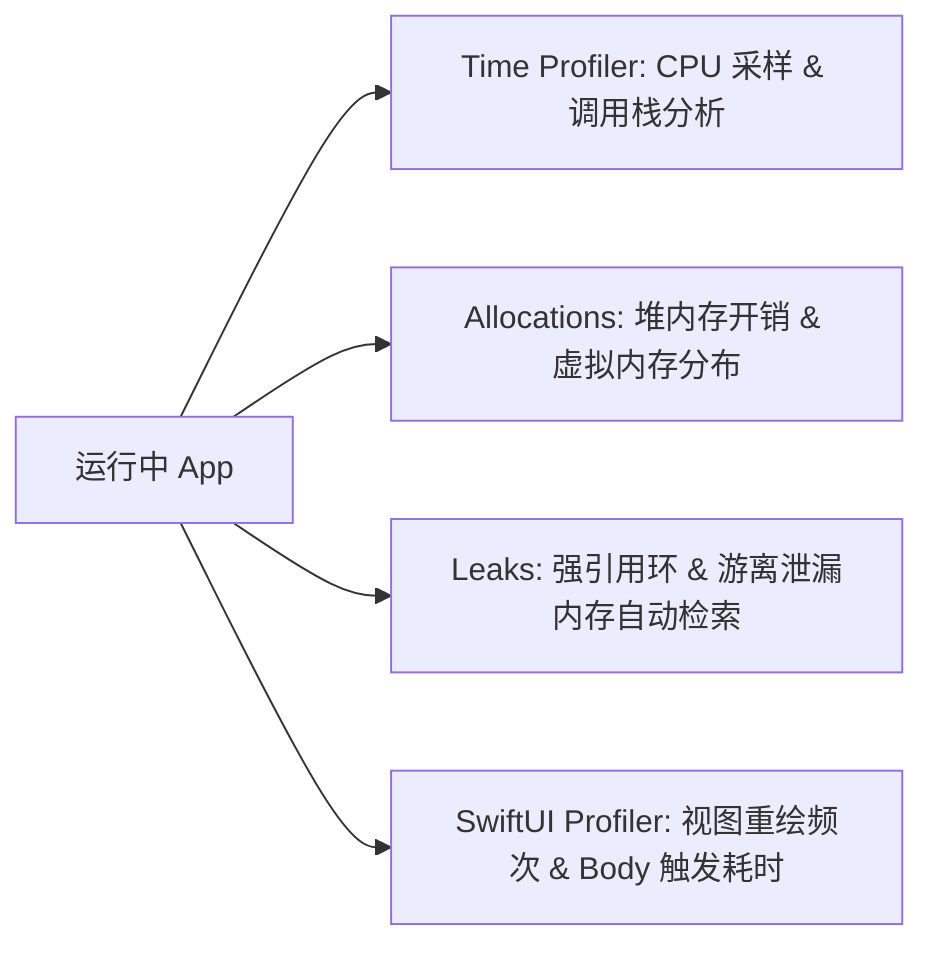

# 现代测试与 Instruments 诊断调优

软件质量与极致性能是高品质 Apple 生态应用的核心竞争壁垒。Swift 6 推出了全新的 **Swift Testing 框架**（`import Testing`），全方位超越了传统的 XCTest。同时，结合 Xcode **Instruments** 性能诊断工具链，开发者可以精确定位 CPU 卡顿、内存泄漏与卡帧现象。

---

## 1. Swift 6 现代测试框架 (`import Testing`)

Swift 6 引入的 Swift Testing 框架使用**宏（Macros）**重构了单元测试语法，具备更高的可读性、更强的并发测试能力以及精准的失败断言。

### 1.1 Swift Testing vs XCTest 架构对比

| 维度 | Swift Testing (`import Testing`) | 传统 XCTest (`import XCTest`) |
| :--- | :--- | :--- |
| **测试声明** | 属性宏 `@Test`，任何函数均可作为测试 | 方法名必须以 `test` 开头（如 `testExample`） |
| **测试套件分组** | 结构体/类 + 属性宏 `@Suite` | 必须继承自 `XCTestCase` 类 |
| **断言机制** | 统一宏 `#expect(...)` 与 `#require(...)` | 众多变体 (`XCTAssertEqual`, `XCTAssertNil` 等) |
| **参数化测试** | 原生支持 `@Test(arguments: [...])` | 需通过 `for` 循环手动写多条断言 |
| **并行执行** | 默认以 Task 级别高度并发并行运行 | 串行或进程级有限并行 |

### 1.2 `#expect` 与 `#require` 断言实战

```swift
import Testing
@testable import MyAppCore

@Suite("用户鉴权与状态机测试")
struct AuthenticationTests {

    @Test("验证标准登录流程")
    func testSuccessfulLogin() async throws {
        let authService = AuthService()
        
        // #require: 若计算失败，立即中断当前测试函数（类似于 unwrap 非空表达）
        let token = try #require(await authService.login(username: "admin", password: "123"))
        
        // #expect: 展开完整表达式，在测试失败时自动打印变量的实际运行值
        #expect(!token.isEmpty)
        #expect(token.hasPrefix("Bearer_"))
    }

    @Test("参数化边界条件测试", arguments: ["", "   ", "invalid_email"])
    func testInvalidEmails(email: String) {
        let validator = EmailValidator()
        #expect(!validator.isValid(email))
    }
}
```

:::tip `#require` 与 `#expect` 的最佳实践
- 使用 **`#expect`** 进行一般断言：即使断言失败，测试仍会继续执行后面的语句，尽可能收集更多失败信息。
- 使用 **`#require`** 进行前置准备：如果前置条件不满足（如 `nil` 解包失败），继续执行会引发崩溃时，`#require` 会抛出错误并优雅中断当前测试。
:::

---

## 2. Xcode Instruments 性能诊断实战

Xcode 的 Instruments 包含了丰富的 Profiler 探针，是解决卡顿、发热、耗电与内存泄漏的终极利器。



### 2.1 Time Profiler：定位主线程卡顿与 CPU 瓶颈

- **诊断原理**：以固定频率（通常 1ms）对 CPU 寄存器与线程调用栈进行采样。
- **使用步骤**：
  1. 在 Xcode 中按 `Cmd + I` 启动 Instruments，选择 **Time Profiler**。
  2. 点击录制，在 App 中重复触发卡顿的操作。
  3. 在 Call Tree 底部勾选 **`Invert Call Tree`**（反转调用树）与 **`Hide System Libraries`**（隐藏系统库）。
  4. 展开最耗时的主线程树（Main Thread），直接定位到耗时过长的 Swift 业务方法。

### 2.2 Allocations 与 Leaks：内存泄漏与溢出排查

- **Allocations（内存分配）**：记录每一块堆内存的申请与释放。通过 **Mark Generation**（内存快照对比）功能，连续点击 3 次相同页面后查看 Persistent 增加的对象，排查未释放的 VM 缓存。
- **Leaks（内存泄漏）**：自动分析 ARC 引用图（Reference Graph）。一旦发现由于未写 `[weak self]` 导致闭包捕获形成的强引用环（Retain Cycle），Leaks 视图会直接标红并渲染 Graph 节点路径。

### 2.3 SwiftUI View Render 渲染剖析

在 Instruments 中使用 **SwiftUI Profiler** 模板，可以精确追踪每一个 `struct View` 的 `body` 评估次数：
- 若发现某个静态列表项的 `body` 在滚动时被无故重复评估数百次，说明该视图依赖了不必要的全局变量，需重构为精准传递参数，或在 iOS 17+ 迁移至 **`@Observable` 宏** 进行状态隔离。
