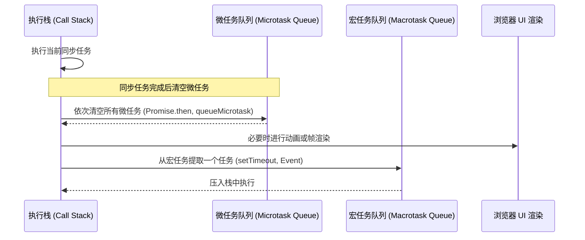

## 现代 JavaScript (ES6+) 核心原理解析

要写出高性能、无漏洞的 React 代码，必须彻底吃透现代 JavaScript（ECMAScript 6 及更高版本）的核心编译、运行机制与异步逻辑管道。

---

## 一、 事件循环与异步并发模型 (Event Loop)

JavaScript 作为单线程语言，其底层的异步执行依赖于**事件循环（Event Loop）**。

### 1.1 宏任务 (Macrotasks) 与 微任务 (Microtasks)

执行阶段按照如下执行流循环往复：



#### 📦 原理剖析核心示例

```javascript
console.log('1. 同步开始');

setTimeout(() => {
  console.log('5. 宏任务');
}, 0);

Promise.resolve().then(() => {
  console.log('3. 微任务 1');
}).then(() => {
  console.log('4. 微任务 2');
});

console.log('2. 同步结束');

// 输出顺序: 
// 1. 同步开始
// 2. 同步结束
// 3. 微任务 1
// 4. 微任务 2
// 5. 宏任务
```

---

## 二、 内存管理、作用域与闭包机制

### 2.1 闭包的形成 (Closure)

闭包是指**有权访问另一个函数作用域中的变量的函数**。在 React 中，`useEffect`、`useCallback` 等 Hooks 底层均严重依赖闭包，若不关注则易形成“闭包旧值陷阱（Stale Closure）”。

```javascript
function createCounter() {
  let count = 0;
  return {
    increment() {
      count++;
      return count;
    },
    getCurrent() {
      return count; // 闭包：对外部 count 的活性引用
    }
  };
}
```

### 2.2 垃圾回收与内存泄漏 (Garbage Collection)

- JavaScript 核心采用**标记清除（Mark-and-Sweep）**机制，从全局 `window` 或活动运行域根点出发，所有不可达的节点均会被回收。
- **React 防空建议**：
  - 在 React 的 `useEffect` 中，如果有长期的定时器 `setInterval`、网络通道 `Websocket` 或原生 DOM 绑定事件，必须在 Cleanup 函数中显式予以注销，否则其引用的作用域将无法释放，导致高额内存泄漏。

---

## 三、 this 关键字绑定机制

在 JavaScript 中，`this` 是在**运行时（Runtime）**绑定的，它的值取决于函数的**调用位置和调用方式**。

### 3.1 四大绑定规则

1. **默认绑定**：在非严格模式下，独立函数调用时 `this` 绑定到全局对象 `window`（Node.js 中为 `global`）；严格模式（`use strict`）下绑定到 `undefined`。
2. **隐式绑定**：当函数作为某个对象的方法被调用时，`this` 绑定到该对象。例如 `obj.foo()`，`foo` 内部的 `this` 指向 `obj`。
3. **显式绑定**：通过 `call`、`apply` 或 `bind` 方法强行指定 `this` 的绑定对象。
4. **`new` 绑定**：使用 `new` 操作符调用构造函数时，JS 会在内存中创建一个空对象，并将构造函数内部的 `this` 绑定到这个新对象上。

### 3.2 箭头函数的例外（Lexical this）

箭头函数**没有自己的 `this`**。它内部的 `this` 是在**定义时**根据外层（词法作用域）上下文静态决定的。且无法通过 `call`/`apply`/`bind` 改变。这使得在 React 类组件的方法回调中，使用箭头函数可以完美避免 `this` 丢失的常见错误。

---

## 四、 原型与原型链继承

JavaScript 是一种基于原型的语言，其对象之间的继承是通过**原型链（Prototype Chain）**实现的。

### 4.1 `__proto__` 与 `prototype` 的关系

- 每个**函数**（Function）都有一个 `prototype` 属性，指向一个包含共享属性和方法的原型对象。
- 每个**对象**（Instance）都有一个内置属性 `__proto__`（标准为 `[[Prototype]]`），指向创建它的构造函数的 `prototype` 原型对象。

```javascript
function Person(name) {
  this.name = name;
}
Person.prototype.sayHello = function() {
  return `Hi, I am ${this.name}`;
};

const student = new Person('张三');
console.log(student.__proto__ === Person.prototype); // true
console.log(Person.prototype.constructor === Person); // true
```

### 4.2 原型链查找机制

当访问一个对象的属性时，JavaScript 引擎会首先在对象自身属性中查找。如果找不到，就会沿着 `__proto__` 指针去原型对象中查找；如果还找不到，就去原型对象的原型（`Person.prototype.__proto__` 即 `Object.prototype`）中查找，直到找到或到达最顶端 `null`（`Object.prototype.__proto__ === null`）。

### 4.3 ES6 Class 语法糖本质

ES6 引入的 `class` 关键字仅仅是原型继承的**语法糖**。它底层的运行逻辑仍然是基于原型链构建的。

```javascript
class Animal {
  constructor(name) {
    this.name = name;
  }
  eat() {
    return `${this.name} is eating`;
  }
}
// 底层等同于：
// function Animal(name) { this.name = name; }
// Animal.prototype.eat = function() { ... }
```

---

## 五、 Promise 状态机与 Async/Await 机制

异步处理在 React 状态管理及网络请求中处于支配地位。

### 5.1 Promise 的三大状态

Promise 本质是一个状态机，拥有以下三种状态且**一旦状态改变就不可逆转**：

- **Pending**（进行中）：初始状态。
- **Fulfilled**（已成功）：通过调用 `resolve(value)` 达成，并派发微任务执行 `.then(onFulfilled)`。
- **Rejected**（已失败）：通过调用 `reject(error)` 达成，并派发微任务执行 `.catch(onRejected)`。

### 5.2 Async/Await 与 Generator + Co 的降级本质

`async/await` 是异步编程的终极解决方案。在底层（例如经 Babel 降级编译后），`async/await` 实际上是 **Generator（生成器）** 与 **Co 自动执行器** 的语法糖。它通过将异步控制权交给 Generator 的 `yield`，并在微任务队列（`Promise.then`）中自动调用 `generator.next()`，实现用同步的写法写异步代码。

---

## 六、 ES6+ 语法在 React 中的核心应用

### 6.1 数组高阶方法契约

在 React 渲染机制中，严禁进行任何原地数据的 Push/Pop 改变（会破坏 immutable 性质导致不重新渲染）。因此，必须运用返回浅拷贝新引用的 ES6+ 数组方法：

```javascript
const list = [{ id: 1, name: 'Alice' }, { id: 2, name: 'Bob' }];

// 1. map (列表渲染)
const listItems = list.map(item => ({ ...item, role: 'User' }));

// 2. filter (删除项)
const filtered = list.filter(item => item.id !== 1);

// 3. reduce (聚合运算，如购物车总额)
const total = list.reduce((acc, current) => acc + current.id, 0);
```

### 6.2 属性解构、剩余符与合并

在 React 的 Props 数据流体系中常用于分发：

```javascript
// 对象属性提取与默认值分配
const { name, title = 'Developer', ...restProps } = props;

// 浅层合并 (Shallow Merge)
const updatedState = { ...state, count: state.count + 1 };
```

---

## 七、 核心自检与常见误区

### 7.1 核心自检清单

- [ ] 能够徒手画出事件循环中宏任务、微任务与 UI 渲染时帧的交替运行图。
- [ ] 能够清晰拆解 Promise、Async/Await 和 Generator 底层的降级编译转化。
- [ ] 掌握闭包的性能代价，能在实际业务中通过解引用防止 GC（垃圾回收）挂挡。
- [ ] 能解释并熟练写出 `this` 动态绑定的四种作用域情景（默认、隐式、显式、new）。
- [ ] 能够讲清 `__proto__` 和 `prototype` 的查找链路及 Class 的语法糖本质。

### 7.2 常见误区与方案

| 误区 | 错误做法导致的灾难 | 正确做法 |
| :--- | :--- | :--- |
| 定时器忘记 Cleanup | 组件卸载后，`setInterval` 依然在后台运行，疯狂修改已销毁组件的状态导致严重内存泄漏。 | 在 `useEffect` 的清理函数中执行 `clearInterval`。 |
| 以为 `const` 不能修改其属性 | 声明 `const obj = {}` 并在后续修改内部属性（`obj.a = 1`），误以为会触发重新渲染。 | 声明可变属性需要保持 immutable，用新对象引用覆盖旧对象。 |
| 混淆 `==` 和 `===` | 使用双等号发生不可挽救的底层 JavaScript 隐式类型转换崩溃（如 `0 == ""` 成立）。 | 全文、一律、无条件采用 `===` 严格进行类型与值全等判断。 |
