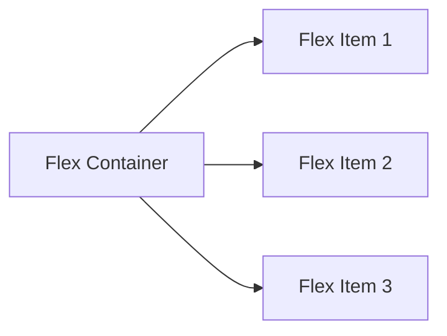

## HTML5 语义化与现代布局

在现代前端开发中，优雅、语义化的 HTML5 结构与强大的 CSS3 现代布局体系，是构建高性能、响应式用户界面的坚实基石。

---

## 一、 HTML5 语义化结构

语义化（Semantic）是指使用正确的标签来描述页面的结构和内容的含义，而不仅仅是为了展示它的样式。

### 1.1 常用语义化标签对比

| 标签 | 语义与作用 | 亮色 / 暗色适配 |
| :--- | :--- | :--- |
| `<header>` | 页面或区块的头部导航/引言 | 继承自 `--ifm-navbar-background-color` |
| `<nav>` | 导航链接区域，便于屏幕阅读器快速识别 | 继承自自定义导航栏背景 |
| `<main>` | 页面的主体内容，每个页面应当仅有一个 | 继承自 `--ifm-background-color` |
| `<article>` | 完整的、独立的、可分发的内容块（如博客文章） | 独立卡片背景 |
| `<section>` | 表示页面的某个专题卡片 or 逻辑分块 | 卡片色 `--ifm-card-background-color` |
| `<aside>` | 侧边栏，包含与主要内容间接相关的附加信息 | 继承自 Docusaurus 侧边栏样式 |
| `<footer>` | 页面或区块的尾部版权与链接信息 | `--ifm-footer-background-color` |

### 1.2 为什么需要语义化

- **SEO 友好**：爬虫（如 Googlebot）通过解析语义标签，更容易建立准确的文档大纲索引，提升网站排名。
- **无障碍访问（Accessibility）**：使残障人士辅助工具（如屏幕阅读器）能顺畅地理解文档的结构，为盲人提供完美的轮廓定位。
- **可维护性**：相比于满屏无序嵌套的 `<div>` 沙箱，语义化结构具有天然的模块自维护直观性。

---

## 二、 CSS 盒模型与格式化上下文

在进行复杂的 Flex/Grid 布局前，必须熟练掌握元素尺寸的计算边界与内部排版格式。

### 2.1 CSS 盒模型 (Box Model)

每个 HTML 元素在网页中都被渲染为一个矩形盒子，由内到外由 `Content`、`Padding`、`Border` 和 `Margin` 组成。CSS3 提供了 `box-sizing` 属性在两种计算模型间切换：

1. **标准盒模型 (W3C Box Model)**：
   - **声明**：`box-sizing: content-box` (浏览器默认值)。
   - **尺寸计算**：设置的宽度/高度仅等于内容区的宽高。盒子的实际占用空间宽度 = `width` + `padding-left/right` + `border-left/right`。
2. **怪异盒模型 (IE Box Model)**：
   - **声明**：`box-sizing: border-box`。
   - **尺寸计算**：设置的宽度/高度等于内容区 + 内边距 + 边框的总和。盒子的实际占用空间宽度 = `width`。
   - **最佳实践**：在现代前端中，通常通过全局重置样式为所有元素声明 `box-sizing: border-box`，这样更容易精准预测容器大小，避免内边距和边框撑破布局。

### 2.2 BFC (Block Formatting Context) 块级格式化上下文

BFC 是页面中一个**独立的渲染区域**，在这个区域内的元素排版不会在视觉上影响到外部的元素，反之亦然。

#### 2.2.1 触发 BFC 的条件

- `overflow` 的值不为 `visible`（如 `hidden`、`auto`、`scroll`）。
- `display` 的值为 `inline-block`、`flex`、`inline-flex`、`grid`、`table-cell`。
- `position` 的值为 `absolute` 或 `fixed`。
- `float` 的值不为 `none`。

#### 2.2.2 BFC 实战应用场景

1. **解决外边距重叠（Margin Collapse）**：
   - 在同一个 BFC 下，垂直方向上相邻的两个块级盒子的外边距会发生重叠。如果不希望重叠，可以将其中一个盒子包裹在另一个触发了 BFC 的容器（如 `overflow: hidden`）内。
2. **清除浮动影响**：
   - 如果父元素的所有子元素都是浮动元素，父元素会发生高度塌陷。让父元素触发 BFC（如声明 `overflow: hidden`），BFC 容器在计算高度时会将浮动子元素的高度也计算在内，从而撑起父级高度。
3. **阻止元素被浮动元素覆盖**：
   - 在两栏自适应布局中，左侧浮动，右侧元素可以通过声明 `overflow: hidden` 触发 BFC，从而避免自身与左侧浮动元素重叠，实现标准的自适应排版。

---

## 三、 现代 CSS 布局体系

在 CSS3 阶段，我们彻底淘汰了 `float` 浮动和 `table` 布局，取而代之的是 **Flexbox（一维布局）** 与 **Grid（二维网格布局）**。

### 3.1 Flexbox 弹性盒子（一维轴线布局）

Flexbox 专为一维流式排列（单行或单列）而生，擅长处理主轴与交叉轴上的尺寸伸缩、分配和对齐。



#### 📦 优秀实践：水平悬浮垂直居中的多功能自适应卡片

```css
/* component.module.css */
.flexContainer {
  display: flex;
  flex-direction: row; /* 主轴横向 */
  justify-content: space-between; /* 主轴等间距分配 */
  align-items: center; /* 交叉轴精准垂直居中 */
  flex-wrap: wrap; /* 自适应换行 */
  gap: 1.5rem; /* 子节点原子级间隔 */
}

.flexItem {
  flex: 1 1 200px; /* 伸、缩、基准像素 */
  padding: 1.5rem;
  background-color: var(--ifm-card-background-color);
  border-radius: 8px;
  box-shadow: var(--ifm-global-shadow-lw);
}
```

---

### 3.2 Grid 网格布局（二维多维矩阵）

Grid 是一种功能极其强悍的二维多维矩阵系统，可同时将元素划分进按比例划分的行（Row）和列（Column）中。

```mermaid
grid-layout
    Header Header Header
    Sidebar MainContent MainContent
    Footer Footer Footer
```

#### 📦 优秀实践：九宫格自适应 Dashboard 栅格系统

```css
/* component.module.css */
.gridDashboard {
  display: grid;
  /* 自动填充算法：按至少 250px 宽度等分，最大填满 1fr 弹性比列 */
  grid-template-columns: repeat(auto-fill, minmax(250px, 1fr));
  grid-auto-rows: minmax(150px, auto);
  gap: 1rem;
}

/* 跨行/跨列卡片 */
.gridFeaturedCard {
  grid-column: span 2; /* 跨两列 */
  grid-row: span 2; /* 跨两行 */
}
```

---

## 四、 SSG 安全说明与响应式原理

### 4.1 媒体查询 (Media Queries) 与 Breakpoints

利用 CSS 变量动态匹配 Infima 框架的媒体尺寸：

```css
/* 自定义全局响应 */
@media (max-width: 996px) {
  .flexContainer {
    flex-direction: column; /* 窄屏自动蜕化为垂直序列流 */
  }
}
```

### 4.2 SSG 防空指南 (Avoid Layout Shift)

在服务端渲染（SSR/SSG）模型（如 Docusaurus Build）中，因服务器不拥有 `window` 屏幕尺寸，若通过 JS 推导加载 CSS 会有首屏抖动（Layout Shift）隐患。
- **最佳实践**：严禁利用客户端 JS 获取浏览器 `window.innerWidth` 在服务端决定渲染哪个组件。
- **安全隔离**：统一使用纯 CSS 媒体查询（Media Query）管理响应式布局流展现，确保 Docusaurus 静态部署无首屏闪烁及乱屏问题。

---

## 五、 核心自检与常见误区

### 5.1 核心自检清单

- [ ] 能够区分什么样的布局选用 Flexbox，什么样的布局必须用 Grid。
- [ ] 是否完全理解并掌握 `flex: 1 1 auto` 的具体代表含义。
- [ ] 能够区分标准盒模型与怪异盒模型，并熟练运用 `box-sizing: border-box`。
- [ ] 掌握 BFC 触发的几种常见方式，能够说明它在清除浮动、边距合并时的作用。
- [ ] 能够避开 JS 依赖，纯通过 CSS `@media` 规则实施无布局偏移的响应。
- [ ] 能够写出规范、无多余 WAI-ARIA 污染的 HTML5 页面主体内容。

### 5.2 常见误区与方案

| 误区 | 错误做法导致的灾难 | 正确做法 |
| :--- | :--- | :--- |
| 子元素超出 Flex 边界 | 没声明 `flex-wrap` 导致所有元素在同一排被极其严重的压缩变形。 | 使用 `.flexContainer { flex-wrap: wrap; }` |
| JS 决定首屏布局 | 服务端没有 `window` 属性，构建失败，或造成客户端严重的注水延迟 Layout Shift. | 全面通过 `@media` 纯样式进行卡片响应与隐藏。 |
| 用 `padding` 强制定死列表间距 | 屏幕尺寸变动发生错乱与折行溢出。 | 声明 `gap` 控制网格和弹性父级下各元素间的标准间隙。 |
