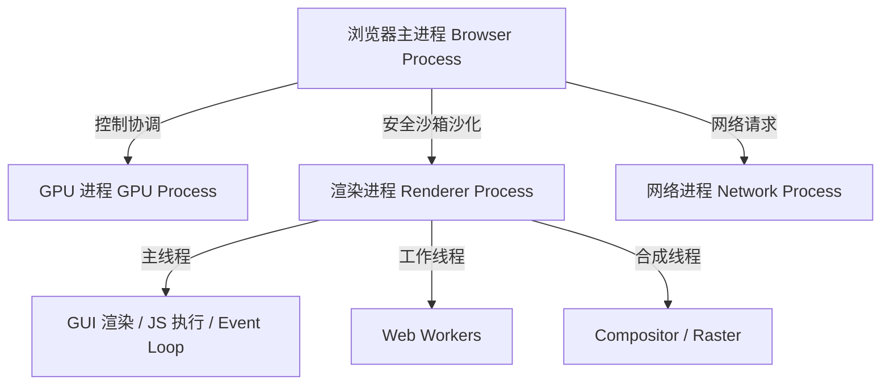
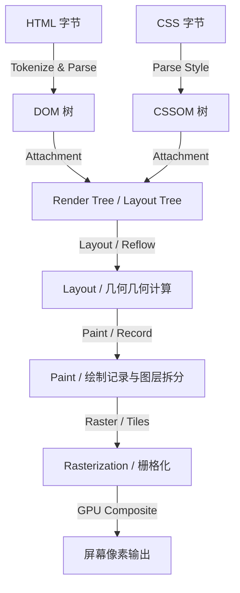

## 浏览器渲染机制与关键渲染路径调优

要构建拥有极致用户体验的现代 Web 应用，前端工程师不仅需要理解 React 的虚拟 DOM 状态流转，更必须洞悉物理浏览器（User Agent）的底层渲染管道（Rendering Pipeline）。

---

## 一、 浏览器多进程架构与渲染进程

现代浏览器（以 Chrome 为例）采用多进程架构，以确保沙箱安全、硬件隔离和稳定性。

### 1.1 核心进程职责



* **浏览器主进程 (Browser Process)**：控制应用生命周期的标签页创建、销毁，负责浏览器界面（Chrome）的地址栏、书签栏、后退按钮等，并协调其他子进程的工作。
* **网络进程 (Network Process)**：主要负责页面的网络资源加载，安全证书验证等。
* **GPU 进程 (GPU Process)**：专门负责 3D CSS 绘制、页面合成（Compositing）和物理硬件加速渲染。
* **渲染进程 (Renderer Process)**：又称**沙箱进程**。每个标签页默认对应一个独立的渲染进程（在 Site Isolation 策略下）。渲染进程内部运行着至关重要的**渲染主线程**、**合成线程**（Compositor）以及**栅格化线程池**（Raster Tile Worker）。

---

## 二、 关键渲染路径 (Critical Rendering Path)

**关键渲染路径**是指浏览器从通过网络接收 HTML、CSS、JavaScript 字节开始，到在屏幕上绘制像素的完整中间流转过程。其经典渲染逻辑如下：



### 2.1 DOM 树构建 (Document Object Model)

解析器读取原始字节，将其根据指定的编码（如 UTF-8）转换成字符。随后通过标记化（Tokenization）将其转换为不同的标签 Token，最后将 Token 转为节点并组织为具备父子关系的树形 DOM 结构。

### 2.2 CSSOM 树构建 (CSS Object Model)

在构建 DOM 的同时，若遇到 `<link>` 标签或 `<style>` 标签，网络进程将拉取样式资源。CSS 解析器会将样式表解析成树级 CSSOM，该过程由于需要递归计算元素的最终级联样式，会**阻塞 DOM 的渲染流程**（但不阻塞 DOM 的 HTML 解析）。

### 2.3 生成渲染树 (Render Tree / Layout Tree)

DOM 与 CSSOM 两棵树在主线程中合并生成 **Render Tree**：
1. 浏览器从 DOM 树的根节点开始遍历每个**可见**节点。
2. 忽略不可见节点（如 `<head>`、`<script>` 以及被设为 `display: none` 的节点；注意 `visibility: hidden` 节点依然保留在树中，因为其占据空间）。
3. 为每个可见节点匹配并应用对应的 CSSOM 规则。

### 2.4 布局计算 (Layout / Reflow)

渲染树构建完成后，浏览器通过遍历渲染树，计算出每个可见节点在屏幕视口（Viewport）内的精确**几何外框尺寸**与**绝对坐标偏移量**。这一阶段也被称为**重排（Reflow）**。

### 2.5 图层粉碎与绘制记录 (Paint)

在布局计算之后，主线程并不会直接把位图扔给显卡。相反，主线程会为页面元素拆分出不同的物理图层（Graphics Layers），并针对每个图层生成一份**绘制指令列表**（Paint Records），标记每个元素的绘制顺序。

### 2.6 合成与栅格化 (Compositing & Rasterization)

这是现代浏览器最关键的性能秘密：
1. **主线程**将生成的图层信息与绘制指令提交（Commit）给**合成线程（Compositor）**。
2. 合成线程将大图层剪切为适量的**瓦片/分块（Tiles）**。
3. 合成线程调用 GPU 进程中的**栅格化线程池**，将这些 Tiles 转换成显卡内存中的位图，此过程称为**栅格化（Rasterization）**。
4. 合成线程收集到全部物理位图后，向 GPU 发送 `DrawQuad` 指令，调用操作系统的底层图形 API（Skia / OpenGL）将各个图层混合拼装，最终刷新在显示器屏幕上。

---

## 三、 重排 (Reflow) 与重绘 (Repaint) 优化

在交互或 React 状态改变导致 DOM 结构变化时，渲染流会发生局部回溯。

### 3.1 渲染回溯成本对比

| 触发阶段 | 英文命名 | 物理代价大小 | 物理过程说明 |
| :--- | :--- | :--- | :--- |
| **重排** | Reflow / Layout | 极高 ($O(N)$ 渲染引擎遍历) | 只要几何属性（宽高、定位、边框、字体大小）变更，就必须重新计算布局并重绘 |
| **重绘** | Repaint | 中等 | 几何未改变，仅外观变更（背景色、文字颜色、阴影）。略过 Layout 直接 Paint |
| **合成** | Compositing | 极低 (GPU 直接处理) | 仅改变 Transform、Opacity，利用合成线程在 GPU 直接拼装，避开主线程阻塞 |

### 3.2 规避重排的优化策略

#### 1. 批量修改样式与 DOM

不要逐行修改元素的样式属性：

```typescript
// 避免：触发多次 Reflow
const el = document.getElementById('target-box')!;
el.style.width = '200px';
el.style.height = '300px';
el.style.margin = '10px';

// 推荐：采用合并修改或切换 CSS Class
el.classList.add('active-layout');
```

在追加大量子节点时，必须利于文档碎片（`DocumentFragment`）建立离线沙盒缓冲：

```typescript
const fragment = document.createDocumentFragment();
for (let i = 0; i < 1000; i++) {
  const item = document.createElement('div');
  item.textContent = `Item ${i}`;
  fragment.appendChild(item);
}
document.getElementById('list-container')!.appendChild(fragment);
```

#### 2. 避免强制同步布局 (Forced Synced Layout)

当从 DOM 读取某些几何属性时，为了保证返回值的绝对准确度，浏览器会**被迫中断当前 JS 任务，强行先执行一次即时布局计算**。

```typescript
// 触发强制同步布局的常见 API
const width = el.offsetWidth;
const height = el.offsetHeight;
const scroll = el.scrollTop;
const rect = el.getBoundingClientRect();
```

下面的循环会导致灾难性的**布局抖动（Layout Thrashing）**：

```typescript
// 灾难：每次循环都写入并立即读取，导致连续多次同步布局
for (let i = 0; i < els.length; i++) {
  els[i].style.width = box.offsetWidth + 'px'; // 同步读取 + 写入
}

// 推荐：读写分离，利用缓存的测量值
const targetWidth = box.offsetWidth;
for (let i = 0; i < els.length; i++) {
  els[i].style.width = targetWidth + 'px';
}
```

---

## 四、 现代化前端性能指标 (Web Vitals)

Google 倡导并在现代 Lighthouse 中强制推行 **Core Web Vitals**（核心网页指标），它们是衡量 CRP 及页面交互顺畅度的黄金准则：

### 4.1 核心指标模型

1. **LCP (Largest Contentful Paint)**：最大内容绘制。
   * **定义**：视口内最大文本块或图像渲染完成的时间。
   * **极佳标准**：$2.5$ 秒内。
2. **FID (First Input Delay) & INP (Interaction to Next Paint)**：首次输入延迟与交互到下次绘制。
   * **定义**：INP 用于衡量用户在页面生命周期中经历的每次交互的响应延迟（React 18/19 中的并发渲染和 `useTransition` 核心解决的就是这一指标）。
   * **极佳标准**：$200$ 毫秒内。
3. **CLS (Cumulative Layout Shift)**：累积布局偏移。
   * **定义**：页面生命周期内所有意外布局移动的累计分数。
   * **极佳标准**：小于 $0.1$。

---

## 五、 Docusaurus 静态站点生成 (SSG) 下的渲染防空设计

在 Docusaurus 构建中，所有组件在 Node 编译期会被执行。因此在引用浏览器特有环境对象时，需要谨防 “ Hydration Mismatch ”，这是由于服务端与客户端初始渲染结构不一致导致的性能骤降与报错。

### 5.1 实战组件：防空安全视口滚动测量器 (WindowScrollSpy)

这是一个安全的、支持服务器端渲染（SSR/SSG）的视口位置组件。非客户端环境下安全降级，并完美继承 Infima 主题系统的颜色。

要创建并测试类似组件，可设计其代码如下：

```tsx
import React, { useState, useEffect } from 'react';
import BrowserOnly from '@docusaurus/BrowserOnly';
import styles from './styles.module.css';

interface ScrollMetrics {
  scrollY: number;
  viewportHeight: number;
}

function ScrollTracker(): React.JSX.Element {
  const [metrics, setMetrics] = useState<ScrollMetrics>({ scrollY: 0, viewportHeight: 0 });

  useEffect(() => {
    const handleScroll = (): void => {
      setMetrics({
        scrollY: window.scrollY,
        viewportHeight: window.innerHeight,
      });
    };

    // 绑定时即刻测量一次
    handleScroll();

    window.addEventListener('scroll', handleScroll, { passive: true });
    window.addEventListener('resize', handleScroll);

    return () => {
      window.removeEventListener('scroll', handleScroll);
      window.removeEventListener('resize', handleScroll);
    };
  }, []);

  const progressPercentage = Math.min(
    100,
    metrics.viewportHeight > 0 
      ? Math.round((metrics.scrollY / (document.documentElement.scrollHeight - metrics.viewportHeight)) * 100) 
      : 0
  );

  return (
    <div className={styles.scrollTrackerContainer}>
      <div className={styles.metaRow}>
        <span>当前视口滚动：<strong>{Math.round(metrics.scrollY)} px</strong></span>
        <span>整页进度：<strong>{progressPercentage}%</strong></span>
      </div>
      <div className={styles.progressBarBg}>
        <div 
          className={styles.progressBarFill} 
          style={{ width: `${progressPercentage}%` }}
        />
      </div>
    </div>
  );
}

export default function WindowScrollSpy(): React.JSX.Element {
  return (
    <BrowserOnly fallback={<div className={styles.scrollTrackerFallback}>正在加载视图指标...</div>}>
      {() => <ScrollTracker />}
    </BrowserOnly>
  );
}
```

其样式文件可在对应组件目录下被注入。该组件完美适配：
* [x] **SSG 安全性**：使用 `<BrowserOnly>` 包裹，将客户端特定的 API 完全封闭在客户端渲染生命周期。
* [x] **性能考量**：注册 `scroll` 事件时开启 `{ passive: true }`，告知合并线程无需等待 JS 事件回调结果，直接进行流畅的合成滚动，极大提升了 INP 表现。
